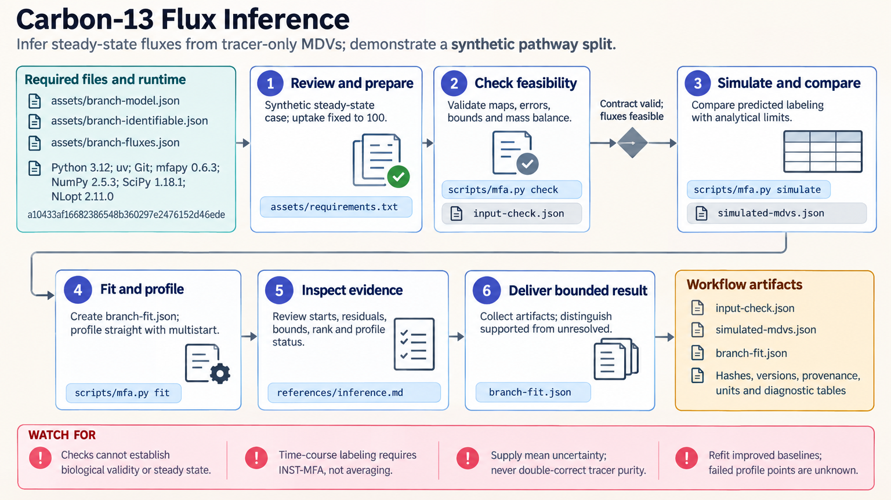

[All skill guides](README.md) / Carbon-13 Metabolic Flux Inference

# Carbon-13 Metabolic Flux Inference

**Estimate pathway activity from isotope labeling and determine which fluxes the experiment actually constrains.**

Carbon-13 tracing follows labeled carbon through a metabolic network. This skill connects those measurements to a model of atom movement, simulates expected labeling, and fits intracellular reaction rates. Its central question is both how well a model explains the data and whether different flux patterns could explain them equally well. It supports experiments at metabolic and isotopic steady state.

*Connect isotope measurements to flux estimates while checking which fluxes the experiment can resolve. [View the full-size workflow diagram](../images/13c-metabolic-flux.png).*

## Questions this skill can help you explore

- **How is carbon divided between competing pathways?** Fit fluxes using labeling measurements and extracellular constraints.
- **Which rates are supported by the experiment?** Examine sensitivities and flux profiles rather than relying on a single best fit.
- **What information is missing?** Identify unresolved flux combinations before proposing additional measurements.

## What you bring

Provide a reviewed reaction network with carbon atom maps, tracer mixtures, measurement fragments, corrected mass isotopomer distributions, and measurement uncertainty. Include flux bounds, extracellular rates, units, and evidence for both kinds of steady state. Joint tracer experiments need a defensible shared biological state; separate conditions need separate datasets.

## How the workflow works

1. **Validate the model and measurements.** Check carbon conservation, tracer fractions, fragment definitions, uncertainty matrices, and feasible mass balance.
2. **Check the forward simulation.** Compare predicted labeling for a feasible flux vector with a reference or known limiting case.
3. **Fit several starting points.** Estimate constrained fluxes with mfapy isotope simulation and multistart optimization.
4. **Investigate identifiability.** Profile reactions of interest while refitting other fluxes, then inspect active bounds, sensitivity rank, failed fits, and residuals.
5. **Preserve the evidence.** Save predictions, diagnostics, model and data hashes, units, provenance, and unresolved directions.

## What you get

| Output | What it helps you do |
| --- | --- |
| Flux estimates and predicted labeling | Compare a feasible model with measured isotope patterns. |
| Residuals and flux profiles | Distinguish an adequate fit from a well-constrained rate. |
| Reproducible JSON artifacts | Retain the model, assumptions, and diagnostics for review. |

## Example request

> Use the carbon-13 metabolic flux skill to fit my steady-state tracer experiment. I have reviewed carbon maps, corrected labeling distributions, extracellular rates, and measurement covariance. Estimate the branch split, profile both branch fluxes, and show whether the data constrain them separately. Report any bounds or unresolved directions that determine the answer.

*This is an illustrative request, not a reported research result.*

## Interpreting the results

**A small residual does not establish identifiability.** Flat profiles and active bounds can make a precise-looking point estimate misleading. Profile intervals describe individual fluxes under the stated error model, not simultaneous coverage of the whole network.

Time-course labeling requires a nonstationary framework with additional information; averaging those observations does not make this steady-state solver appropriate. Computational checks cannot establish biological correctness of an atom map.

## Get started

The inference runs locally without credentials. The documented Python 3.12 environment uses mfapy from a pinned Git revision, NumPy, SciPy, and NLopt, with uv and Git for setup. Network access is needed to obtain dependencies; inputs are JSON.

[Setup and technical instructions](../../skills/13c-metabolic-flux/SKILL.md)
