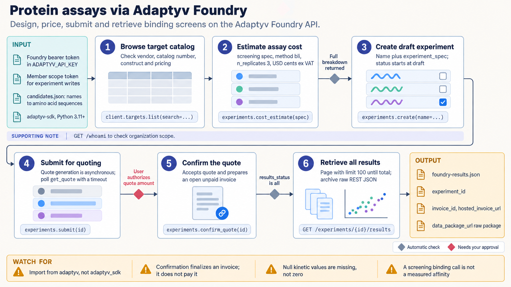

[All skill guides](README.md) / Adaptyv Bio Foundry

# Adaptyv Bio Foundry

**Turn a protein characterization question into a reviewable cloud laboratory experiment.**

The Adaptyv skill helps a research assistant work with the Foundry service to characterize protein sequences experimentally. It connects target and assay selection with cost estimation, experiment drafts, laboratory status, and result retrieval. The supported workflow includes binding, affinity, expression, thermostability, fluorescence, epitope binning, and enzyme activity assays, subject to the service’s available experiment specifications.

*Protein sequences move through assay planning, experiment review, laboratory execution, and result retrieval. [View the full-size workflow diagram](../images/adaptyv.png).*

## Questions this skill can help you explore

- **Which assay fits my protein question?** Review available targets and experiment requirements.
- **What will a proposed batch involve?** Assemble a draft with sequences, controls, conditions, and a cost estimate.
- **Where are the measurements?** Track an experiment and retrieve its result records without dropping fields.

## What you bring

Bring protein sequences with stable identifiers, the biological question, the target construct where applicable, and the intended assay conditions. Specify controls, replicate needs, and budget constraints. An account and token provide access to the Foundry; the experiment still needs a scientifically reviewed design before it is submitted.

## How the workflow works

1. **Inspect the available experiment options.** Confirm that the requested assay and target construct are supported.
2. **Build the proposed specification.** Include sequences and the fields required by that experiment type, with controls and replication considered explicitly.
3. **Estimate and review.** Obtain a cost estimate, create a draft, and inspect the actual quote and experiment details.
4. **Submit and monitor deliberately.** Follow the service’s lifecycle and distinguish a draft, submitted experiment, quote confirmation, and laboratory progress.
5. **Retrieve complete results.** Preserve identifiers and full result fields so measurements can be traced to the submitted proteins and experiment.

## What you get

| Output | What it helps you do |
| --- | --- |
| Experiment specification and draft | Review the proposed laboratory work before execution. |
| Cost estimate and quote details | Assess financial scope for the requested assay. |
| Status and result records | Connect laboratory progress and measurements to your sequence batch. |

## Example request

> Use the Adaptyv skill to prepare an affinity characterization experiment for my protein variants. Review the target construct and required controls, assemble a draft, and show the estimate and quote details. After the experiment has been approved and completed, retrieve all result fields with the original sequence identifiers.

*This is an illustrative request, not a reported research result.*

## Interpreting the results

**An assay measures performance under its stated conditions.** Binding and expression results do not establish therapeutic efficacy or behavior in a different biological system. Construct choice, controls, concentration ranges, and replication determine what comparisons are justified.

Draft creation, quote acceptance, and submission are different actions. Some convenience options can accept pricing or advance a submission, and retries do not establish that a write operation is safe to repeat.

## Get started

Network access, an Adaptyv Foundry account, and an API bearer token are required. Python workflows use Python 3.11+ and the official GitHub-distributed adaptyv-sdk; direct REST examples use httpx. The technical instructions describe credential configuration and endpoint details.

[Setup and technical instructions](../../skills/adaptyv/SKILL.md)
