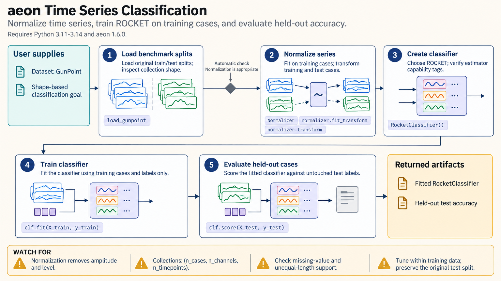

[All skill guides](README.md) / Aeon Time Series Machine Learning

# Aeon Time Series Machine Learning

**Analyze patterns in repeated measurements with methods designed for time series.**

Time series contain information in their order, shape, timing, and relationships between channels. The Aeon skill helps choose and apply methods that preserve those features instead of treating every time point as an unrelated table row. It covers classification, regression, clustering, forecasting, anomaly detection, segmentation, and similarity search through a consistent Python estimator interface.

*Time series are prepared, modeled for a defined task, and evaluated with appropriate temporal comparisons. [View the full-size workflow diagram](../images/aeon.png).*

## Questions this skill can help you explore

- **Can a signal distinguish experimental groups?** Train a classifier on complete series or multichannel recordings.
- **Where does a recording change?** Explore segmentation and anomaly-detection methods.
- **Which trajectories resemble one another?** Compare shapes, group recordings, or search for recurring subsequences.

## What you bring

Provide time-indexed measurements, channel definitions, sampling information, and the scientific unit represented by each series. Include labels or target values for supervised tasks and identifiers for participants, experiments, or batches. Describe missing values, unequal lengths, and the intended prediction horizon when forecasting future observations.

## How the workflow works

1. **Define the prediction or exploration task.** Decide whether the output is a series label, a numerical target, future values, segments, or unusual intervals.
2. **Prepare the collection.** Check array shape, channel order, missing values, and estimator support for unequal-length or multivariate data.
3. **Choose a justified baseline.** Compare suitable distance-based, feature-based, convolution-based, or other time-series methods.
4. **Evaluate without temporal leakage.** Separate related recordings and respect time order or forecast origin as the scientific question requires.
5. **Inspect and retain results.** Save predictions, evaluation measures, parameters, and visual comparisons that reveal where the model succeeds or fails.

## What you get

| Output | What it helps you do |
| --- | --- |
| Fitted estimators and predictions | Apply a specified model to new recordings. |
| Cluster, segment, or anomaly assignments | Locate recurring patterns and candidate changes. |
| Evaluation summaries and plots | Assess utility against a task-appropriate baseline. |

## Example request

> Use the Aeon skill to compare time-series classifiers for multichannel sensor recordings from independent experiments. Keep recordings from the same experiment together when splitting the data, check unequal lengths and missing values, and compare a simple baseline with a stronger candidate. Report held-out predictions and the kinds of signals each model confuses.

*This is an illustrative request, not a reported research result.*

## Interpreting the results

**A model can learn experimental artifacts as easily as scientific structure.** Overlapping windows or repeated measurements from one subject can leak information across a random split. Scaling and feature selection must also be learned within the training data.

Anomalies are deviations from a model’s expectations, not automatically meaningful events. Clusters and segments need domain interpretation, and forecasting quality depends on the horizon and stability of the data-generating process.

## Get started

The documented environment uses Python 3.11–3.14 and Aeon. Optional methods add dependencies such as stumpy or TensorFlow. Local analysis needs no credentials; installation and remote datasets need network access. The technical guide distinguishes exercised examples from illustrative remote or deep-learning workflows.

[Setup and technical instructions](../../skills/aeon/SKILL.md)
