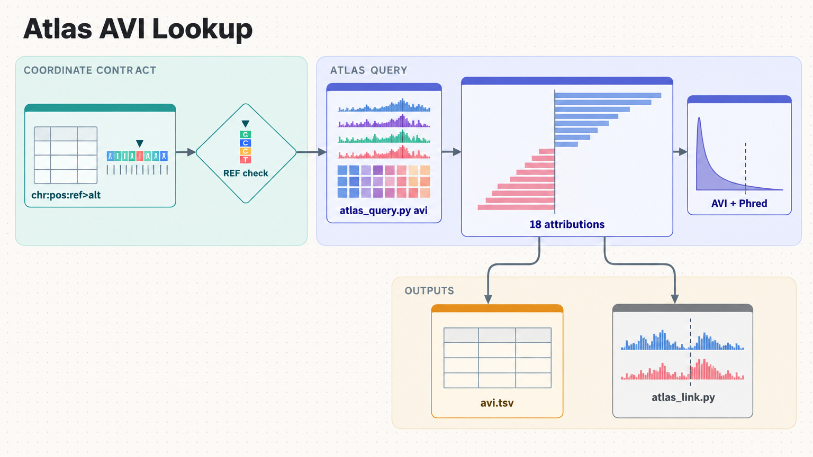

[All skill guides](README.md) / AlphaGenome and the AlphaGenome Atlas

# AlphaGenome and the AlphaGenome Atlas

**Prioritize sequence variants and examine their predicted molecular effects in relevant tissues.**

This skill provides two routes to AlphaGenome: retrieving precomputed human single-nucleotide variant effects from the Atlas, and requesting model predictions for variants or genomic windows. It helps connect a ranking score with the molecular tracks behind it, such as expression, accessibility, splicing, or chromatin contacts. The intended use is research prioritization and mechanistic hypothesis generation.

*Genomic variants are checked, ranked, and examined through tissue-specific predicted molecular tracks. [View the full-size workflow diagram](../images/alphagenome.png).*

## Questions this skill can help you explore

- **Which variants deserve closer study?** Rank candidates using Atlas scores with their feature attributions.
- **What predicted mechanism supports a ranking?** Inspect relevant tissue, gene, splice, or regulatory tracks.
- **How do reference and alternate sequences differ?** Compare model predictions or explore a window by in silico mutagenesis.

## What you bring

Bring variant coordinates and alleles, a confirmed reference genome, and the tissue or cell type relevant to the question. Human inputs require GRCh38; model-only mouse work uses mm10. Resolve rsIDs to coordinates and check the reference allele against the assembly. A credible set or regional list is more interpretable with its association and experimental context.

## How the workflow works

1. **Check coordinates and alleles.** Distinguish one-based variants and intervals from the SDK’s zero-based interval convention.
2. **Choose Atlas or model access.** Use available precomputed SNV records or request predictions for supported variants and windows.
3. **Inspect the ranking evidence.** Examine AVI feature attributions to see whether coding, splicing, conservation, or regulatory features drive the score.
4. **Resolve the relevant tracks.** Filter to appropriate biosamples and compare reference and alternate signals rather than selecting an unrelated extreme.
5. **Report reproducibly.** Retain raw scores, quantiles or Phred ranks, scorer names, biosample identifiers, genes, lookup failures, and portal links.

## What you get

| Output | What it helps you do |
| --- | --- |
| Variant ranking tables | Prioritize candidates with explicit scoring context. |
| Track-level predictions and attributions | Develop a testable explanation of a predicted effect. |
| Atlas links and query records | Let collaborators inspect the underlying evidence. |

## Example request

> Use the AlphaGenome skill to investigate these GRCh38 variants from a lung-related association region. Retrieve Atlas rankings, check which features drive each score, and inspect lung-relevant regulatory and splicing tracks. Report both raw effects and ranks, including variants with little predicted change, and suggest experimentally testable mechanisms.

*This is an illustrative request, not a reported research result.*

## Interpreting the results

**Scores are predictions, and quantiles are ranks rather than p-values.** A high rank can accompany a small raw change, and a genome-wide threshold can miss regulatory variants. Unsigned scorers do not indicate effect direction.

The available tissues, sequence context, and modeled biology limit interpretation. These outputs do not establish pathogenicity or clinical actionability; the skill is intended for research, and model-output usage terms must be respected.

## Get started

Use Python 3.10+ with the alphagenome package, network access, and an AlphaGenome API key. Atlas support needs the package version described in the technical instructions. Building a website deep link alone does not require an authenticated prediction request.

[Setup and technical instructions](../../skills/alphagenome/SKILL.md)
