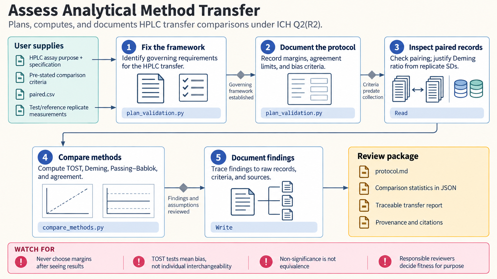

[All skill guides](README.md) / Analytical Method Validation

# Analytical Method Validation

**Plan and evaluate evidence that an analytical procedure is fit for its intended purpose.**

An assay can be repeatable yet unsuitable for the concentration range, sample matrix, or decision it must support. This skill guides validation, verification, and transfer studies by first identifying the governing framework and the procedure’s intended use. It combines study planning, statistical calculations, and report structure for analytical and bioanalytical methods.

*An intended analytical use is translated into predefined criteria, validation studies, and reviewable evidence. [View the full-size workflow diagram](../images/analytical-method-validation.png).*

## Questions this skill can help you explore

- **What must this procedure demonstrate?** Identify the characteristics required for its purpose and governing framework.
- **Are accuracy and precision adequate?** Summarize performance against criteria declared before the study.
- **Can another laboratory or instrument use the method?** Plan transfer and method-comparison evidence.

## What you bring

Provide the analytical procedure, matrix, analyte, intended reportable range, specification or analytical target profile, and applicable framework. Include the study design and raw observations with concentration levels, replicates, days, analysts, and instruments as relevant. Acceptance criteria should be supplied or justified before results are inspected.

## How the workflow works

1. **Select the governing framework.** Distinguish pharmaceutical, bioanalytical, clinical laboratory, and laboratory-accreditation contexts.
2. **Specify the protocol.** Define required characteristics, experimental factors, replication, calculations, and acceptance criteria in advance.
3. **Evaluate response and measurement performance.** Examine calibration behavior, accuracy, repeatability, intermediate precision, and appropriate intervals.
4. **Assess limits and special requirements.** Document how detection and quantitation limits were obtained and confirmed; apply the relevant run-level checks where required.
5. **Assemble the evidence for review.** Present calculations, deviations, uncertainty, transfer comparisons, and limitations for the responsible technical and quality reviewers.

## What you get

| Output | What it helps you do |
| --- | --- |
| Validation protocol structure | Make the study and decision criteria explicit before data collection. |
| Tables and machine-readable calculations | Review response, precision, accuracy, and method comparisons. |
| Report-ready findings and caveats | Support a documented fitness-for-purpose review. |

## Example request

> Use the analytical method validation skill to plan an LC-MS method validation for a specified matrix and concentration range. Start by identifying the governing framework and missing acceptance criteria. Then evaluate my calibration, recovery, and precision data, retain the replicate structure, and prepare findings and limitations for technical review.

*This is an illustrative request, not a reported research result.*

## Interpreting the results

**A calculation does not itself validate a physical assay.** The responsible analyst, reviewers, and quality organization make the fitness-for-purpose decision. Criteria chosen after seeing the data cannot serve as prospective acceptance criteria.

Different frameworks have different purposes and requirements. Do not combine convenient thresholds from unrelated guidance, mistake correlation for method agreement, or report a calculated detection limit without its approach and experimental confirmation.

## Get started

The bundled tools run locally with Python 3.11+ and the standard library, without credentials or network access. They provide tabular, TSV, or JSON output. Access to authorized copies of applicable standards and a clear laboratory context is still needed for the substantive review.

[Setup and technical instructions](../../skills/analytical-method-validation/SKILL.md)
