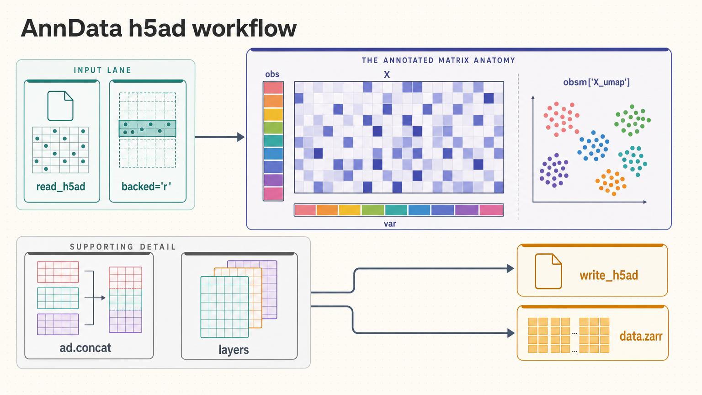

[All skill guides](README.md) / AnnData

# AnnData

**Keep experimental measurements and their annotations aligned in one reusable data object.**

AnnData is a storage and organization layer for annotated matrices. In single-cell work, rows usually represent cells and columns represent genes; metadata, alternative expression layers, embeddings, and analysis annotations travel with that matrix. This skill helps create, inspect, combine, subset, and save those objects while preserving the relationships needed by downstream scientific tools.

*Measurement matrices and annotations are organized, checked, combined, and saved in interoperable files. [View the full-size workflow diagram](../images/anndata.png).*

## Questions this skill can help you explore

- **How should I organize measurements and metadata?** Store observations, variables, and derived annotations together.
- **Can I combine datasets safely?** Check identifiers and decide how unmatched features and metadata are handled.
- **How can I work with a larger file?** Choose in-memory, backed, or supported lazy access deliberately.

## What you bring

Bring a measurement matrix, identifiers for rows and columns, and corresponding metadata tables. State what the values mean: raw counts, normalized values, transformed measurements, or another quantity. For existing objects, identify important layers, embeddings, annotations, and prior processing. Supply the intended output format and downstream analysis tools.

## How the workflow works

1. **Inspect the data model.** Establish the observation and variable axes and confirm that identifiers align with metadata.
2. **Create or load the object.** Place the main matrix and alternative representations in appropriate slots without confusing raw and transformed data.
3. **Subset and combine carefully.** Review joins, duplicated identifiers, missing features, and view-versus-copy behavior.
4. **Choose an access strategy.** Consider sparse arrays, file-backed reads, or supported lazy operations based on memory and the planned computation.
5. **Save and verify.** Write an H5AD or Zarr representation and check dimensions, annotations, and values after reloading.

## What you get

| Output | What it helps you do |
| --- | --- |
| Annotated AnnData object | Keep measurements and scientific context synchronized. |
| H5AD or Zarr files | Share and reopen data within compatible analysis workflows. |
| Combined or subset datasets | Prepare selected samples and features for downstream methods. |

## Example request

> Use the AnnData skill to combine these single-cell datasets into one clearly documented object. Preserve original counts, retain donor and batch metadata, explain the feature-join choice, and detect duplicated identifiers. Save an H5AD file and verify that cell labels, gene identifiers, layers, and matrix dimensions survive reloading.

*This is an illustrative request, not a reported research result.*

## Interpreting the results

**Correct storage does not establish a valid analysis.** Concatenation can introduce missing values or alter the feature set, and matching row counts does not prove metadata alignment. Labels, units, and processing history remain scientific responsibilities.

Backed and lazy access do not make every downstream operation memory efficient. Some operations materialize arrays, and compatibility varies across third-party libraries and experimental APIs. Plan the analysis separately with an appropriate method skill.

## Get started

The documented workflow uses Python 3.12+ and AnnData. Optional formats and lazy or remote access require additional packages, such as Dask, openpyxl, or provider-specific filesystem adapters. Local H5AD operations need no service credentials; installation and remote stores need network access.

[Setup and technical instructions](../../skills/anndata/SKILL.md)
