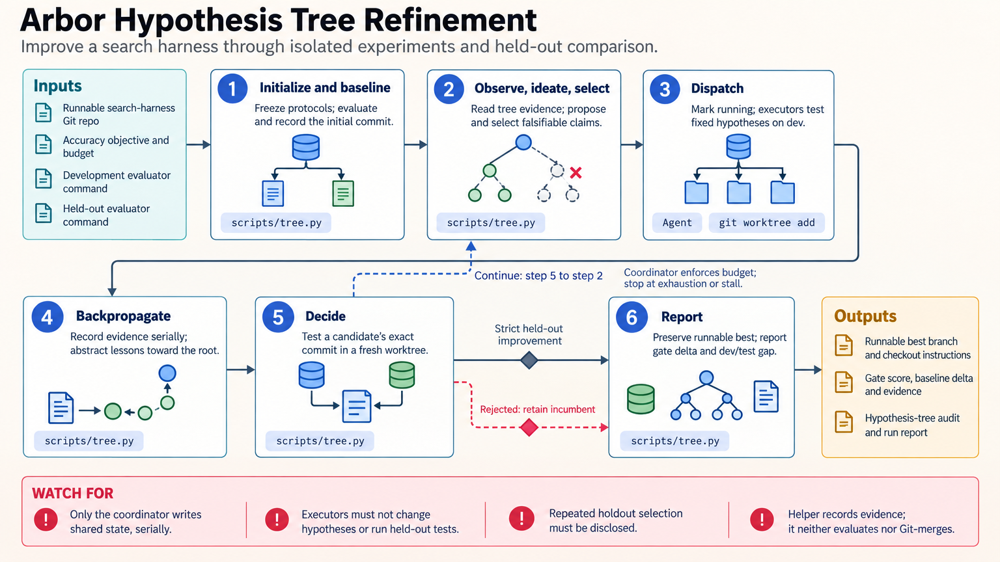

[All skill guides](README.md) / Arbor Hypothesis Tree Refinement

# Arbor Hypothesis Tree Refinement

**Organize repeated computational experiments so each trial contributes traceable evidence.**

Research optimization often involves many plausible changes to a model, training procedure, or analysis artifact. Arbor keeps those ideas in a persistent hypothesis tree, connects each experiment to a versioned artifact, and records what the evidence supports. It is designed for work with repeatable evaluators and a clearly defined objective, including model training and benchmark experiments.

*Hypotheses branch into isolated experiments, feed evidence back into a persistent tree, and face held-out comparison. [View the full-size workflow diagram](../images/arbor.png).*

## Questions this skill can help you explore

- **Which proposed change should I test next?** Compare hypotheses using accumulated evidence and a fixed budget.
- **What have earlier trials taught us?** Retain insights and artifact versions instead of relying on conversation history.
- **Does an apparent improvement generalize?** Compare candidates with a separate held-out evaluation protocol.

## What you bring

Provide a baseline artifact, version-controlled code, a repeatable development evaluator, and an independent held-out evaluator. Define the objective, constraints, compute or time budget, and stopping conditions. Evaluation outputs must be meaningful for the research question; a readily available numerical score is not sufficient if it rewards the wrong behavior.

## How the workflow works

1. **Establish the baseline.** Record artifact identity, evaluators, initial performance, resources, and the allowed search space.
2. **Observe and propose.** Inspect the hypothesis tree and formulate distinct explanations for how a change might improve the objective.
3. **Run isolated experiments.** Test selected hypotheses in separate worktrees and retain their evidence and artifact references.
4. **Update the research record.** Propagate useful findings, distinguish failure from lack of evidence, and prune unproductive branches.
5. **Compare and conclude.** Apply the held-out decision gate to candidates and report the best supported artifact alongside rejected ideas and remaining uncertainty.

## What you get

| Output | What it helps you do |
| --- | --- |
| Persistent hypothesis tree | Track why each experiment was attempted and what it taught. |
| Versioned candidate artifacts and evidence | Reproduce and compare individual trials. |
| Final comparison and research account | Explain the selected result and the limits of the search. |

## Example request

> Use the Arbor skill to improve this reproducible model-training experiment within a fixed compute budget. Establish the baseline, propose distinct hypotheses, and test them in isolated worktrees. Keep a tree of results and reserve the independent evaluation set for the candidate decision gate. Report the selected artifact and unsuccessful hypotheses.

*This is an illustrative request, not a reported research result.*

## Interpreting the results

**Repeated optimization can overfit an evaluator.** The held-out protocol must remain separate from the development signal and must not become another search oracle. A benchmark improvement supports that evaluation context; it does not automatically establish broader scientific validity.

The bundled state manager records scores and decisions. It does not execute evaluators, create worktrees, verify Git references, or merge code, and shared-state writes require coordination because it has no multi-writer locking.

## Get started

The local state manager uses Python 3.10+ and the standard library, with Git for experiment worktrees. The optional arbor-agent CLI is a separate installation. Autonomous model calls require the selected provider’s credentials and network access; research compute requirements depend on the experiments.

[Setup and technical instructions](../../skills/arbor/SKILL.md)
