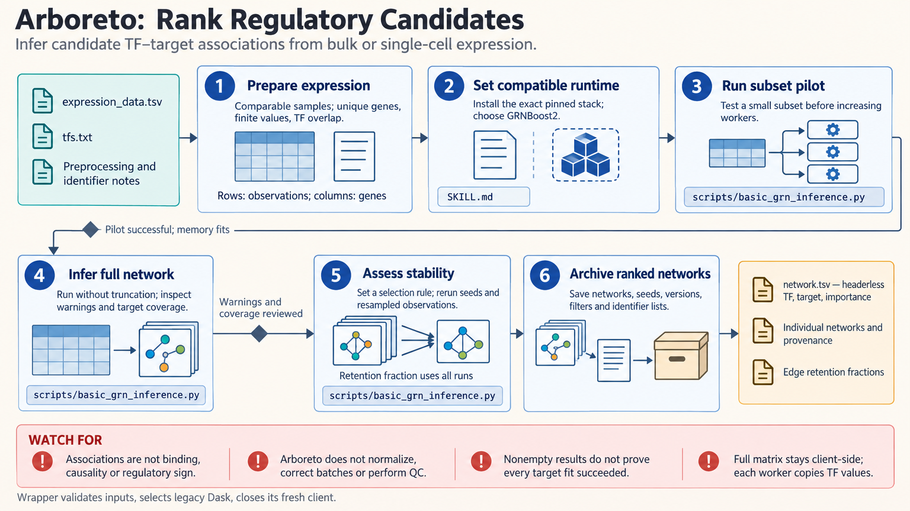

[All skill guides](README.md) / Arboreto Gene Regulatory Network Inference

# Arboreto Gene Regulatory Network Inference

**Rank candidate regulator–target relationships from gene expression measurements.**

Arboreto uses machine learning to ask which genes help predict the expression of other genes. The skill supports GRNBoost2 and GENIE3 for building ranked candidate networks from bulk or single-cell data. It emphasizes input orientation, a compatible computational environment, and stability checks so a long edge list remains interpretable as exploratory evidence.

*Expression measurements and regulator lists produce ranked associations that are checked across repeated analyses. [View the full-size workflow diagram](../images/arboreto.png).*

## Questions this skill can help you explore

- **Which transcription factors predict a target’s expression?** Rank candidate associations from a specified regulator set.
- **Which candidate links are stable?** Compare selections across random seeds and resampled observations.
- **How sensitive is the network to method choice?** Contrast GRNBoost2 and GENIE3 with matched inputs.

## What you bring

Provide a numeric expression matrix with observations in rows and genes in columns, unique gene identifiers, and a transcription-factor list in the same identifier system. Describe the organism, selected cells or samples, normalization, filtering, expression layer, and batch handling. Samples should be biologically comparable for the question being asked.

## How the workflow works

1. **Prepare the expression inputs.** Exclude identifiers from numeric values, check finite measurements, and remove uninformative genes where appropriate.
2. **Check candidate regulators.** Confirm that the transcription-factor list overlaps the expression genes and record that overlap.
3. **Pilot the selected method.** Run a small subset in the documented compatibility environment before increasing worker counts.
4. **Inspect inference coverage.** Check warnings and which targets were fitted, then preserve the complete ranked network.
5. **Assess stability and context.** Repeat runs using a defined edge-selection rule and compare candidates with independent motif, binding, or perturbation evidence.

## What you get

| Output | What it helps you do |
| --- | --- |
| Ranked regulator–target table | Prioritize associations for biological follow-up. |
| Run logs and target coverage | Detect incomplete inference or worker failures. |
| Stability summaries | Identify links repeatedly selected under stated analysis choices. |

## Example request

> Use the Arboreto skill to infer candidate transcription-factor relationships in this selected cell population. Check identifiers and expression orientation, run GRNBoost2 with a documented regulator list, and assess stability across seeds and resampled cells. Save all networks and flag targets with incomplete inference before proposing candidate links for follow-up.

*This is an illustrative request, not a reported research result.*

## Interpreting the results

**Predictive association is not direct or causal regulation.** The output does not establish binding, activation, repression, or a regulatory mechanism. GRNBoost2 importance values can exceed one and are not probabilities; they are also not directly comparable with GENIE3 scores.

Missing edges can reflect filtering, zero importance, or failed regression. Score differences between conditions do not alone establish differential regulation. For consensus, count missing selections across all runs rather than averaging only the runs where an edge appears.

## Get started

Local inference needs no credentials. The skill documents an isolated Python 3.11 stack with Arboreto, compatible Dask/distributed, NumPy, pandas, scikit-learn, and SciPy. Network access is needed for installation. Memory and process-worker configuration should be established with a small pilot.

[Setup and technical instructions](../../skills/arboreto/SKILL.md)
