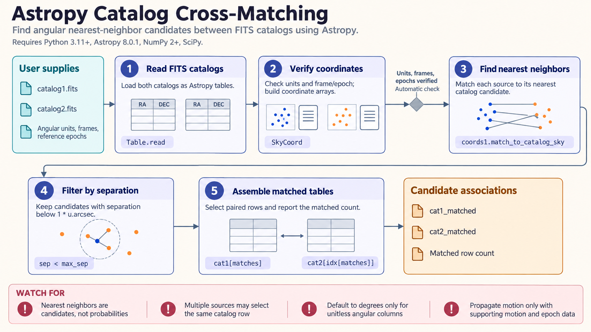

[All skill guides](README.md) / Astropy

# Astropy

**Handle astronomical units, coordinates, times, and data formats with explicit scientific conventions.**

Astronomy combines measurements expressed in different frames, time scales, physical units, and file formats. The Astropy skill helps keep those conventions explicit while reading FITS data, manipulating catalogs, transforming sky coordinates, using image world-coordinate systems, and calculating quantities under a chosen cosmology. It supports the foundations of an analysis rather than prescribing one astronomical inference.

*Astronomical measurements are read, assigned explicit conventions, transformed, and preserved with metadata. [View the full-size workflow diagram](../images/astropy.png).*

## Questions this skill can help you explore

- **Are these measurements expressed consistently?** Convert physical quantities while preserving units.
- **Which sources correspond across catalogs?** Transform coordinates and perform a justified sky match.
- **What does an image pixel represent on the sky?** Use FITS metadata and a world-coordinate system.

## What you bring

Bring FITS images, tables, catalogs, or numerical measurements with their units and provenance. Supply coordinate frames, epochs and observation times, time scales, observatory location where relevant, and the cosmological parameters needed by the question. Note uncertainty, masks, and any calibration or preprocessing already applied to the data.

## How the workflow works

1. **Inspect the source metadata.** Read file structure, headers, table columns, units, and coordinate definitions before calculating.
2. **Represent quantities explicitly.** Attach physical units and use coordinate and time objects that preserve the required conventions.
3. **Transform or compare.** Convert frames and time scales, match catalogs, map pixels to sky coordinates, or compute a specified cosmological quantity.
4. **Check assumptions and edge cases.** Review masks, precision, match separations, and the external calibration data used by relevant transformations.
5. **Export usable results.** Save tables, coordinates, derived quantities, and provenance in formats appropriate to the next analysis step.

## What you get

| Output | What it helps you do |
| --- | --- |
| Unit-aware quantities and tables | Reduce ambiguity when combining measurements. |
| Transformed coordinates or matched catalogs | Connect observations expressed in different systems. |
| FITS/WCS products and derived values | Retain the metadata needed for reuse and scientific interpretation. |

## Example request

> Use the Astropy skill to cross-match two source catalogs with different coordinate conventions. Check their units, epochs, and time metadata; transform them into a common frame; and report match separations with a justified matching radius. Save the matched table and explain ambiguous matches and assumptions about source motion.

*This is an illustrative request, not a reported research result.*

## Interpreting the results

**A technically valid transformation can still encode the wrong scientific assumptions.** Coordinate frame, epoch, observer location, time scale, and cosmology affect the answer. Closest-neighbor matching does not by itself establish source identity, particularly in crowded fields or across long time baselines.

Preserve uncertainties and masks, and distinguish numerical precision from observational accuracy. Some coordinate and timing calculations depend on external Earth-orientation information whose availability and provenance should be recorded.

## Get started

The documented environment uses Python 3.11+, Astropy, and NumPy; SciPy supports several cosmology, matching, and fitting workflows. Local file operations need no service credentials. Name resolution, remote FITS access, site lookups, and Earth-orientation data updates can require network access.

[Setup and technical instructions](../../skills/astropy/SKILL.md)
