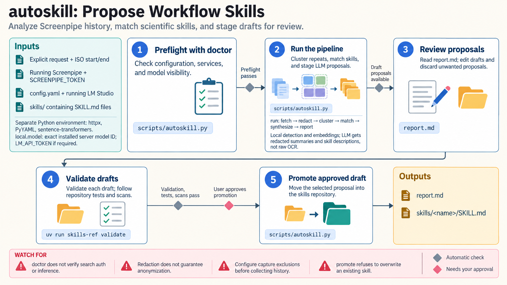

[All skill guides](README.md) / Autoskill

# Autoskill

**Identify repeated research workflows and turn them into reviewable skill proposals.**

Autoskill examines a user-requested window of recorded computer activity to look for recurring patterns of work. It matches those patterns against existing scientific skills and can propose reuse, a composition recipe, or a new draft. This is a workflow-discovery aid: it produces suggestions for review rather than evidence that a researcher performed or validated a particular analysis.

*An explicitly selected activity window is redacted, grouped into recurring workflows, and matched to skill proposals. [View the full-size workflow diagram](../images/autoskill.png).*

## Questions this skill can help you explore

- **Which research tasks am I repeating?** Group similar activity sessions within a chosen history window.
- **Does an existing skill already help?** Compare recurring workflows with the installed skill descriptions.
- **What should a reusable workflow include?** Review proposed drafts or recipes before promoting them.

## What you bring

Provide an explicit request to analyze a defined activity window, access to a running Screenpipe daemon, and a directory of candidate skills. Choose the model backend and review its data destination. A representative history window and clear task boundaries help distinguish repeated research work from coincidental use of the same applications.

## How the workflow works

1. **Check configuration and connectivity.** Confirm the selected history source, skills directory, and language-model backend.
2. **Retrieve the requested window.** Fetch activity with pagination and reject incomplete retrieval rather than silently summarizing a partial record.
3. **Redact and group.** Scrub recognizable secret patterns, segment sessions, and cluster recurring application sequences.
4. **Match and propose.** Use local embeddings to find relevant skills, then ask the configured model to suggest reuse, composition, or a new draft.
5. **Review before adoption.** Inspect the report and drafts, correct their scientific content, and validate proposed skills before promotion.

## What you get

| Output | What it helps you do |
| --- | --- |
| Activity-cluster plan or report | Review which repeated patterns the system detected. |
| Matched skill suggestions | Find existing procedures relevant to repeated work. |
| Draft skills or composition recipes | Provide editable starting points for a reusable workflow. |

## Example request

> Use Autoskill to inspect the research activity I recorded during this explicitly selected week. Start with a dry run so I can review the recurring workflow clusters. Then use my configured local model to propose existing skills or draft procedures for the repeated tasks, keeping all proposals separate from the installed collection.

*This is an illustrative request, not a reported research result.*

## Interpreting the results

**Recorded activity is incomplete evidence of scientific work.** Application sequences and window titles may miss the actual reasoning or outcome, and similarity scores do not establish that a skill is appropriate. Proposed procedures need domain review and ordinary validation.

Redaction is a safeguard rather than a guarantee. Detection and embedding inference run locally, but the selected model receives redacted summaries and matched descriptions; a remote backend sends that information off the machine.

## Get started

The workflow requires Python 3.10+, httpx, PyYAML, sentence-transformers, Screenpipe, and a configured language-model endpoint. Local LM Studio is the default route; cloud backends are opt-in and require credentials. Initial model downloads need network access. Authentication may also be required by the local services.

[Setup and technical instructions](../../skills/autoskill/SKILL.md)
