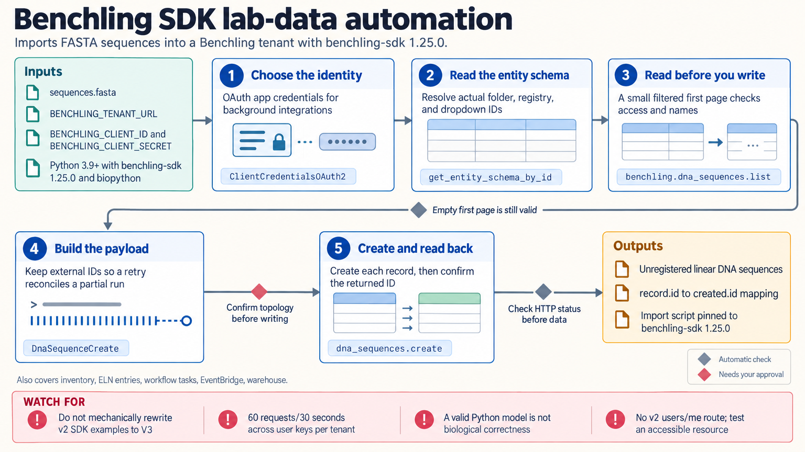

[All skill guides](README.md) / Benchling Integration

# Benchling Integration

**Connect laboratory records, registered materials, and inventory through a traceable data workflow.**

The Benchling integration skill helps a research assistant query and update a laboratory’s Benchling environment using its Python SDK and REST API. It covers registry entities, sequence records, inventory, electronic notebook entries, workflows, apps, and warehouse queries. The emphasis is on matching the laboratory’s actual schemas and preserving identifiers so automated work can be checked and reconciled.

*Laboratory schemas and identifiers connect controlled reads, prepared updates, and verified Benchling records. [View the full-size workflow diagram](../images/benchling-integration.png).*

## Questions this skill can help you explore

- **Where is the material or sequence I need?** Query registry and inventory records using actual tenant identifiers.
- **Can I import a batch consistently?** Prepare schema-aware records while retaining external and returned identifiers.
- **Did an automated operation finish correctly?** Check asynchronous status and read back the resulting records.

## What you bring

Provide the Benchling tenant, the requested operation, the relevant projects or folders, and access with appropriate permissions. For imports, bring source records with stable identifiers, sequence alphabet and topology, units, and required schema fields. Explain how duplicates and partially completed earlier imports should be recognized.

## How the workflow works

1. **Establish access and scope.** Identify the API version, authentication identity, and permissions for the intended records.
2. **Read the laboratory schema.** Resolve folder, registry, dropdown, status, and workflow identifiers instead of assuming display names are sufficient.
3. **Check a small read.** Confirm response structure, pagination, and visibility before preparing writes.
4. **Prepare a representative payload.** Preserve external identifiers and validate required fields, quantities, and biological semantics.
5. **Execute and verify.** Check terminal job status and read records back, retaining identifier mappings for reconciliation and safe recovery.

## What you get

| Output | What it helps you do |
| --- | --- |
| Filtered records and exports | Retrieve laboratory information for a defined question. |
| Schema-aware import or update payloads | Review how source data map to the laboratory system. |
| Identifier and operation records | Trace changes and reconcile partial processing. |

## Example request

> Use the Benchling integration skill to prepare an import of these DNA sequences into the specified registry schema. Read the required fields first, check for existing identifiers, and show a representative payload. After the requested import, verify each returned record and save the mapping between my source identifiers and Benchling identifiers.

*This is an illustrative request, not a reported research result.*

## Interpreting the results

**API acceptance is not biological validation.** A syntactically valid record can still contain an incorrect sequence, unit, topology, or schema interpretation. An empty query can reflect permissions or filters rather than the absence of a material.

Moving a container and transferring its contents are different laboratory actions. Completed polling also does not guarantee success: terminal jobs can fail, and partial imports require reconciliation rather than blindly repeating the batch.

## Get started

The documented Python workflow uses Python 3.9+ and benchling-sdk, network access, and a Benchling tenant with API access. Authentication uses an API key or OAuth app credentials, according to the integration’s identity. Optional sequence import examples need Biopython. Tenant-specific permissions and required fields remain essential.

[Setup and technical instructions](../../skills/benchling-integration/SKILL.md)
