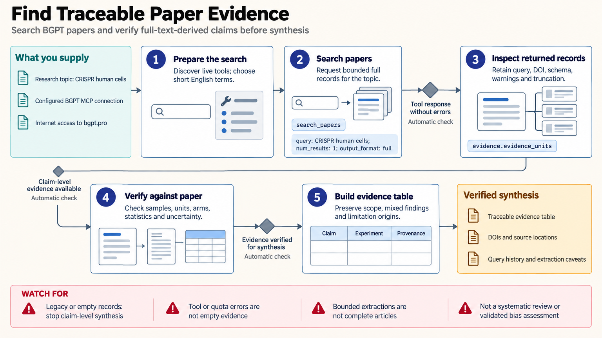

[All skill guides](README.md) / BGPT Paper Search

# BGPT Paper Search

**Find experimental claims from scientific papers and preserve their supporting context.**

BGPT Paper Search retrieves literature evidence by topic or DOI, including claims extracted from full text and the experiments associated with them. It helps build an evidence table that goes beyond an abstract by retaining reported statistics, experimental scope, limitations, and provenance. The skill also explains how to distinguish service and extraction failures from a genuinely empty search result.

*A research question or DOI leads to extracted claims, supporting experiment details, and source-grounded evidence review. [View the full-size workflow diagram](../images/bgpt-paper-search.png).*

## Questions this skill can help you explore

- **Which experiments address my question?** Search for paper-level and claim-level evidence.
- **What was actually measured?** Inspect experimental arms, sample sizes, units, and reported statistics.
- **Where do studies disagree?** Preserve contradictory findings and their contexts during synthesis.

## What you bring

Bring a focused research question, relevant concepts or known DOIs, and criteria for the population, system, intervention, and outcome of interest. Specify the desired evidence scope and any date or study-type restrictions. Access requires a BGPT connection configured in the assistant’s host; installing the skill alone does not create that connection.

## How the workflow works

1. **Form a bounded search.** Translate the question into clear terms or request evidence for a known DOI.
2. **Check the returned representation.** Identify whether the response contains extracted claims, supporting experiments, or a legacy metadata structure.
3. **Extract the scientific context.** Retain sample sizes, measurement units, study arms, statistical results, and provenance alongside each claim.
4. **Verify important details.** Compare key statements with their source context, distinguishing reported limitations from extraction-generated interpretation.
5. **Synthesize with visible gaps.** Assemble a traceable table that includes disagreement, retrieval limits, and unresolved evidence.

## What you get

| Output | What it helps you do |
| --- | --- |
| Paper and claim records | Locate studies and candidate evidence beyond abstracts. |
| Experiment-level evidence table | Compare what studies tested and measured. |
| Provenance and limitation notes | Make a synthesis easier to check against its sources. |

## Example request

> Use BGPT Paper Search to find experimental evidence about whether this intervention changes the specified cellular outcome. Build a table with study system, sample size, comparison, measurement, reported statistics, and source DOI. Keep conflicting findings, flag missing details, and separate the authors’ conclusions from any interpretation introduced by extraction.

*This is an illustrative request, not a reported research result.*

## Interpreting the results

**Extracted evidence needs source checking.** A structured claim can omit qualifications, confuse an experimental unit, or overstate what a statistic supports. The source paper remains the authority for a consequential interpretation.

A bounded result list is not an exhaustive systematic review and does not constitute a validated risk-of-bias assessment. A connection error, quota limit, or failed tool call is not evidence that no studies exist. Search and coverage limits belong in the report.

## Get started

The workflow needs internet access and a configured remote BGPT MCP connection. A local stdio bridge additionally uses Node.js/npm. Paid access requires a BGPT API key in the connection’s authorization header. Credentials belong in host configuration, and service allowances should be checked before large batches.

[Setup and technical instructions](../../skills/bgpt-paper-search/SKILL.md)
