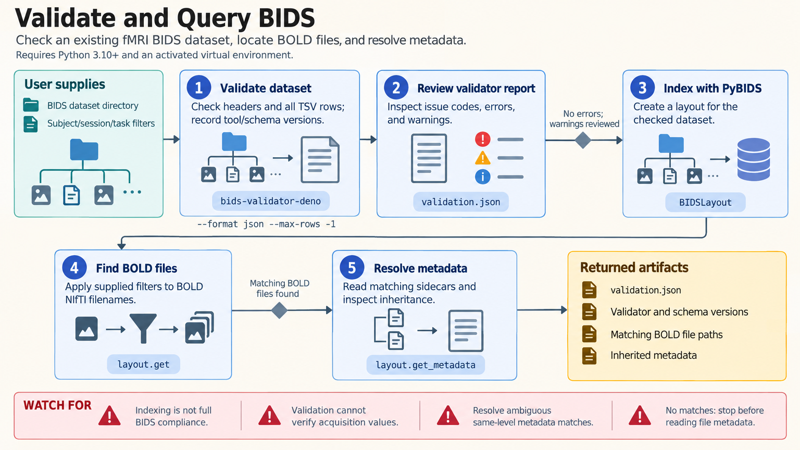

[All skill guides](README.md) / Brain Imaging Data Structure (BIDS)

# Brain Imaging Data Structure (BIDS)

**Organize neuroscience and biomedical datasets so their files and metadata can be understood and reused.**

BIDS supplies conventions for file names, directory layout, and metadata across supported imaging, electrophysiology, and related modalities. This skill helps convert and organize raw data, query a dataset with PyBIDS, write sidecars and events files, validate compliance, and describe derived products. Its goal is an interpretable dataset whose structure supports reproducible downstream analysis.

*Acquisition files become an organized dataset with explicit metadata, validated structure, and discoverable derivatives. [View the full-size workflow diagram](../images/bids.png).*

## Questions this skill can help you explore

- **How should these acquisitions be organized?** Map subjects, sessions, runs, and modalities into a consistent structure.
- **Which files belong in an analysis?** Query entities and inherited metadata with PyBIDS.
- **What must be corrected before sharing?** Review validator findings and incomplete acquisition information.

## What you bring

Provide acquisition files, participant and session identifiers, scan or recording metadata, and a description of the modalities. For imaging conversion, include DICOM data and acquisition knowledge needed to identify runs and directions. Task studies also need event timing and its reference point. Supply de-identified participant information and intended derivative provenance.

## How the workflow works

1. **Inventory the dataset.** Establish subjects, sessions, modalities, acquisitions, and the supported convention appropriate to each.
2. **Convert and organize.** Use the relevant conversion tools and an explicit mapping from acquisition records to BIDS entities.
3. **Complete metadata.** Create dataset descriptions, modality sidecars, participant dictionaries, and event tables with correct units and timing.
4. **Validate and inspect.** Run the BIDS validator, review warnings and metadata inheritance, and record the schema and tool versions.
5. **Query and preserve provenance.** Use PyBIDS to select analysis inputs and place derived products in a clearly described derivatives structure.

## What you get

| Output | What it helps you do |
| --- | --- |
| Organized BIDS dataset | Provide predictable file locations and scientific metadata. |
| Validator findings and corrections | Identify structural and metadata problems before analysis. |
| Queries and derivative descriptions | Support repeatable data selection and processing provenance. |

## Example request

> Use the BIDS skill to organize my task MRI dataset from DICOM files. Map subjects, sessions, and runs explicitly; preserve acquisition metadata; and check event timing against the recordings. Validate the resulting dataset and report every unresolved warning, especially phase-encoding and timing fields, before preparing a downstream analysis input list.

*This is an illustrative request, not a reported research result.*

## Interpreting the results

**Structural compliance does not establish scientific correctness.** A validator cannot know that a participant label, event onset, or acquisition direction reflects the experiment. Successful PyBIDS indexing is also not a full compliance check.

Phase-encoding values use image axes rather than anatomical shorthand, so an AP/PA label alone does not determine the correct field. Review conversion orientation and scanner metadata, and distinguish stable supported conventions from extension proposals.

## Get started

Python 3.10+ supports the documented PyBIDS and validator workflow. DICOM conversion needs dcm2niix and the selected conversion framework. Installation and schema updates need network access; local organization and validation do not require service credentials. The technical instructions describe modality-specific references and validator options.

[Setup and technical instructions](../../skills/bids/SKILL.md)
