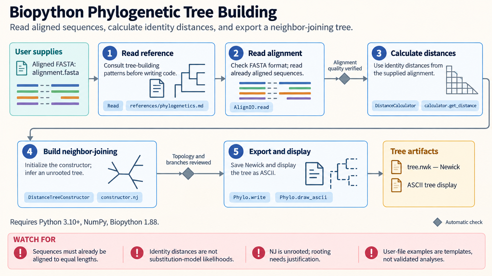

[All skill guides](README.md) / Biopython

# Biopython

**Build reproducible sequence, structure, and biological database workflows in Python.**

Biopython connects common molecular-biology tasks through a collection of parsers and scientific objects. This skill covers sequence manipulation, FASTA and GenBank records, alignments, database retrieval, BLAST results, macromolecular structures, and phylogenetic trees. It helps a research assistant combine those operations while keeping identifiers, annotations, and external-tool assumptions visible.

*Biological records are parsed, transformed, compared, and exported with their annotations and provenance. [View the full-size workflow diagram](../images/biopython.png).*

## Questions this skill can help you explore

- **How can I process a sequence collection consistently?** Read records, inspect features, translate, and export selected sequences.
- **Which database records match my query?** Retrieve and preserve accession-based information through Entrez.
- **What does an alignment or structure contain?** Inspect sequence relationships, tree records, or atomic coordinates.

## What you bring

Bring sequence or structure files, accession identifiers, or a focused database query. Specify organism, molecule type, genetic code where relevant, annotation needs, and desired output format. For alignment and phylogenetic work, explain the biological comparison and provide any existing alignments or trees. Remote database use also needs an appropriate contact identity.

## How the workflow works

1. **Choose the appropriate record type.** Parse files using their actual format and inspect identifiers, lengths, features, and warnings.
2. **Apply explicit biological conventions.** Set sequence orientation, translation assumptions, feature handling, or structure-model selection as needed.
3. **Run the intended comparison or retrieval.** Use local operations, an installed external program, or a bounded remote service request.
4. **Check interpretation and completeness.** Review alignment coverage, database matches, parser warnings, and missing or ambiguous records.
5. **Export reproducibly.** Preserve accession versions, source files, parameters, and annotations required by the next analysis stage.

## What you get

| Output | What it helps you do |
| --- | --- |
| Processed sequences and annotated records | Reuse biological data without losing essential context. |
| Alignment, BLAST, or tree objects | Inspect comparative evidence in a programmatic workflow. |
| Database and structure summaries | Assemble traceable inputs for further analysis. |

## Example request

> Use the Biopython skill to inspect this GenBank collection, extract the specified coding features, and translate them with the correct genetic code. Flag partial or inconsistent features, preserve accession versions, and export nucleotide and protein FASTA files plus a table linking every output sequence to its original annotation.

*This is an illustrative request, not a reported research result.*

## Interpreting the results

**A valid file or sequence operation does not establish biological meaning.** Translation depends on the genetic code and feature boundaries; sequence similarity does not alone establish function or orthology. Structural files may contain missing residues, alternate conformations, or multiple models that change an analysis.

Database records and remote results have provenance and coverage limits. Preserve ambiguous matches and failed retrievals rather than treating them as confirmed absence, and use an appropriate phylogenetic method for evolutionary conclusions.

## Get started

The documented environment uses Python 3.10+, NumPy, and Biopython. Plotting may add Matplotlib or ReportLab. Local BLAST, alignment programs, and DSSP require separate executables. Entrez and web BLAST need network access and a contact email; an optional NCBI API key supports higher request limits.

[Setup and technical instructions](../../skills/biopython/SKILL.md)
