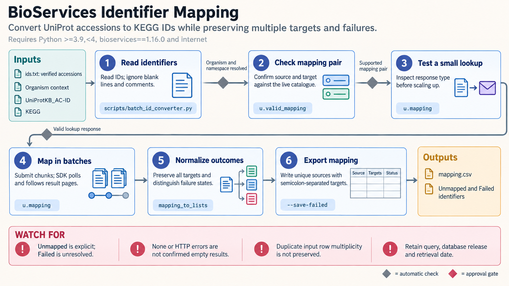

[All skill guides](README.md) / BioServices

# BioServices

**Connect biological database records while preserving identifiers, evidence, and unresolved mappings.**

BioServices provides Python access to multiple biological resources, including protein annotations, pathways, functional terms, chemical cross-references, and associations. This skill helps assemble data across services such as UniProt, KEGG, QuickGO, ChEMBL, and UniChem. It emphasizes the differences between their response formats and evidence models so integration does not silently change the scientific meaning.

*Stable biological identifiers connect service queries, evidence-aware mappings, and traceable annotation tables. [View the full-size workflow diagram](../images/bioservices.png).*

## Questions this skill can help you explore

- **What is known about this protein?** Combine accession-based annotations and linked resources.
- **Which pathways or terms are associated with a set of records?** Retrieve memberships and evidence context.
- **Do these chemical identifiers refer to the same entity?** Review cross-references and structural distinctions.

## What you bring

Provide stable accessions where possible, the organism or taxon, the intended annotation question, and the desired resource scope. If only names or gene symbols are available, allow ambiguous matches to remain unresolved. For compounds, supply structural information sufficient to distinguish stereochemistry, charge, salts, and parent forms.

## How the workflow works

1. **Resolve the biological entity.** Review candidate matches and confirm taxonomy and identifier namespace before combining records.
2. **Pilot each service query.** Check response type, pagination, and error behavior rather than assuming every client behaves identically.
3. **Preserve mapping multiplicity.** Retain one-to-many matches, explicit unmapped identifiers, and failed requests as distinct outcomes.
4. **Assemble evidence-aware annotations.** Keep qualifiers, evidence codes, references, and pathway context with the resulting tables.
5. **Record provenance and limits.** Save query parameters, retrieval dates, database information, and unresolved records before scaling the batch.

## What you get

| Output | What it helps you do |
| --- | --- |
| Protein or pathway annotation tables | Collect connected information for downstream review. |
| Identifier conversion and compound mappings | Track successful, ambiguous, and failed resolutions. |
| Network and evidence exports | Inspect associations while retaining their source context. |

## Example request

> Use the BioServices skill to annotate this list of protein accessions with UniProt information, KEGG pathways, and QuickGO terms. Preserve taxonomy, evidence codes, and one-to-many mappings. Report failed requests separately from unmapped identifiers and explain which associations are inferred rather than directly experimentally supported.

*This is an illustrative request, not a reported research result.*

## Interpreting the results

**Database association is not a causal finding.** Pathway membership is not enrichment, a functional network edge need not be physical binding, and a chemical cross-reference may collapse biologically relevant forms unless checked.

Services can return unusual error values or incomplete pages instead of raising exceptions. Empty results do not prove biological absence. Name-based searches, lossy network projections, and filtered annotation summaries must be described as such rather than presented as exhaustive source exports.

## Get started

The documented workflow uses Python 3.9+ with BioServices and internet access. Most illustrated core lookups are public, while particular services may impose their own access limits. The EMBL-EBI-hosted BLAST submission route requires a real contact email. Local installation should follow the compatibility versions in the technical guide.

[Setup and technical instructions](../../skills/bioservices/SKILL.md)
