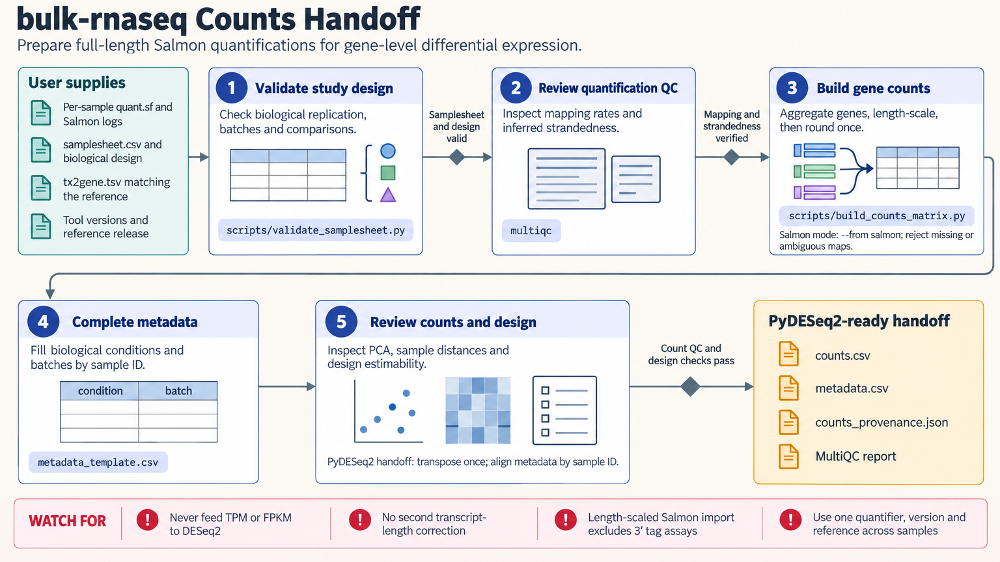

[All skill guides](README.md) / Bulk RNA-seq

# Bulk RNA-seq

**Prepare reproducible gene counts and sample metadata for a defensible expression comparison.**

The bulk RNA-seq skill covers the route from sequencing reads or quantification files to a validated gene-level count matrix. It guides sample checks, read quality control, reference selection, quantification, and the handoff to a separate differential-expression analysis. It supports an nf-core/rnaseq route and standalone workflows using tools such as STAR, featureCounts, and Salmon.

*RNA-seq reads or quantifications pass through quality checks and count assembly into a documented statistical handoff. [View the full-size workflow diagram](../images/bulk-rnaseq.png).*

## Questions this skill can help you explore

- **Are these samples ready for expression analysis?** Review replication, metadata, strandedness, and read quality.
- **How should reads be quantified consistently?** Select an upstream pipeline and matching references.
- **Can these outputs be combined for differential expression?** Assemble counts with explicit sample order and provenance.

## What you bring

Provide FASTQ files or supported quantification outputs, a sample sheet, and the study design. Include biological replicate identifiers, treatment, batch, pairing, library strandedness, and relevant quality information. State the organism and reference genome/transcriptome versions, and keep technical lanes distinguishable from independent biological samples.

## How the workflow works

1. **Validate samples and design.** Check identifiers, pairing, replication, confounding, and whether the planned comparison is estimable.
2. **Choose the processing route.** Use a pinned pipeline or a documented standalone alignment/quantification workflow with matching references.
3. **Inspect quality throughout.** Review reads and quantification diagnostics before proceeding to statistical interpretation.
4. **Build the count handoff.** Assemble the selected count representation, preserve sample order, and record import mode and source hashes.
5. **Prepare the next analysis.** Complete metadata and pass the count matrix to the appropriate differential-expression skill, followed by separately planned enrichment.

## What you get

| Output | What it helps you do |
| --- | --- |
| Quality-control and quantification records | Evaluate whether upstream data support further analysis. |
| Gene-by-sample counts | Supply a consistent input for count-based modeling. |
| Metadata template and provenance JSON | Preserve study structure, source hashes, and import decisions. |

## Example request

> Use the bulk RNA-seq skill to prepare these paired-end FASTQ samples for a treatment comparison. Check biological replication, strandedness, and batch metadata, choose a reproducible quantification route, and inspect quality reports. Export gene counts, a completed sample table, and reference provenance suitable for a separate PyDESeq2 analysis.

*This is an illustrative request, not a reported research result.*

## Interpreting the results

**Count preparation does not establish differential expression.** Statistical fitting must match the study design and account for biological variability. Technical lanes do not increase biological sample size, and a customary replicate count is not a power guarantee.

Different quantification routes produce different count representations. Length-scaled estimates must not receive a second length correction, and TPM values should not be substituted for count-model inputs. Keep gene identifiers and reference releases consistent through downstream mapping.

## Get started

The helper environment uses Python 3.11+, pandas, and NumPy; Salmon import also needs pytximport. Read processing needs Nextflow with suitable containers or separately installed bioinformatics tools. Installation and reference downloads need network access, while local count assembly requires no service credentials.

[Setup and technical instructions](../../skills/bulk-rnaseq/SKILL.md)
