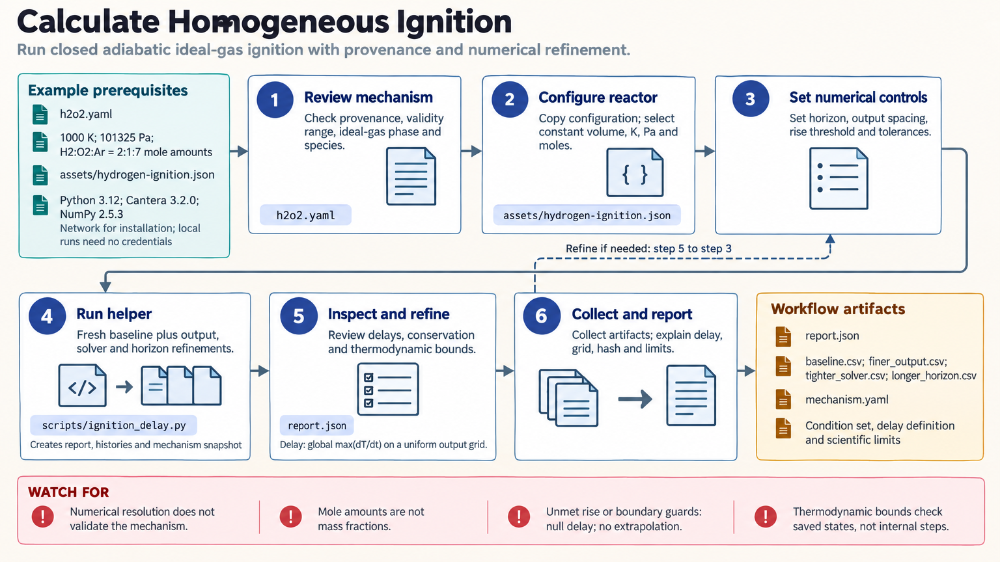

[All skill guides](README.md) / Cantera Homogeneous Ignition Calculations

# Cantera Homogeneous Ignition Calculations

**Simulate a defined ignition experiment and check whether its numerical delay estimate is resolved.**

This Cantera skill focuses on closed, adiabatic, homogeneous ideal-gas reactors at constant volume or constant pressure. It uses a specified kinetic mechanism to calculate temperature and species histories and a precisely defined temperature-based ignition delay. The bundled workflow includes conservation checks and deliberate numerical refinements, making assumptions and numerical limitations part of the reported result.

*Follow a reacting-system calculation from physical assumptions to a reviewed ignition-delay estimate. [View the full-size workflow diagram](../images/cantera.png).*

## Questions this skill can help you explore

- **What temperature history does this mechanism predict?** Simulate a defined initial mixture and reactor constraint.
- **When does the modeled ignition event occur?** Apply the stated maximum-heating-rate delay definition.
- **Is the reported delay numerically stable?** Compare output spacing, solver controls, and simulation horizon.

## What you bring

Provide the kinetic mechanism in Cantera YAML form, its source and applicability evidence, and initial temperature, pressure, and mole composition. Specify constant volume or pressure, tracked species, simulation duration, and a meaningful minimum temperature rise. Keep custom mechanism dependencies and rate-extension code with the input provenance.

## How the workflow works

1. **Review mechanism and physical scope.** Confirm species availability and whether the mechanism is appropriate for the fuel and conditions.
2. **Specify the initial state.** Use explicit units and mole amounts, then retain the normalized composition and reactor constraint.
3. **Run the baseline and refinements.** Compare finer output spacing, tighter solver settings, and a longer time horizon using fresh reactors.
4. **Inspect histories and checks.** Review mass, elemental and appropriate energy conservation, temperature bounds, and the location of the heating-rate maximum.
5. **Report the bounded result.** Save delay estimates, numerical changes, histories, settings, and mechanism provenance together.

## What you get

| Output | What it helps you do |
| --- | --- |
| Temperature and species history tables | Inspect the modeled course of ignition. |
| Delay estimates and refinement report | Assess sensitivity to numerical settings and horizon. |
| Mechanism snapshot and provenance | Reproduce the loaded chemical model and conditions. |

## Example request

> Use the Cantera skill to simulate this documented fuel mixture in a closed adiabatic constant-volume reactor. Use my specified mechanism and initial conditions, report the maximum-temperature-rise-rate ignition delay, and compare all numerical refinements. Save the histories and explain any conservation, horizon, or mechanism-validity limitations.

*This is an illustrative request, not a reported research result.*

## Interpreting the results

**Numerical agreement is not mechanism validation.** Conservation and refinement checks do not measure uncertainty in reaction rates or show that the model matches the actual experiment. Delay definitions based on temperature, species, or optical signals need not agree.

A missing delay can mean insufficient heating or an unresolved event within the chosen horizon; no later delay is extrapolated. This helper does not represent a flame, transport-resolved experiment, or general reactor network.

## Get started

The documented local environment uses Python 3.12–3.14, Cantera, and NumPy, with no service credentials or separate solver executable. Network access is needed for installation. A custom mechanism and all dependencies must be available locally for reproducible simulation.

[Setup and technical instructions](../../skills/cantera/SKILL.md)
