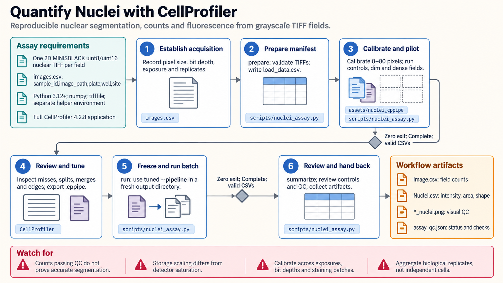

[All skill guides](README.md) / CellProfiler Quantitative Microscopy

# CellProfiler Quantitative Microscopy

**Measure nuclei in fluorescence images with a fixed pipeline and visible segmentation checks.**

This skill guides a bounded CellProfiler assay for nuclear segmentation, counts, and per-object fluorescence measurements. It connects image manifests, a reusable pipeline, headless batch execution, overlays, and measurement quality checks. The supplied assay expects one two-dimensional grayscale nuclear TIFF channel per field with bright nuclei on a dark background.

*Turn microscopy images into measurements with explicit segmentation and quality checks. [View the full-size workflow diagram](../images/cellprofiler.png).*

## Questions this skill can help you explore

- **How many nuclei are detected in each field?** Apply consistent segmentation and inspect missed or merged objects.
- **How do nuclear measurements vary?** Export per-object intensity, area, and shape measurements.
- **Is the batch analysis trustworthy?** Review acquisition metadata, saturation, controls, and segmentation overlays.

## What you bring

Bring supported uint8 or uint16 single-plane nuclear TIFFs and a manifest linking each field to sample, plate, well, and site. Include pixel size, exposure, gain, detector bit depth, staining batch, and biological replicate. Proprietary formats need explicit conversion; stacks, RGB images, and other assay types need a separately designed pipeline.

## How the workflow works

1. **Check acquisition and input identity.** Validate image properties and unique sample and field identifiers while preserving original intensity values.
2. **Calibrate the starter pipeline.** Set nuclear size and segmentation choices using representative controls, densities, dim images, and plate edges.
3. **Inspect overlays in a pilot.** Look for splits, merges, missed objects, and border exclusions before freezing the settings.
4. **Run the batch consistently.** Preserve the exact pipeline, input hashes, execution log, and engine completion status.
5. **Review measurements and controls.** Check counts, areas, intensity ranges, saturation, and biological replicate structure before interpreting conditions.

## What you get

| Output | What it helps you do |
| --- | --- |
| Image and nucleus measurement tables | Analyze field counts and individual nuclear measurements. |
| Segmentation overlays | Visually assess what the pipeline measured. |
| Pipeline and quality-control artifacts | Trace settings, inputs, execution status, and flagged measurements. |

## Example request

> Use the CellProfiler skill to quantify nuclei in these fluorescence images. Build a manifest with plate, well, field, and replicate information, pilot the segmentation across representative controls, and inspect overlays before processing the batch. Export counts and nuclear fluorescence measurements, flag saturation and segmentation problems, and retain the exact pipeline.

*This is an illustrative request, not a reported research result.*

## Interpreting the results

**Plausible counts do not prove correct segmentation.** Review overlays and independently annotated fields, and report boundary exclusions and segmentation errors. Cells within one well do not substitute for independent biological replicates.

Intensity depends on storage scaling and acquisition conditions. The starter pipeline does not automatically correct illumination or subtract background, and its storage-maximum check can miss detector saturation below that maximum. Comparisons across exposure, gain, bit depth, or staining need explicit calibration.

## Get started

Helpers use Python 3.12+, NumPy, and tifffile. Actual segmentation requires a separate compatible CellProfiler application or container; preparing inputs and summarizing outputs can run without that engine. Network access is needed for installation, and the local workflow requires no service credentials.

[Setup and technical instructions](../../skills/cellprofiler/SKILL.md)
