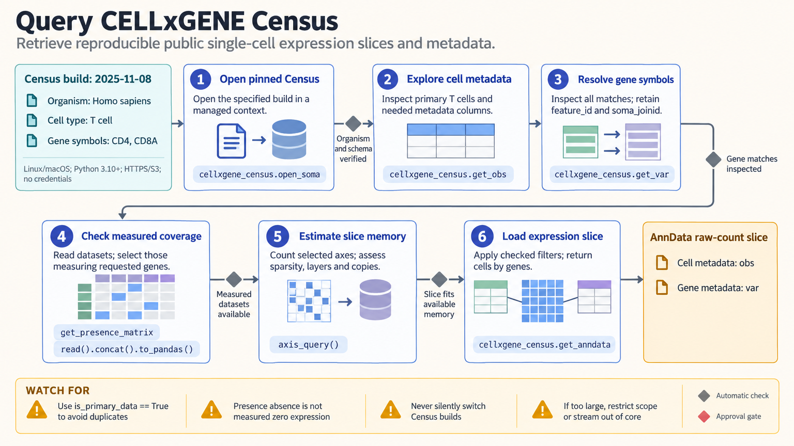

[All skill guides](README.md) / CZ CELLxGENE Census

# CZ CELLxGENE Census

**Query public single-cell reference data without first downloading entire studies.**

The CELLxGENE Census skill provides programmatic access to versioned public single-cell and supported spatial transcriptomics data. It helps explore available metadata, select relevant tissues or cell populations, retrieve expression slices, and locate source datasets. The workflow is intended for reference comparisons and population-scale data access; analysis of a researcher’s own dataset belongs in a separate analysis workflow.

*A pinned Census release is explored, filtered, and queried to retrieve documented metadata and expression subsets. [View the full-size workflow diagram](../images/cellxgene-census.png).*

## Questions this skill can help you explore

- **Which reference cells are available for my question?** Explore organism, tissue, disease, assay, and cell-type metadata.
- **How is a gene represented in a selected population?** Retrieve a bounded expression slice with dataset context.
- **Where did these records originate?** Locate source datasets and their downloadable H5AD files.

## What you bring

Bring a biological question, organism, relevant tissue or cell type, and gene identifiers appropriate to the dataset. Specify any disease, assay, or donor restrictions and whether you need metadata, expression, embeddings, or spatial information. Define an intended release and a memory budget before requesting a large matrix.

## How the workflow works

1. **Select a reproducible release.** Record the Census version rather than relying on a moving alias.
2. **Explore metadata first.** Inspect available categories and dataset coverage before constructing an expression query.
3. **Define the cell and feature filters.** Use primary-data filtering to avoid duplicate cells and request only needed metadata columns.
4. **Check query size and feature presence.** Estimate memory needs and distinguish genes absent from a dataset’s measured feature set.
5. **Retrieve and preserve context.** Export the selected data with release, filters, dataset identifiers, and relevant donor and assay metadata.

## What you get

| Output | What it helps you do |
| --- | --- |
| Filtered cell and dataset metadata | Assess what public reference evidence is available. |
| Expression or embedding subsets | Prepare bounded reference comparisons or downstream analyses. |
| Source dataset locations and provenance | Trace retrieved data back to the contributing studies. |

## Example request

> Use the CELLxGENE Census skill to find a versioned human lung reference for my epithelial-cell analysis. Explore available datasets first, select primary cells with suitable metadata, and retrieve only the genes needed for my marker comparison. Preserve donor and source-dataset information and flag features that were not measured in contributing datasets.

*This is an illustrative request, not a reported research result.*

## Interpreting the results

**A large collection does not remove study heterogeneity.** Donors, assays, processing, and annotation practices can differ across datasets. Cell labels are source annotations rather than independently validated identities for a new question.

Zero expression and an unmeasured gene are different situations. Duplicate representations and related cells can distort comparisons if primary-data and replicate structure are ignored. Reference retrieval supplies inputs; an appropriate statistical analysis is still needed for scientific inference.

## Get started

The documented workflow uses Linux or macOS, Python 3.10+, cellxgene-census, and compatible TileDB-SOMA, with public HTTPS and S3 network access. No Census credentials are required. Spatial export and machine-learning workflows add their own optional dependencies, and query size must fit the available resources.

[Setup and technical instructions](../../skills/cellxgene-census/SKILL.md)
