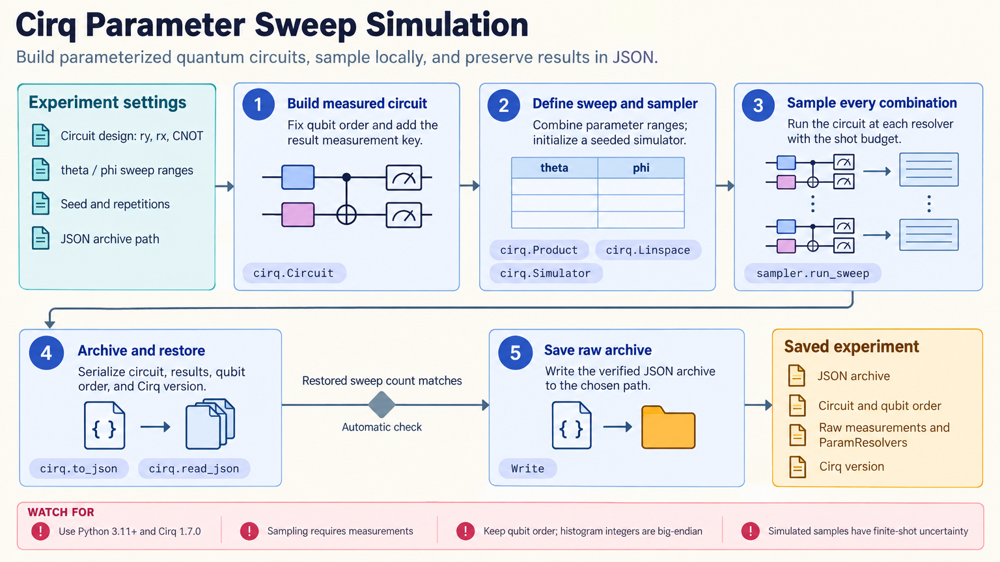

[All skill guides](README.md) / Cirq Quantum Computing

# Cirq Quantum Computing

**Design and evaluate quantum circuits with explicit attention to hardware and noise.**

Cirq helps construct quantum circuits, simulate their behavior, sweep parameters, and transform operations into forms suitable for a selected device. This skill covers local simulation, noise studies, hardware-oriented circuit design, and characterization experiments. It also describes provider integrations, while keeping local simulator evidence separate from successful execution on a physical quantum processor.

*Quantum circuits are constructed, checked in simulation, adapted to device constraints, and evaluated under explicit noise assumptions. [View the full-size workflow diagram](../images/cirq.png).*

## Questions this skill can help you explore

- **Does this circuit implement the intended operation?** Inspect ideal simulation before running larger experiments.
- **How does noise change the observable?** Compare specified noise models and measurement outcomes.
- **Can this circuit run on the selected hardware?** Review gates, connectivity, compilation, and provider requirements.

## What you bring

Provide the scientific or algorithmic objective, circuit description, qubit requirements, observables, and parameter ranges. State whether the task is ideal simulation, noisy simulation, or hardware execution. For device work, identify the assigned target and its constraints, access credentials, shot budget, and relevant calibration information.

## How the workflow works

1. **Represent the experiment.** Build circuits with clear qubit identities, operations, measurement keys, and parameter symbols.
2. **Check ideal behavior.** Use a suitable simulator to verify small cases and expected observables.
3. **Model the intended conditions.** Add a stated noise model or transform the circuit for the selected hardware gates and connectivity.
4. **Run controlled comparisons.** Execute parameter sweeps or characterization procedures with documented repetitions and seeds where supported.
5. **Interpret and preserve results.** Retain compiled circuits, measurement records, noise assumptions, target details, and uncertainty estimates.

## What you get

| Output | What it helps you do |
| --- | --- |
| Circuit and parameter-sweep definitions | Make the experiment reproducible and inspectable. |
| Simulation or measurement results | Evaluate observables under stated execution conditions. |
| Noise and hardware comparisons | Assess how implementation choices affect the experiment. |

## Example request

> Use the Cirq skill to build a parameterized circuit for this observable and verify it on a small ideal simulator. Then compare two explicitly specified noise models over the same parameter grid. Report measurement uncertainty, save the circuits and settings, and identify what would need checking before execution on my assigned hardware target.

*This is an illustrative request, not a reported research result.*

## Interpreting the results

**Simulator behavior depends on the model being simulated.** A simple noise channel cannot represent every device effect, and an ideal result does not establish useful performance on hardware. Shot noise, calibration drift, and compilation can all change the comparison.

Validate mitigation against separate calibration evidence and uncertainty. Provider access, target names, and supported package versions also need checking at execution time; local examples do not establish that a cloud processor is available.

## Get started

The documented local environment uses Python 3.11+ and Cirq, without cloud credentials. Hardware execution needs the provider-specific package, credentials, network access, and an assigned target. Some integrations, including the described Azure route, require a separate compatibility environment rather than the same package stack.

[Setup and technical instructions](../../skills/cirq/SKILL.md)
