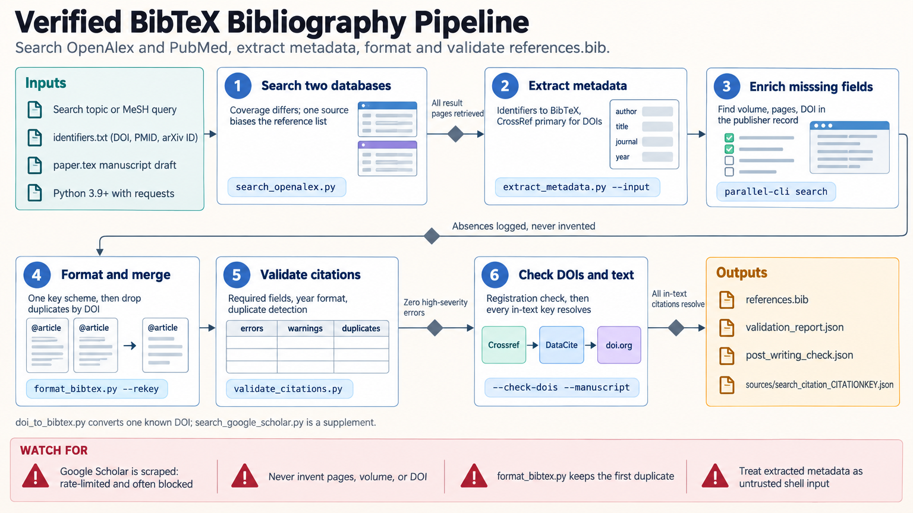

[All skill guides](README.md) / Citation Management

# Citation Management

**Build a reference list whose bibliographic details can be checked and reused.**

This skill helps discover papers, resolve identifiers to publication metadata, fill genuine metadata gaps, format BibTeX, and check citations against a manuscript. It treats the reference list as a traceable research artifact rather than a set of plausible-looking strings. The workflow uses scholarly databases and publisher records while preserving the actual publication state of each item.

*Paper discovery and identifier resolution lead to verified metadata, consistent BibTeX, and manuscript citation checks. [View the full-size workflow diagram](../images/citation-management.png).*

## Questions this skill can help you explore

- **Which paper does this identifier refer to?** Resolve DOIs, PubMed identifiers, arXiv records, or suitable publication URLs.
- **Are my references complete and accurate?** Check authors, titles, venues, dates, and available publication fields.
- **Does the bibliography match the manuscript?** Find unresolved citations, duplicates, and malformed entries.

## What you bring

Provide a research topic, list of identifiers, existing bibliography, or manuscript containing citation keys. State the intended venue or citation style and whether the task is discovery, correction, deduplication, or formatting. Preserve any source notes that explain how a reference supports a manuscript claim.

## How the workflow works

1. **Discover relevant records.** Use appropriate sources with awareness of their different disciplinary coverage.
2. **Resolve publication metadata.** Retrieve identifier-based records and match duplicates by DOI and bibliographic identity rather than citation key alone.
3. **Investigate missing fields.** Check publisher or complementary database records, preserving article numbers and online-first status when appropriate.
4. **Format consistently.** Produce BibTeX entries with suitable entry types and stable citation keys while keeping source files intact unless an edit is requested.
5. **Validate the handoff.** Check required fields, malformed dates, duplicate identities, and correspondence between manuscript citations and bibliography entries.

## What you get

| Output | What it helps you do |
| --- | --- |
| Verified bibliographic records | Identify the publication being cited with less ambiguity. |
| Clean BibTeX bibliography | Support reproducible manuscript and document preparation. |
| Citation audit and unresolved items | Show which references still need source verification or editing. |

## Example request

> Use the citation-management skill to audit this manuscript and BibTeX file. Resolve each DOI, check incomplete records against publisher metadata, merge genuine duplicates, and identify unresolved manuscript keys. Preserve article numbers and online-first status, and keep an audit trail for every correction rather than inventing unavailable pages or volume numbers.

*This is an illustrative request, not a reported research result.*

## Interpreting the results

**An accurate citation does not establish that a claim is supported.** Bibliographic validation checks publication identity and completeness; scientific interpretation still requires reading the relevant evidence. Search coverage can also bias a reference list, so discovery should use sources appropriate to the field.

Missing pages, volumes, or DOIs may reflect a legitimate publication state. Citation-count heuristics are editorial aids rather than universal submission requirements. Google Scholar access can be unreliable and is supplementary in the documented workflow.

## Get started

The bundled workflow uses Python 3.9+ and requests, with scholarly added only for Google Scholar searching. Metadata retrieval needs network access to the selected publication services. Contact information and optional NCBI or OpenAlex keys support service identification and applicable quotas; they are not required for every route.

[Setup and technical instructions](../../skills/citation-management/SKILL.md)
