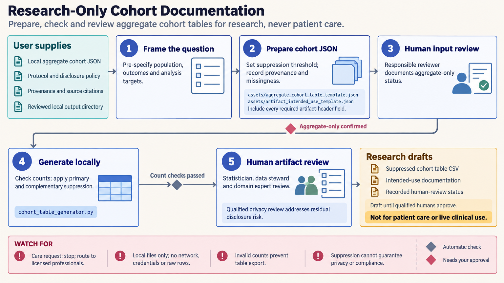

[All skill guides](README.md) / Clinical Decision-Support Research and Evaluation

# Clinical Decision-Support Research and Evaluation

**Prepare transparent research evaluation and governance artifacts from aggregate or synthetic information.**

This skill supports the documentation around clinical decision-support research: intended use, cohort summaries, survival-analysis plans, aggregate model evaluation, evidence profiles, and governance review. It operates on local aggregate or synthetic inputs and produces draft artifacts with explicit provenance and review roles. Its scope excludes patient care, person-level classification, treatment recommendations, and live clinical operation.

*Aggregate research inputs support documented evaluation plans, evidence checks, and qualified human governance review. [View the full-size workflow diagram](../images/clinical-decision-support.png).*

## Questions this skill can help you explore

- **What exactly is the research artifact intended to evaluate?** State the population, outcome, decision role, and limitations.
- **Is aggregate model evaluation clearly documented?** Review denominators, subgroup support, calibration, uncertainty, and validation status.
- **What remains for qualified review?** Make privacy, methodology, governance, and evidence gaps visible.

## What you bring

Bring aggregate or synthetic information confirmed by the responsible human reviewer, a defined research purpose, source citations, and the proposed artifact type. Provide data-cut dates, population definitions, exclusions, missingness, transformations, and prespecified disclosure rules. Patient rows, narratives, identifiers, images, waveforms, and genomic sequences are outside the input contract.

## How the workflow works

1. **Frame the research question.** Define the estimand or evaluation target, distinguishing descriptive, prognostic, predictive, diagnostic-accuracy, and causal aims.
2. **Choose the appropriate artifact.** Select an intended-use template, evidence profile, aggregate table, analysis plan, or traceability matrix.
3. **Document assumptions and boundaries.** Include population scope, prohibited uses, foreseeable failures, source versions, and external-validation status.
4. **Run local consistency checks.** Inspect required declarations, aggregate structure, and internal relationships without sending source data to services.
5. **Arrange qualified review.** Preserve draft status and identify the methodological, domain, privacy, and governance decisions still required.

## What you get

| Output | What it helps you do |
| --- | --- |
| Research evaluation and analysis-plan drafts | Make objectives, assumptions, and limitations explicit. |
| Aggregate tables and evidence-profile checks | Inspect declared evidence and internal consistency. |
| Governance and traceability artifacts | Record ownership, review, change control, and unresolved requirements. |

## Example request

> Use this skill to review a synthetic, aggregate evaluation package for a clinical prediction research project. Check the intended-use statement, subgroup sample sizes, uncertainty reporting, validation status, and source traceability. Produce draft governance and evaluation artifacts marked “Not for patient care or live clinical use,” with a clear list of qualified reviews still needed.

*This is an illustrative request, not a reported research result.*

## Interpreting the results

**Passing a script is not evidence of clinical utility or authorization.** The tools check declared fields and internal consistency; they do not establish privacy, study quality, effectiveness, or compliance. Evidence-profile certainty ratings require reasoned human assessment, not automatic inference from keywords or p-values.

Aggregate predictive values and calibration depend on sampling and prevalence. Selected or enriched samples do not automatically represent the intended population, and no person-level prediction or care decision is produced.

## Get started

The bundled tools use Python 3.11+ and the standard library. They operate on bounded local files without network access, credentials, API keys, model calls, or image services. The technical source contains the exact input restrictions, artifact headers, and review responsibilities.

[Setup and technical instructions](../../skills/clinical-decision-support/SKILL.md)
