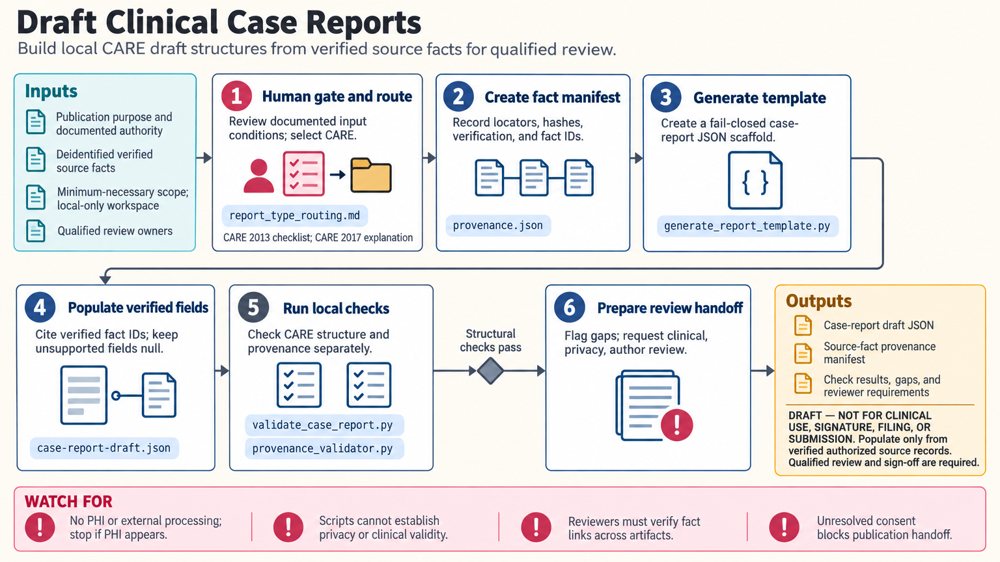

[All skill guides](README.md) / Clinical and Research Report Drafts

# Clinical and Research Report Drafts

**Organize verified facts into reviewable report structures with explicit source traceability.**

The clinical-reports skill creates draft scaffolds for case, diagnostic, trial, safety, and aggregate research reporting. It helps route the artifact to an appropriate reporting framework and run deterministic structural checks. Content comes only from authorized, verified source facts; the skill does not interpret raw clinical observations, make diagnoses, or supply treatment decisions.

*Verified source facts populate draft report structures that undergo consistency checks and qualified review. [View the full-size workflow diagram](../images/clinical-reports.png).*

## Questions this skill can help you explore

- **Which report structure fits the intended artifact?** Distinguish case reports, trial results, protocols, and other supported drafts.
- **Can each populated field be traced to a verified fact?** Maintain a source-fact manifest and unresolved-content markers.
- **What needs human review before use?** Identify structural gaps, missing support, and responsible reviewers.

## What you bring

Provide the explicit reporting purpose, authorized synthetic, de-identified, or aggregate inputs, and a verified source-fact manifest. Identify the qualified review owner and minimum necessary information. The manifest records local source locators and verification metadata; declarations alone do not establish permission, de-identification, or reviewer qualifications.

## How the workflow works

1. **Select the report route.** Match the artifact to its study design, reporting guidance, and applicable institutional context.
2. **Establish provenance.** Give every supported fact an identifier with documented verification information, keeping source records separate from the draft.
3. **Create the draft scaffold.** Populate only fields supported by verified facts and leave missing or unassessed content explicit.
4. **Run bounded local checks.** Check structure, terminology schema, aggregate-table consistency, and provenance relationships using the appropriate helpers.
5. **Hand off for review.** Retain draft status and route clinical, statistical, safety, privacy, or regulatory matters to qualified reviewers.

## What you get

| Output | What it helps you do |
| --- | --- |
| Draft report templates | Provide an organized structure for verified content. |
| Source-fact and review manifests | Trace populated fields and identify missing support. |
| Deterministic check reports | Expose structural and internal consistency issues before review. |

## Example request

> Use the clinical-reports skill to organize an aggregate trial-results draft from this verified source-fact manifest and approved analysis tables. Select the appropriate report structure, populate only supported fields, preserve missing and not-assessed values, and run consistency checks. Return a draft with fact identifiers and the statistical and reporting reviews still required.

*This is an illustrative request, not a reported research result.*

## Interpreting the results

**A well-formed report is not an independently verified clinical interpretation.** The checks do not diagnose, assess causality or seriousness, establish regulatory compliance, or determine whether an individual case is reportable. Qualified reviewers author and approve those judgments.

Every populated claim needs actual source support. Hashes are integrity metadata rather than de-identification, and checking an identifier’s shape does not prove that its cited fact exists or matches the source. Cross-artifact and source review remain necessary.

## Get started

Optional helpers run locally with Python 3.11+ and the standard library, without credentials or network-based data processing. Current public reporting guidance may need separate source review. The source skill describes the accepted data classes, report routing, provenance checks, and required human handoff.

[Setup and technical instructions](../../skills/clinical-reports/SKILL.md)
