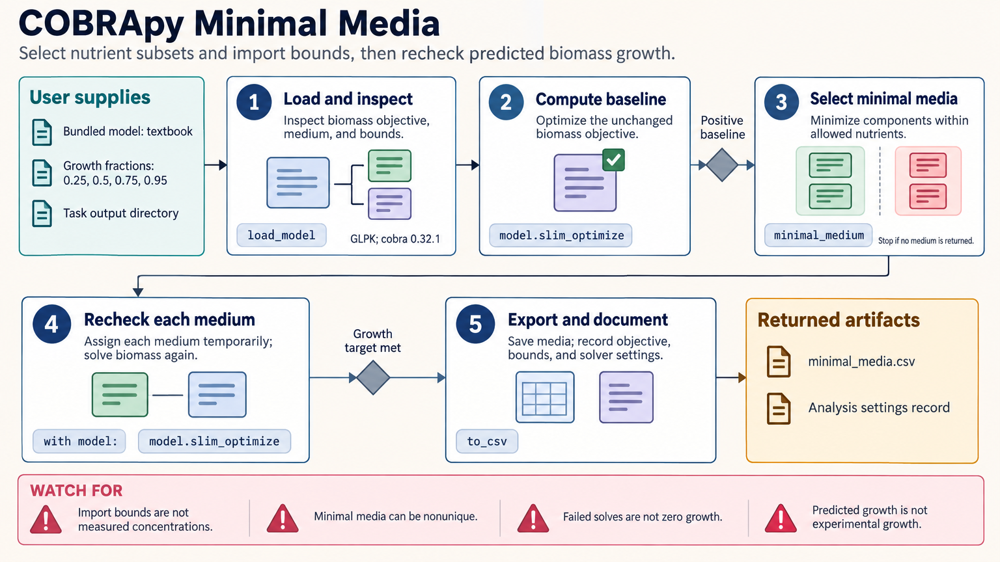

[All skill guides](README.md) / COBRApy Metabolic Modeling

# COBRApy Metabolic Modeling

**Explore what a metabolic network can do under explicit steady-state constraints.**

COBRApy represents metabolism as reactions, metabolites, genes, and bounds on feasible fluxes. This skill guides flux balance analysis, variability analysis, knockout screens, growth-media exploration, sampling, production envelopes, and model-building checks. It helps turn a metabolic reconstruction into clearly stated predictions and engineering hypotheses, while keeping the assumptions behind the objective and constraints visible.

*A reviewed metabolic model and environmental constraints lead to flux predictions, variability, and testable design hypotheses. [View the full-size workflow diagram](../images/cobrapy.png).*

## Questions this skill can help you explore

- **What flux patterns support the chosen objective?** Compare optimization and variability under stated bounds.
- **Which model genes or nutrients affect predicted growth?** Explore knockouts and medium constraints.
- **Where does the reconstruction need investigation?** Examine infeasibility, missing chemistry, and gap-filling candidates.

## What you bring

Bring a metabolic reconstruction, preferably with provenance and SBML annotations, plus the organism and scientific question. Specify exchange bounds, environmental assumptions, objective, and available experimental constraints. Include evidence for reaction directionality, formulas, charges, and any changes made to the source model.

## How the workflow works

1. **Inspect the reconstruction.** Review identifiers, stoichiometry, chemistry, boundary reactions, and objective before optimization.
2. **Set the feasible problem.** Define medium bounds and additional constraints in units consistent with the model.
3. **Compare flux solutions.** Use FBA, parsimonious FBA, and FVA to distinguish one optimum from the range of feasible alternatives.
4. **Explore perturbations or sampling.** Apply knockouts, medium changes, or feasible-space sampling while holding the intended comparison constraints fixed.
5. **Export hypotheses and checks.** Retain solver status, modified models, flux tables, provenance, and biological limitations.

## What you get

| Output | What it helps you do |
| --- | --- |
| Flux and variability tables | Inspect model predictions and alternative feasible states. |
| Knockout, medium, and production summaries | Prioritize model-based experimental hypotheses. |
| Validated model exports and provenance | Preserve the exact assumptions behind each comparison. |

## Example request

> Use the COBRApy skill to examine growth and product formation in this metabolic reconstruction. Check the objective and exchange constraints, compare FBA with FVA, and evaluate candidate knockouts at a common growth requirement. Save solver statuses and modified models, and explain which engineering suggestions depend strongly on unmeasured bounds.

*This is an illustrative request, not a reported research result.*

## Interpreting the results

**A feasible optimum is a model prediction rather than a measured flux state.** FBA does not infer kinetics or establish experimental growth, thermodynamic feasibility, or identifiability. Individually optimized FVA bounds need not be jointly achievable.

Medium values are import bounds rather than measured concentrations. Feasible-space samples are not biological confidence intervals, and failed solves must remain distinct from zero growth. Gap-filled reactions are hypotheses requiring chemical, energetic, and experimental support.

## Get started

The local workflow uses Python 3.9+ and the cobra package, with a compatible optimization solver. GLPK is available through swiglpk; commercial solvers require separate installation and licensing. Local bundled examples work offline, while remote model retrieval needs network access. Preserve downloaded source models for replay.

[Setup and technical instructions](../../skills/cobrapy/SKILL.md)
