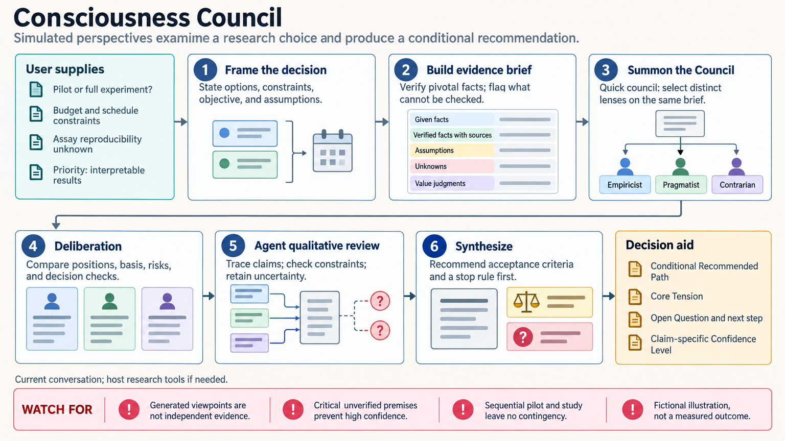

[All skill guides](README.md) / Consciousness Council

# Consciousness Council

**Compare research choices through explicit assumptions, evidence, and competing priorities.**

This skill structures a requested council-style discussion around a difficult decision. It generates several thinking perspectives, each emphasizing different assumptions or values, then synthesizes a conditional recommendation and a useful next step. The perspectives are simulated viewpoints from one system; their agreement adds no independent evidence and does not substitute for scientific review.

*A shared evidence brief supports contrasting decision perspectives, explicit trade-offs, and a conditional next step. [View the full-size workflow diagram](../images/consciousness-council.png).*

## Questions this skill can help you explore

- **Should I run a pilot or commit to a larger study?** Compare uncertainty, cost, and what each option would teach.
- **Which assumption most affects this decision?** Challenge the premise behind the leading option.
- **Where do reasonable priorities differ?** Separate factual disagreement from differences in risk tolerance or objectives.

## What you bring

Bring the decision, feasible options, constraints, objective, and the evidence already available. State budget, timing, scientific priorities, and what would make an outcome unacceptable. Identify information that is uncertain or unavailable. The exercise is most useful when choices involve real trade-offs rather than a factual question with one readily verifiable answer.

## How the workflow works

1. **Frame the decision.** Define options, including delay or additional information gathering where relevant, and establish the user’s priorities.
2. **Prepare a shared evidence brief.** Separate supplied facts, verified facts, assumptions, unknowns, and value judgments.
3. **Generate distinct perspectives.** Examine the same brief through complementary lenses without inventing opposing evidence.
4. **Test consequential assumptions.** Identify what would change the recommendation and verify facts that materially affect the choice.
5. **Synthesize conditionally.** Explain supported agreement, unresolved differences, decision criteria, and a practical next step.

## What you get

| Output | What it helps you do |
| --- | --- |
| Evidence and assumptions brief | Clarify what the decision actually rests on. |
| Structured perspective comparison | Expose different priorities and fragile premises. |
| Conditional recommendation and next step | Choose an action while keeping uncertainty visible. |

## Example request

> Use the Consciousness Council skill to compare a small assay pilot with immediate execution of the full study. Work from my budget, timeline, and existing validation evidence. Separate facts from assumptions and priorities, test whether the pilot could change the decision, and recommend a next step with explicit conditions that would reverse the recommendation.

*This is an illustrative request, not a reported research result.*

## Interpreting the results

**Generated perspectives are a reasoning aid rather than independent experts.** A vote, repeated assertion, or apparently persuasive voice cannot validate a scientific claim. Consequential claims must trace to supplied evidence or separately verified sources.

Do not manufacture disagreement where the evidence is clear. A conditional recommendation should distinguish confidence in the proposed next action from confidence in the eventual research outcome, especially when a critical premise remains unverified.

## Get started

The exercise runs in the conversation and has no bundled code, service API, account, or credential requirement. It does not create hosted council sessions or persistent memories. Factual verification uses whatever appropriate research tools the host provides, with network access needed only when those sources require it.

[Setup and technical instructions](../../skills/consciousness-council/SKILL.md)
