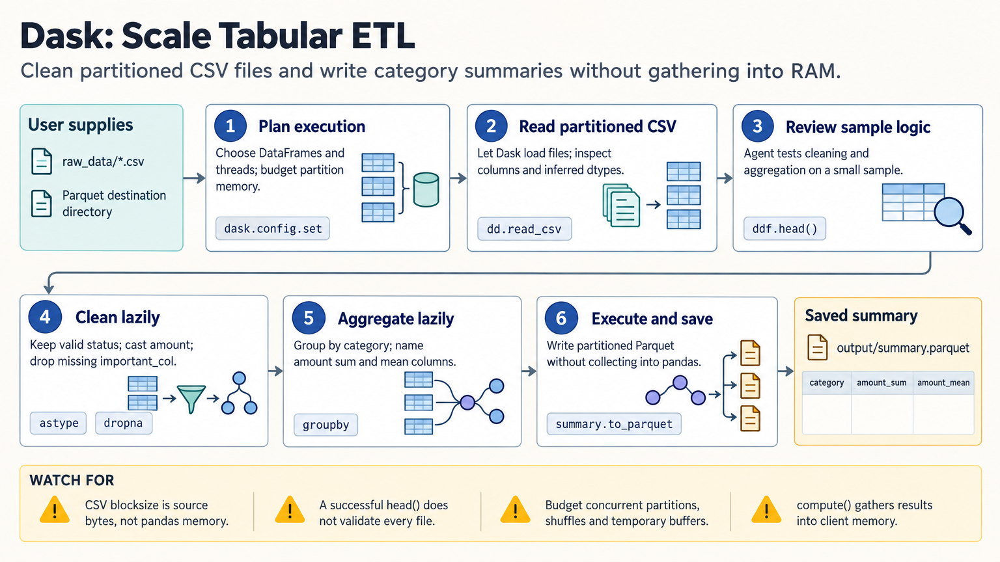

[All skill guides](README.md) / Dask

# Dask

**Process research data in manageable pieces or parallel tasks when one in-memory calculation is insufficient.**

Dask extends familiar Python table and array workflows with partitioned computation and task scheduling. This skill helps choose between DataFrames, Arrays, Bags, and Futures, plan chunk sizes, run computations locally or on a cluster, and diagnose memory or scheduling problems. It is a computational scaling aid; the scientific analysis still needs a valid algorithm and study design.

*Research computations are divided into bounded partitions or tasks, scheduled, monitored, and written to reusable outputs. [View the full-size workflow diagram](../images/dask.png).*

## Questions this skill can help you explore

- **Can I analyze files larger than available memory?** Design partitioned reads and bounded intermediate results.
- **Which independent tasks can run together?** Express dependencies without duplicating expensive work.
- **Why is a parallel analysis slow or unstable?** Inspect task sizes, data movement, worker memory, and scheduler diagnostics.

## What you bring

Provide representative input files, the intended calculation, expected dimensions and data types, and available CPU, memory, storage, and cluster resources. Explain which operations require global communication or full-array access. A small working reference calculation helps verify that the distributed version preserves the intended results.

## How the workflow works

1. **Assess whether partitioning helps.** Identify the actual memory or execution bottleneck and a suitable Dask collection.
2. **Choose file and chunk layout.** Align partitions with storage and the computation while allowing space for intermediate arrays and concurrent tasks.
3. **Build a lazy computation.** Define transformations and dependencies before triggering execution, minimizing unnecessary transfers and repeated work.
4. **Pilot and monitor.** Compare a small subset with the reference calculation and inspect worker memory, task duration, and graph size.
5. **Scale and save deliberately.** Materialize bounded results or write partitioned outputs, then close clients and retain the computational configuration.

## What you get

| Output | What it helps you do |
| --- | --- |
| Partitioned analysis workflow | Run defined calculations without loading all input at once. |
| Distributed outputs and diagnostics | Inspect results alongside memory and task behavior. |
| Resource and execution configuration | Reproduce how the calculation was scheduled. |

## Example request

> Use the Dask skill to aggregate these large research tables by sample and time window. Start with a representative subset, verify the result against the existing pandas calculation, and choose partitions that fit the available memory. Save partitioned output and explain any costly shuffles or operations that still require a large materialized result.

*This is an illustrative request, not a reported research result.*

## Interpreting the results

**Parallel execution is not an automatic speedup or a scientific validation.** Small tasks can spend more time in scheduling than calculation, while shuffles and oversized intermediates can exhaust memory despite partitioned input. Results can also depend on reduction order or algorithmic changes.

Calling a computation that returns a large result can still overwhelm the client. Preserve the original analytical assumptions, check numerical agreement at an appropriate tolerance, and size concurrency according to actual worker memory.

## Get started

The documented environment uses Python 3.10+ and Dask. DataFrame workflows require pandas and PyArrow; arrays, storage formats, and cluster deployment add relevant dependencies. Local execution requires no service credentials. Remote object stores need their filesystem adapters, network access, and credentials when the data are private.

[Setup and technical instructions](../../skills/dask/SKILL.md)
