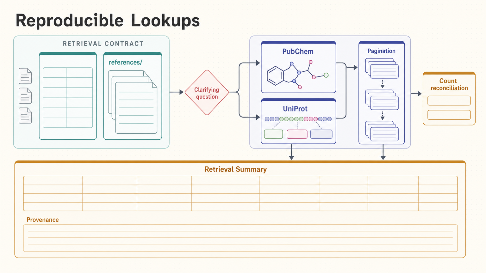

[All skill guides](README.md) / Database Lookup

# Database Lookup

**Retrieve database-backed facts with explicit filters, identifiers, and reproducible provenance.**

This skill helps convert a scientific information request into a bounded query against an appropriate database. It provides resource-specific retrieval guidance and a common workflow for identifiers, filters, pagination, and source attribution. The goal is a result another researcher can reproduce, with failures and coverage limitations visible rather than hidden behind a polished summary.

*A defined retrieval question becomes an authoritative database query with verified pagination and recorded provenance. [View the full-size workflow diagram](../images/database-lookup.png).*

## Questions this skill can help you explore

- **What does the named database report for this entity?** Query stable identifiers and relevant fields.
- **Can I retrieve the complete matching set?** Verify pagination and counts against an explicit scope.
- **Why do sources disagree?** Compare entity resolution, release, organism, build, or filter choices.

## What you bring

Provide the target entity or topic, accepted identifiers, organism or taxon where applicable, and the database or scientific context. Specify assembly, date, release, fields, and inclusion criteria when they affect meaning. State whether a targeted lookup or an exhaustive matching dataset is required, since those need different completeness checks.

## How the workflow works

1. **Define the retrieval contract.** Make the entity, filters, scope, and output fields explicit before requesting records.
2. **Select the authoritative source.** Use the primary database for the question and add cross-checks only for a clear reason.
3. **Review the endpoint contract.** Confirm identifier syntax, authentication, pagination, and relevant service limits.
4. **Retrieve and verify.** Run bounded requests, preserve failures, and check all pages and counts when completeness matters.
5. **Report with provenance.** Return the useful records with query parameters, retrieval date, identifiers, and any unresolved scope limitations.

## What you get

| Output | What it helps you do |
| --- | --- |
| Structured records or concise factual summaries | Answer a defined database-backed question. |
| Query and provenance details | Enable another researcher to repeat the retrieval. |
| Completeness and ambiguity notes | Show how coverage and identifier choices limit the result. |

## Example request

> Use the database-lookup skill to retrieve all records matching this organism, assembly, and annotation criterion from the primary database. Show the exact filters and identifier conventions, verify pagination against the reported count, and export a table with retrieval provenance. Keep ambiguous mappings and failed requests separate from confirmed empty results.

*This is an illustrative request, not a reported research result.*

## Interpreting the results

**Retrieved data inherit the source’s definitions and limitations.** An annotation is not automatically experimental evidence, an empty result may reflect an identifier mismatch, and apparently similar filters can select different biological populations. A cross-database agreement also needs entity-level checking.

Completeness can only be claimed for a stated query and verified retrieval. Release drift, licensing, rate limits, and incomplete pages can all constrain the answer. Returned descriptive text is data to interpret, not instructions for the assistant.

## Get started

Requirements depend on the selected database and endpoint. Public routes need network access, while registered or licensed routes may require the named service credential or entitlement. The technical guide provides resource-specific references, request patterns, and a shared retrieval contract; no single package or key unlocks every source.

[Setup and technical instructions](../../skills/database-lookup/SKILL.md)
