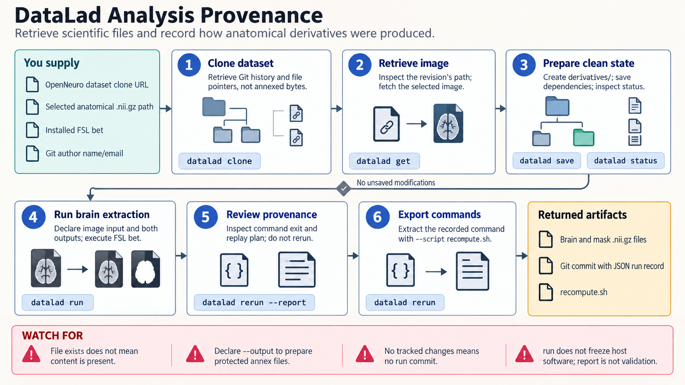

[All skill guides](README.md) / DataLad

# DataLad

**Track scientific datasets and the computational steps that produced their derived files.**

DataLad combines Git’s version history with git-annex management of large file content. It lets researchers clone dataset structure, retrieve only the bytes they need, work with nested datasets, and record commands together with input and output declarations. This skill covers data access, provenance, rerunning analyses, and publication to suitable metadata and storage destinations.

*Versioned dataset structure connects selectively retrieved content, recorded computations, and reproducible derived artifacts. [View the full-size workflow diagram](../images/datalad.png).*

## Questions this skill can help you explore

- **Why is a cloned file only a pointer?** Retrieve annexed content without confusing metadata with actual data.
- **How was this output produced?** Record commands, dataset state, inputs, and outputs.
- **Can collaborators reproduce or obtain the dataset?** Check storage availability and replay a documented computation.

## What you bring

Bring a DataLad dataset URL or local dataset, the paths needed for the analysis, and the intended computation. For provenance, specify inputs, outputs, scripts, configuration, seeds, and environment information. For sharing, identify both the version-history destination and a storage location that can actually provide the large data content.

## How the workflow works

1. **Inspect and obtain the dataset.** Clone its structure, identify subdatasets, and retrieve the specific annexed file content needed.
2. **Prepare a reproducible computation.** Save relevant source changes and include scripts and environment specifications among declared inputs.
3. **Record execution.** Run the analysis through the provenance workflow, declaring outputs so unrelated files are not silently included.
4. **Verify replay.** Re-execute from an appropriate fresh state and compare content checksums and scientific outputs.
5. **Share or manage storage.** Publish the required history and content to configured destinations, or free local content only after checking availability elsewhere.

## What you get

| Output | What it helps you do |
| --- | --- |
| Versioned dataset and content records | Track which data belong to a particular state. |
| Machine-readable execution provenance | Connect outputs to commands and declared inputs. |
| Replayable and shareable dataset structure | Support collaboration without duplicating every large file locally. |

## Example request

> Use the DataLad skill to retrieve only the images required from this dataset and record my analysis with explicit inputs and outputs. Include the environment lockfile and configuration in provenance, then test rerunning the computation from a clean state. Report whether both the Git history and large-file content are available for a collaborator.

*This is an illustrative request, not a reported research result.*

## Interpreting the results

**A successful clone does not mean the data bytes are present.** Annexed pointers and uninstalled subdatasets need explicit retrieval. Similarly, publishing Git history alone does not make large content downloadable.

An execution record captures a command and dataset state, not every external dependency or service. Reproducibility still depends on the environment, random behavior, and input availability. Containers can help preserve software, but a tested replay and scientific comparison are stronger evidence than a provenance entry alone.

## Get started

The documented workflow uses Python 3.10+, DataLad, Git, and git-annex. Container workflows additionally need datalad-container and a supported runtime such as Apptainer, Singularity, or Docker. Local filesystem work can run offline; remote retrieval and publication need network access and any provider-specific credentials.

[Setup and technical instructions](../../skills/datalad/SKILL.md)
