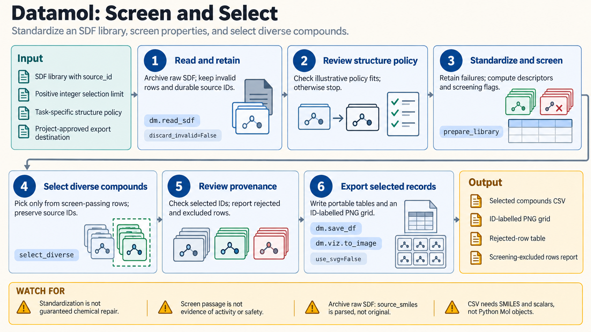

[All skill guides](README.md) / Datamol

# Datamol

**Prepare and explore molecular collections through a convenient RDKit-compatible workflow.**

Datamol simplifies common cheminformatics tasks while returning native RDKit molecular objects. This skill covers molecular parsing, standardization, descriptors, fingerprints, similarity, clustering, scaffold analysis, conformer generation, and visualization. It helps a researcher assemble an auditable molecular-data workflow without obscuring the chemical choices that influence downstream comparisons.

*Molecular records pass through reviewed preparation into descriptors, similarity groups, scaffolds, and visual inspection. [View the full-size workflow diagram](../images/datamol.png).*

## Questions this skill can help you explore

- **What is in my compound collection?** Parse structures and summarize properties while retaining failed records.
- **Which compounds are structurally similar or diverse?** Compare fingerprints, clusters, and scaffolds.
- **How should I prepare molecules for modeling?** Apply a stated standardization and split policy.

## What you bring

Bring molecular structures such as SMILES or SDF records, stable compound identifiers, and the experimental or modeling purpose. Include information about salts, stereochemistry, charge states, mixtures, and assay entities where available. Define which transformations are chemically appropriate instead of assuming that all collections should be standardized identically.

## How the workflow works

1. **Parse and preserve originals.** Convert records to molecules while keeping source structures, identifiers, and rejected-row information.
2. **Apply a task-specific policy.** Review sanitization, salt handling, neutralization, and stereochemistry before changing the assayed entity.
3. **Compute useful representations.** Generate descriptors, selected fingerprints, scaffolds, fragments, or conformers according to the question.
4. **Compare and visualize.** Inspect similarity groups, diverse selections, and aligned structures while respecting memory limits.
5. **Export with provenance.** Save derived tables and structures with their preparation choices, package versions, and mappings to original records.

## What you get

| Output | What it helps you do |
| --- | --- |
| Prepared molecular records | Provide consistent inputs while preserving chemical identity decisions. |
| Descriptors, fingerprints, and scaffold tables | Support exploration or a separately evaluated prediction model. |
| Structure grids and selected subsets | Review chemical series and choose candidates for follow-up. |

## Example request

> Use the Datamol skill to inspect this compound collection, preserving original SMILES and identifiers. Propose a standardization policy suitable for the assay, compute descriptors and fingerprints, and group compounds by scaffold. Export a diverse subset with structure figures and report parsing failures, ambiguous stereochemistry, and transformations that could change the measured entity.

*This is an illustrative request, not a reported research result.*

## Interpreting the results

**A convenient default is still a chemical assumption.** Salt removal, neutralization, metal disconnection, and stereochemical changes can alter the object that was actually tested. Similarity and calculated descriptors do not establish activity, safety, or mechanism.

Conformer generation is not evidence of a bound pose. Pairwise clustering can require quadratic memory, and scaffold splits do not eliminate every form of modeling leakage. Package changes can alter canonical forms or retained conformers, so preserve versions and chemical invariants.

## Get started

The documented environment uses Python 3.11+, Datamol, and a compatible RDKit. Local molecular operations require no credentials; installation needs network access. Remote file access uses the relevant filesystem protocol and provider permissions. Parallel descriptor work needs a bounded batch size and memory-aware worker settings.

[Setup and technical instructions](../../skills/datamol/SKILL.md)
