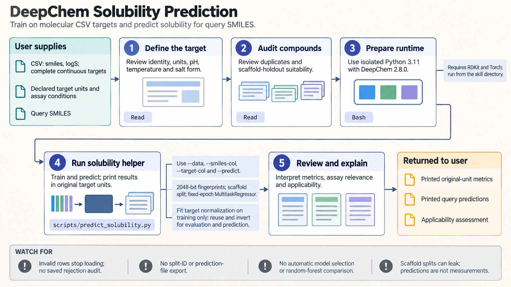

[All skill guides](README.md) / DeepChem Molecular Machine Learning

# DeepChem Molecular Machine Learning

**Build molecular prediction experiments with explicit representations, holdouts, and label handling.**

DeepChem connects molecular data to featurizers, benchmark datasets, and machine-learning models. This skill focuses on property prediction and evaluation, including fingerprints, graph models, missing labels, and explicitly configured pretrained encoders. It helps a researcher distinguish successful training from evidence that a model can predict new compounds in the intended setting.

*Chemically identified records are featurized, split, trained, and evaluated with preserved label masks and target units. [View the full-size workflow diagram](../images/deepchem.png).*

## Questions this skill can help you explore

- **Can molecular structure help predict this measured property?** Compare a numerical baseline with an appropriate model.
- **Will evaluation reflect the intended use?** Choose scaffold, temporal, or grouped holdouts.
- **How should incomplete assay labels be handled?** Preserve observation masks and per-task support.

## What you bring

Provide structures with stable identifiers, assay definitions, target units, observed labels, and missing-value information. Include duplicate or repeated measurements, relevant experimental groups, and the intended deployment setting. For transfer learning, supply or select an actual compatible encoder checkpoint and configuration rather than only a model name.

## How the workflow works

1. **Audit chemical and assay identity.** Parse structures, retain rejected rows, and inspect duplicates before defining the split.
2. **Match features to the model.** Use the featurizer and edge information required by the chosen architecture, with a simple baseline for comparison.
3. **Separate training and evaluation.** Preserve split identifiers and inspect scaffold overlap, group structure, and class support.
4. **Fit with correct label handling.** Learn preprocessing only from training data, preserve missing-label masks, and transform continuous targets appropriately.
5. **Evaluate and export.** Select settings on validation data, evaluate the final holdout once, and report task support, planned-repeat uncertainty, and predictions in original units.

## What you get

| Output | What it helps you do |
| --- | --- |
| Featurized datasets and split records | Make chemical representation and evaluation membership explicit. |
| Trained models and predictions | Apply the fitted experiment to compatible inputs. |
| Baseline and holdout evaluations | Assess predictive value within the stated use case. |

## Example request

> Use the DeepChem skill to model solubility from these measured compounds. Audit duplicate structures and assay units, compare a fingerprint baseline with a compatible graph model, and use a holdout that reflects prediction on new chemical series. Preserve split identifiers and report holdout errors, repeated-run variability, rejected molecules, and applicability limits.

*This is an illustrative request, not a reported research result.*

## Interpreting the results

**A benchmark score does not establish prospective chemical performance.** Related compounds, repeated assays, or preprocessing leakage can make a model look stronger than it is. Scaffold splitting helps address one issue but does not remove every source of leakage.

Missing labels must remain masked, and classification metrics need adequate observed class support. Different model wrappers have different contracts: the documented Hugging Face path does not support every sparse or weighted multitask dataset. Predictions remain conditional on training chemistry and assay context.

## Get started

The tested stack uses Python 3.11 and DeepChem with RDKit for molecular work. Torch, Transformers, torch-geometric, or DGL packages depend on the selected model. Network access is needed for packages, benchmark data, or checkpoints; local training has no inherent service-credential requirement.

[Setup and technical instructions](../../skills/deepchem/SKILL.md)
