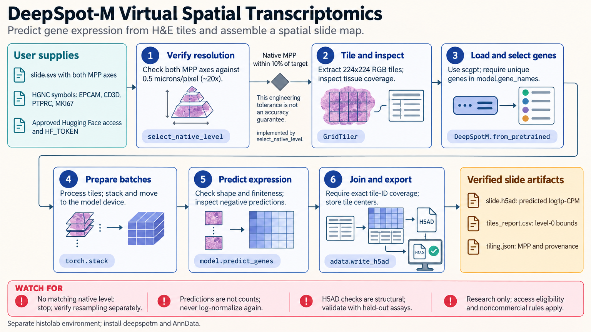

[All skill guides](README.md) / DeepSpot-M Virtual Spatial Transcriptomics

# DeepSpot-M Virtual Spatial Transcriptomics

**Explore predicted spatial gene-expression patterns from histology images with explicit model limitations.**

DeepSpot-M maps small H&E image tiles to predicted gene-expression values. This skill guides use of the released model, selection of genes from its supported panel, resolution-aware whole-slide tiling, and reconstruction of a spatial prediction matrix. It provides virtual spatial transcriptomics: a model-derived view of expression that must remain clearly distinguishable from a measured spatial assay.

*Resolution-checked histology tiles produce gene-expression predictions linked back to their locations on a slide. [View the full-size workflow diagram](../images/deepspot-m.png).*

## Questions this skill can help you explore

- **What expression pattern does the model predict across this tissue?** Query supported genes for each tile.
- **Can predictions be placed accurately on the slide?** Retain tile coordinates, physical resolution, and identifiers.
- **How sensitive is the result to gene representation?** Compare supported embedding-source choices when relevant.

## What you bring

Bring H&E image tiles or a whole-slide image with reliable physical-resolution metadata. The model expects 224-by-224 RGB tiles at approximately 20×, about 0.5 micrometers per pixel. Provide gene symbols from the released model panel, slide and patient identifiers, the intended tissue context, and suitable paired assays if evaluating predictive performance.

## How the workflow works

1. **Confirm access and model identity.** Obtain approved model weights, record the revision, and check supported genes and embedding sources.
2. **Verify image scale.** Read both pixel-size axes and pyramid downsampling; explicitly resample when needed rather than inferring magnification from a level number.
3. **Create a traceable tile grid.** Preserve level-zero bounding boxes, measured output resolution, and unique tile identifiers.
4. **Predict in bounded batches.** Keep a consistent gene list and documented representation source while managing device memory.
5. **Reassemble and evaluate.** Join predictions to coordinates by identifiers, check missing tiles, and compare with held-out paired measurements where available.

## What you get

| Output | What it helps you do |
| --- | --- |
| Tile-by-gene prediction matrix | Explore model-predicted log1p-CPM expression. |
| Spatial coordinates and optional AnnData export | Connect predictions to tissue locations and downstream tools. |
| Model and tiling provenance | Reproduce image preparation and inference choices. |

## Example request

> Use the DeepSpot-M skill to predict a supported marker panel across this H&E slide. Verify the physical tile resolution, retain every tile’s coordinates and identifier, and export predictions in an AnnData object. Label all values as model predictions and outline evaluation on held-out patients with paired spatial measurements.

*This is an illustrative request, not a reported research result.*

## Interpreting the results

**Predicted expression is not measured transcript abundance.** Tissue appearance, staining, imaging, and patient differences can affect generalization. Tiles from one slide are not independent biological replicates, and evaluation should separate patients or slides appropriately.

The released panel limits which genes can be queried. The base model is also distinct from cancer-specific fine-tuned atlas models. Downstream maps should preserve the prediction units and should not silently enter statistical procedures that assume measured integer counts.

## Get started

The documented workflow uses Python 3.10+, deepspotm, and PyTorch. Initial gated weights need network access and approved Hugging Face access; inference supports CPU or optional CUDA. Whole-slide histolab tiling needs a separate compatible environment and OpenSlide, while H5AD export needs AnnData. Noncommercial licensing applies.

[Setup and technical instructions](../../skills/deepspot-m/SKILL.md)
