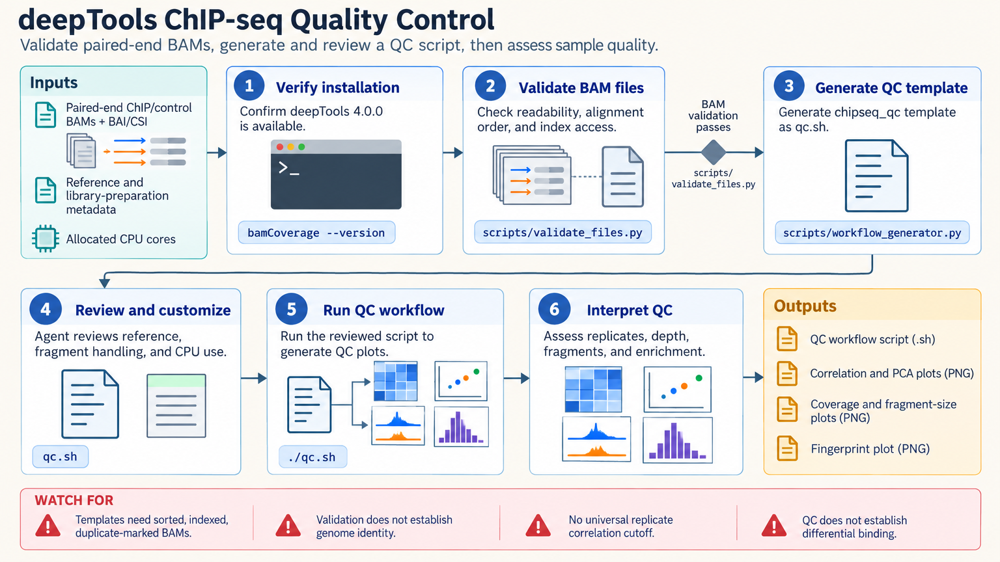

[All skill guides](README.md) / deepTools Sequencing Visualization

# deepTools Sequencing Visualization

**Turn aligned sequencing reads into interpretable coverage tracks and comparative genomic plots.**

deepTools supports sequencing quality control, normalized coverage tracks, sample comparisons, and heatmaps or profiles around genomic features. This skill helps choose the appropriate tools and normalization for ChIP-seq, ATAC-seq, RNA-seq, and related assays. It connects input validation to visualization so a figure’s scale, regions, and preprocessing choices remain scientifically interpretable.

*Validated alignments and genomic regions lead to quality checks, normalized coverage, and labeled profiles or heatmaps. [View the full-size workflow diagram](../images/deeptools.png).*

## Questions this skill can help you explore

- **Do samples behave consistently?** Inspect coverage, correlations, principal components, or fingerprints.
- **Where is signal concentrated relative to genomic features?** Plot profiles around peaks, genes, or transcription start sites.
- **How should coverage be compared?** Choose normalization and filtering appropriate to the assay and question.

## What you bring

Provide coordinate-sorted, indexed alignments or existing coverage tracks, reference assembly information, and the genomic regions to summarize. Include library type, pairing, strandedness, duplicate handling, controls, and replicate metadata. State whether features need orientation, such as transcription start sites, and provide an appropriate effective genome size for methods that require it.

## How the workflow works

1. **Validate files and coordinates.** Confirm sort order, indexes, contig conventions, assembly agreement, and region validity.
2. **Inspect sample quality.** Review coverage and sample-level comparisons before interpreting an attractive aggregate plot.
3. **Generate coverage consistently.** Document bin size, read filters, normalization, controls, and assay-specific options.
4. **Build feature-centered matrices.** Define the regions, orientation, flanking windows, and handling of missing or zero signal.
5. **Plot and retain the data.** Save labeled heatmaps and profiles together with their underlying matrices and processing parameters.

## What you get

| Output | What it helps you do |
| --- | --- |
| Normalized bigWig or bedGraph tracks | Inspect genomic coverage in compatible tools. |
| Sample quality-control summaries | Identify unusual libraries or inconsistent sample relationships. |
| Heatmaps, profiles, and matrices | Compare signal around explicitly defined genomic features. |

## Example request

> Use the deepTools skill to compare ATAC-seq signal around this consensus region set. Validate assemblies and BAM indexes, inspect sample correlations, and choose consistent normalization and filtering. Save coverage tracks, the plotted matrix, a heatmap, and an aggregate profile, with replicate labels and a clear explanation of the plotted scale.

*This is an illustrative request, not a reported research result.*

## Interpreting the results

**An aggregate profile is a visualization rather than a differential test.** Normalization, region selection, feature orientation, and sample quality can change apparent enrichment. Peaks selected from the same data can also shape the result being displayed.

Effective genome size depends on the chosen definition and workflow, and coverage normalizations should not be confused with gene-expression units. Strand interpretation depends on library preparation. Generated workflow templates need review against the actual experiment before execution.

## Get started

The documented environment uses Python 3.12+, deepTools, pysam, and pyBigWig, with samtools for sorting and indexing workflows. Local analysis requires no credentials. Network access is needed for installation or public input retrieval. The technical guide documents normalization behavior and assay-specific template assumptions.

[Setup and technical instructions](../../skills/deeptools/SKILL.md)
