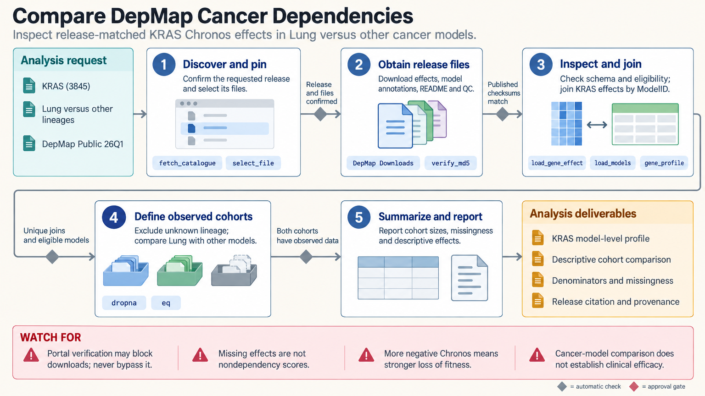

[All skill guides](README.md) / DepMap Cancer Dependency Analysis

# DepMap Cancer Dependency Analysis

**Explore cancer-model dependencies and prioritize biomarker hypotheses with release-aware data handling.**

DepMap combines cancer model annotations with genetic perturbation, molecular, and drug-screen data. This skill helps retrieve a specified release, join records at the correct model or condition level, interpret Chronos gene effects, and examine prespecified biomarker associations or co-essentiality. It is a hypothesis-generation workflow for cancer research, with statistical and identifier checks built into the analysis.

*A pinned DepMap release is mapped to comparable cancer models for dependency and biomarker hypothesis testing. [View the full-size workflow diagram](../images/depmap.png).*

## Questions this skill can help you explore

- **Which models show stronger dependence on a gene?** Inspect continuous effects and relevant model annotations.
- **Does a prespecified biomarker associate with dependency?** Compare suitable cohorts with explicit missingness and multiplicity.
- **What related evidence merits follow-up?** Examine co-essentiality or drug response without equating different assays.

## What you bring

Bring a target, biomarker definition, lineage or disease context, and a chosen release. Obtain the relevant matrices, metadata, mappings, README, and quality-control records. Specify the unit of analysis and keep model, condition, sequencing, and screen identifiers distinct. Include a scientifically justified comparison rather than selecting a cohort after inspecting effects.

## How the workflow works

1. **Pin and document the release.** Use official discovery and download routes and retain source terms and file descriptions.
2. **Inspect file contracts.** Identify numeric columns, gene identifiers, assay type, and how each record maps to a model or condition.
3. **Construct comparable cohorts.** Preserve unknown biomarker status and avoid counting repeated conditions or screens as independent models.
4. **Analyze the planned comparison.** Report group sizes, effect sizes, missingness, p-values, and multiplicity-adjusted results where appropriate.
5. **Review alternative explanations.** Examine lineage and other confounding, then propose orthogonal or matched experiments for candidate dependencies.

## What you get

| Output | What it helps you do |
| --- | --- |
| Target and cohort summaries | Explore dependency patterns with explicit denominators. |
| Biomarker association tables | Prioritize prespecified research hypotheses. |
| Release, mapping, and QC records | Trace analysis choices and exclusions. |

## Example request

> Use the DepMap skill to evaluate whether my prespecified alteration associates with dependency on a candidate pathway. Pin the release, map omics profiles to the correct models, restrict to comparable lineages, and preserve unknown biomarker states. Report effect sizes and adjusted results, then identify confounding and experiments needed to test candidate synthetic lethality.

*This is an illustrative request, not a reported research result.*

## Interpreting the results

**Dependency associations do not establish synthetic lethality or therapeutic efficacy.** Cancer-model comparisons do not provide a normal-tissue therapeutic window. Lineage, culture conditions, and related models can confound apparent biomarkers.

Chronos scores are continuous effects, not probabilities, and a common-essential anchor is not a universal dependency threshold. Release-specific probability and FDR products have different meanings. The bundled exploratory test does not adjust for covariates, and computational fixtures do not validate a biological finding.

## Get started

The helpers use Python 3.10+, NumPy, pandas, and SciPy. Release discovery requires network access, and some downloads may require browser verification through the DepMap portal. Once files are obtained, local analysis uses them directly. The source guide explains data contracts and review limitations.

[Setup and technical instructions](../../skills/depmap/SKILL.md)
