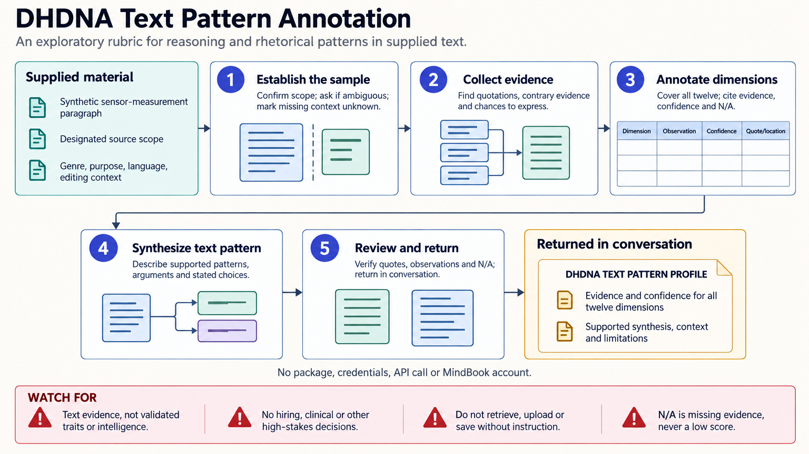

[All skill guides](README.md) / DHDNA Text Pattern Annotation

# DHDNA Text Pattern Annotation

**Reflect on reasoning and writing choices using an explicit, evidence-linked rubric.**

This skill applies DHDNA terminology to a supplied text as an exploratory annotation exercise. It describes observable rhetorical and reasoning patterns, such as stated assumptions, comparison of alternatives, or explicit uncertainty. Its profile concerns the text sample, not a validated psychological trait, personal identity, or stable cognitive signature of its author.

*A designated text sample is annotated with quotations, context, uncertainty, and a bounded writing-pattern synthesis. [View the full-size workflow diagram](../images/dhdna-profiler.png).*

## Questions this skill can help you explore

- **Which reasoning choices appear in this text?** Identify passages supporting specific rubric dimensions.
- **Where does the sample leave too little evidence?** Mark dimensions as not assessable instead of forcing scores.
- **How do two samples differ in their writing patterns?** Compare like contexts without inferring stable personal traits.

## What you bring

Provide the exact text designated for the exercise, with a sample label and line or paragraph references where possible. Describe genre, purpose, language, and known editing or collaboration context. Identify quotations, fictional voices, copied passages, and AI assistance so their content is not automatically attributed to the author’s personal characteristics.

## How the workflow works

1. **Establish the sample and context.** Bound the analysis to the supplied material and record important contextual unknowns.
2. **Collect textual evidence.** Select real passages supporting each observation, including contrary evidence where present.
3. **Apply the rubric cautiously.** Rate supported dimensions using the local ordinal conventions and mark insufficient evidence as not assessable.
4. **Explain confidence.** Describe confidence in the textual interpretation, not confidence in an enduring trait.
5. **Synthesize a bounded reflection.** Connect the supported observations to the writing task, noting how genre and context could explain the pattern.

## What you get

| Output | What it helps you do |
| --- | --- |
| Evidence-linked annotation table | See which passages support each observation. |
| Optional ordinal rubric scores | Summarize local judgments with explanations and missingness. |
| Writing-pattern reflection | Discuss revision or comparison without unsupported psychological claims. |

## Example request

> Use the DHDNA profiler on this supplied research discussion section. Cite paragraph references for each supported observation, distinguish my prose from quotations, and mark dimensions without sufficient evidence as not assessable. Focus on how alternatives, uncertainty, and next steps are expressed, without drawing conclusions about my intelligence, personality, or identity.

*This is an illustrative request, not a reported research result.*

## Interpreting the results

**The rubric is exploratory rather than psychometrically validated.** Its numerical scores are ordinal judgments, not calibrated probabilities, percentiles, or measurements of ability. Named tension pairs are comparison prompts and should be rated independently rather than treated as complementary quantities.

Genre, task demands, language proficiency, editing, and collaboration affect what is expressed. A short passage may not offer an opportunity to demonstrate a dimension, so absence of expression is not evidence of a personal deficit.

## Get started

The exercise runs on supplied text within the conversation and requires no package, account, credentials, or API calls. It does not reproduce a proprietary scoring engine or create a hosted identity profile. The technical instructions define the annotation vocabulary, evidence criteria, and scope limits.

[Setup and technical instructions](../../skills/dhdna-profiler/SKILL.md)
