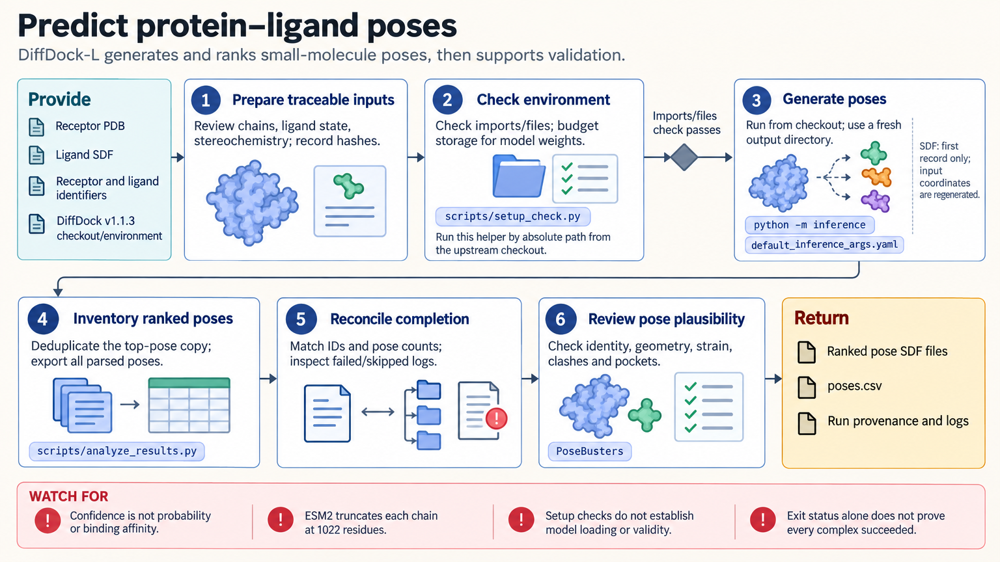

[All skill guides](README.md) / DiffDock Protein–Ligand Pose Prediction

# DiffDock Protein–Ligand Pose Prediction

**Generate candidate binding poses and inspect them as structural hypotheses.**

DiffDock and DiffDock-L predict how a small molecule might sit relative to a protein structure and rank sampled poses using model confidence. This skill covers traceable input preparation, single-pair and batch inference, alternative receptor conformations, completion checks, and pose validation. It supports docking hypothesis generation rather than measurement of binding affinity or identification of confirmed active compounds.

*Prepared protein and ligand inputs generate candidate poses that are checked for completion, chemistry, and structural plausibility. [View the full-size workflow diagram](../images/diffdock.png).*

## Questions this skill can help you explore

- **Where might a ligand bind?** Generate and examine alternative candidate poses.
- **Does a proposed pose remain plausible after inspection?** Review clashes, stereochemistry, geometry, and alternative pockets.
- **Did every batch item actually finish?** Match output poses and failures against the input manifest.

## What you bring

Bring a reviewed receptor structure or complete protein sequence, a ligand description or supported structure file, and stable pair identifiers. Specify the biological assembly, chains, ligand stereochemistry, protonation and tautomer assumptions, and handling of cofactors, waters, or metals. Preserve source coordinates and preparation history rather than silently altering difficult inputs.

## How the workflow works

1. **Validate the input manifest.** Check names, paths, sequences, and ligand representations while recognizing that syntax checks do not establish chemical suitability.
2. **Prepare the exact inference environment.** Record weights, package versions, sampling configuration, and receptor identity.
3. **Generate candidate poses.** Run each pair or conformation with explicit settings and a fresh output location.
4. **Inspect completion and inventory.** Compare expected identifiers and pose counts with actual outputs and upstream failure records.
5. **Validate selected structures.** Review molecular identity, internal strain, geometry, clashes, and interaction hypotheses, retaining both raw and any refined coordinates.

## What you get

| Output | What it helps you do |
| --- | --- |
| Ranked candidate ligand structures | Inspect possible binding arrangements. |
| Confidence and completion summaries | Triage poses while identifying incomplete batch items. |
| Preparation and run provenance | Reproduce the exact inputs and inference settings. |

## Example request

> Use the DiffDock skill to generate poses for this prepared receptor and ligand series. Preserve stereochemistry and receptor identity, use a fresh batch output directory, and report failed complexes. Inspect the leading poses for clashes and strained geometry, then provide structural hypotheses for follow-up without presenting confidence scores as binding affinity.

*This is an illustrative request, not a reported research result.*

## Interpreting the results

**Model confidence is neither a calibrated correctness probability nor an affinity estimate.** Sorting scores across compounds or receptor conformations is triage, not evidence of stronger binding or a preferred thermodynamic state. Low confidence also does not establish absence of binding.

Sequence-derived receptors add folding uncertainty. Existing ligand coordinates are not retained as docking restraints, and relaxation changes the artifact, requiring renewed validation. Experimental binding and activity studies remain separate from pose plausibility.

## Get started

The source documents the upstream DiffDock repository environment or Docker image, including compatible Python, Torch, fair-esm, RDKit, and PyG dependencies. Weight retrieval needs network and disk space; the sequence-folding route requires CUDA. Bundled CSV helpers need pandas and RDKit. Full pretrained execution was not established by the source review.

[Setup and technical instructions](../../skills/diffdock/SKILL.md)
