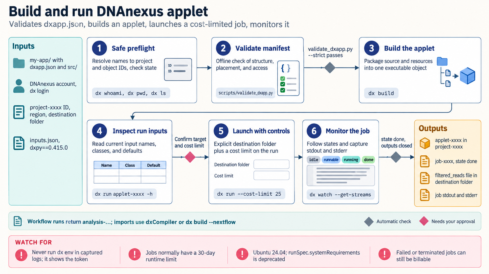

[All skill guides](README.md) / DNAnexus Integration

# DNAnexus Integration

**Build and operate genomics workloads with explicit cloud inputs, provenance, and execution controls.**

This skill connects local scientific workflows with the DNAnexus platform through the dx command-line tools and dxpy. It covers data transfer, project organization, apps and applets, workflow import, execution monitoring, and cost controls. The goal is an operationally reproducible workload whose platform configuration and actual completion can be inspected alongside its scientific outputs.

*Project data and workflow specifications become controlled cloud executions with monitored status and verified outputs. [View the full-size workflow diagram](../images/dnanexus-integration.png).*

## Questions this skill can help you explore

- **How can this genomics workflow run on DNAnexus?** Choose an applet, native workflow, compiler, or supported import path.
- **Which project data belong in the run?** Resolve files and metadata with precise searches.
- **Did the job produce the intended result?** Inspect terminal execution status and output objects.

## What you bring

Provide the DNAnexus project and region, authorized account access, input object identifiers or local files, and the scientific workflow. Specify expected outputs, software versions, resource needs, runtime constraints, and spending limits. Include organizational restrictions on storage, data movement, workflow features, and available execution environments.

## How the workflow works

1. **Inspect access and project context.** Confirm identity, permissions, region, and policy requirements without exposing credentials.
2. **Choose the platform path.** Match the workflow to an app or applet, native workflow, WDL/CWL compilation, or documented Nextflow import.
3. **Prepare data and definitions.** Preserve input identities, validate the application specification, and set explicit file and metadata search semantics.
4. **Launch with controls.** Set appropriate execution resources and cost or runtime boundaries, retaining the execution identifier.
5. **Monitor and verify.** Inspect jobs or analyses to their terminal states and confirm the expected output objects and provenance.

## What you get

| Output | What it helps you do |
| --- | --- |
| App, applet, or workflow specification | Represent the scientific computation on the platform. |
| Execution and monitoring records | Track status, resources, and failures. |
| Output objects with provenance | Connect cloud results to the inputs and software that produced them. |

## Example request

> Use the DNAnexus integration skill to package this genomics analysis as an applet in the specified project. Validate its input/output specification, use the supplied resource and spending limits, and run it on the designated files. Report the execution identifiers, terminal status, and verified outputs, including any retry or resource failures.

*This is an illustrative request, not a reported research result.*

## Interpreting the results

**Cloud job success does not validate the scientific method.** Reference versions, sample identity, algorithm assumptions, and output quality still need analysis-specific review. Platform metadata and execution records help establish provenance, not correctness by themselves.

Files, jobs, and workflow analyses have distinct semantics. Retry behavior, resource escalation, and data movement can affect cost and policy compliance, so they need explicit configuration. Organization licenses and access policies may restrict a workflow even when its local specification is valid.

## Get started

The documented workflow needs a DNAnexus account, network access, Python 3.11+, and dx-toolkit/dxpy. Compiler and workflow routes have additional dependencies, and some infrastructure features depend on organization licensing or policy. Credentials must be configured for official platform endpoints and kept out of captured logs.

[Setup and technical instructions](../../skills/dnanexus-integration/SKILL.md)
