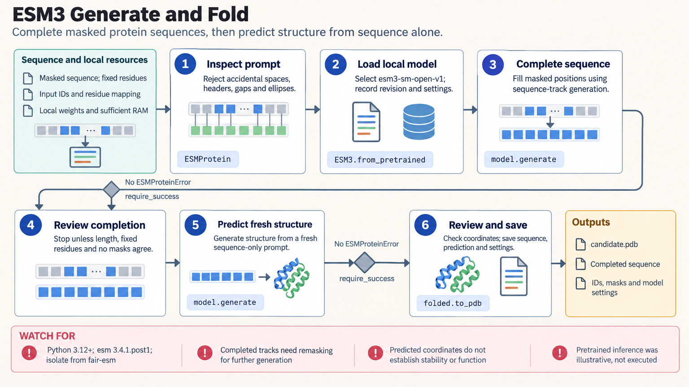

[All skill guides](README.md) / ESM Protein Generation, Embeddings, and Folding

# ESM Protein Generation, Embeddings, and Folding

**Explore protein sequences and predicted structures with clearly identified model outputs.**

This skill covers the Biohub esm SDK for ESM3 multimodal generation, ESMC sequence embeddings, and ESMFold2 structure prediction. It helps select the appropriate model, preserve residue and chain identities, handle local or hosted inference, and validate output shape and meaning. It distinguishes these tools from the separate legacy fair-esm package that shares the same Python import name.

*Explicit protein inputs and model choices lead to generated sequences, residue representations, or predicted structures with provenance. [View the full-size workflow diagram](../images/esm.png).*

## Questions this skill can help you explore

- **Can a model propose sequences satisfying specified constraints?** Use masked generation while checking fixed residues.
- **How can I represent sequences for a downstream model?** Extract embeddings with correct residue and padding handling.
- **What structure does a selected model predict?** Inspect chain mappings, coordinates, and model confidence.

## What you bring

Bring complete, unambiguous sequences or appropriate structural and functional inputs, with stable identifiers and residue/chain mapping. Define whether the goal is generation, representation extraction, or folding. Specify fixed positions, masks, supported functional labels, and any evaluation dataset. Record the selected checkpoint or hosted model and relevant resource constraints.

## How the workflow works

1. **Validate the biological input.** Check sequence formatting, length, chain identity, residue positions, and the intended output.
2. **Select the exact model route.** Keep SDK version, checkpoint revision, masks, settings, and random seed where supported.
3. **Run bounded inference.** Manage memory or hosted concurrency, and inspect returned error objects rather than assuming every response is a prediction.
4. **Check the output contract.** Verify fixed residues and sequence length, exclude special tokens from residue embeddings, and inspect atom and chain mappings.
5. **Save and evaluate.** Retain predictions with provenance and use suitable independent experiments or holdouts to assess the intended scientific use.

## What you get

| Output | What it helps you do |
| --- | --- |
| Generated protein sequences | Provide candidates for subsequent structural and experimental assessment. |
| Residue or sequence embeddings | Supply representations for separately evaluated analyses. |
| Predicted structures and confidence information | Develop structural hypotheses with clear model provenance. |

## Example request

> Use the ESM skill to extract sequence embeddings for my protein set while preserving identifiers and residue mappings. Exclude padding and special tokens from pooled representations, record the exact model revision, and retain failures. If we use the embeddings for property prediction, propose a homology-aware holdout and keep preprocessing within training data.

*This is an illustrative request, not a reported research result.*

## Interpreting the results

**Model outputs do not establish protein function.** Predicted coordinates, pLDDT, or pTM do not measure stability, affinity, or catalytic activity. Generated or inverse-folded sequences require fresh assessment and experimental screening.

Embedding similarity is not a guarantee of homology or shared function. Reusing completed generation tracks does not automatically implement refinement, and model settings must be included in cache identity. Source-level client checks do not establish hosted access or prediction quality.

## Get started

The documented Biohub SDK stack uses Python 3.12+ and esm in an isolated environment separate from fair-esm. Local inference needs downloaded weights and adequate CPU/GPU memory. Hosted inference needs network access and an ESM_API_KEY. Hardware and model-access requirements vary by the selected checkpoint.

[Setup and technical instructions](../../skills/esm/SKILL.md)
