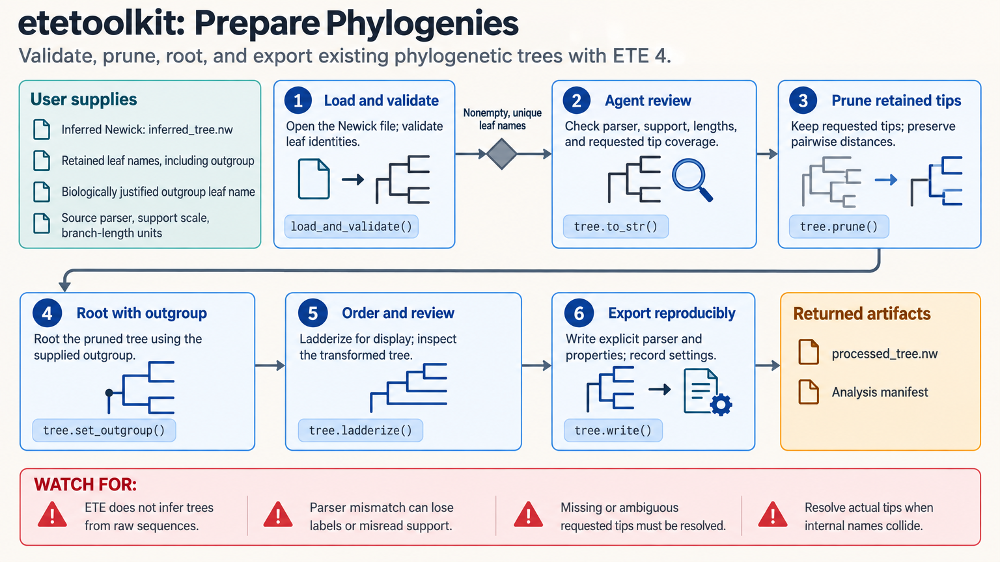

[All skill guides](README.md) / ETE Toolkit for Phylogenetic Trees

# ETE Toolkit for Phylogenetic Trees

**Inspect, compare, annotate, and display existing evolutionary trees with explicit conventions.**

ETE Toolkit works with phylogenetic and other hierarchical trees after they have been inferred. This skill supports Newick and Nexus input, rooting and pruning, topology comparison, gene-tree event analysis, taxonomy queries, interactive exploration, and rendering. It helps preserve labels, support values, and branch lengths while making tree transformations and comparisons reproducible.

*Existing trees are parsed, checked, transformed or compared, and annotated for interpretable visualization. [View the full-size workflow diagram](../images/etetoolkit.png).*

## Questions this skill can help you explore

- **How do two inferred trees differ?** Compare topology using shared, meaningful leaf identities.
- **Can I focus on a clade without losing important information?** Prune or reroot with stated branch-length conventions.
- **What taxonomy or gene-tree annotations are useful?** Link local taxonomy information or explore proposed evolutionary events.

## What you bring

Bring an existing tree or tree set, the meaning of internal labels and branch lengths, and the intended rooted or unrooted interpretation. Provide unique leaf identifiers, any annotation tables, and a taxonomic reference choice. Explain whether support is expressed as fractions, percentages, or another statistic before requesting support-based colors or summaries.

## How the workflow works

1. **Parse and check the tree.** Confirm that names, supports, branch lengths, and leaf identities are read as intended.
2. **Define the operation.** Specify rooting, pruning, annotation, topology comparison, or gene-tree analysis and its assumptions.
3. **Apply transformations transparently.** Preserve distances when required and record any arbitrary resolution of multifurcations.
4. **Compare or annotate carefully.** Align shared leaves and use the correct taxonomy identifier system and database snapshot.
5. **Explore and export.** Save transformed Newick records, comparison summaries, and figures with the parsing and display settings.

## What you get

| Output | What it helps you do |
| --- | --- |
| Checked or transformed tree files | Reuse a documented topology and retained annotations. |
| Tree comparison and event summaries | Investigate differences or candidate evolutionary patterns. |
| Interactive views and rendered figures | Inspect and communicate tree structure. |

## Example request

> Use the ETE Toolkit skill to compare these two inferred gene trees. Check unique leaf names and support conventions, state the rooted or unrooted interpretation, and compare the shared taxa. Prune a specified clade for visualization while preserving the intended distances, and save both transformed trees and a clearly annotated figure.

*This is an illustrative request, not a reported research result.*

## Interpreting the results

**Manipulating a tree does not add evolutionary evidence.** Arbitrary polytomy resolution is an algorithmic or display choice, and rerooting changes interpretation unless supported by a justified criterion. This skill does not infer a phylogeny directly from raw sequences.

Topology distances depend on leaf overlap and conventions. Gene-tree reconciliation and event labels depend on their inputs and assumptions, while taxonomy is a reference classification rather than independent support for every inferred relationship. Retain the source tree and transformation history.

## Get started

The documented helpers use Python 3.10+ and ETE 4. Taxonomy acquisition requires internet access; local cached queries can run without service credentials. SmartView uses a local server and browser. Static rendering requires the relevant ETE extras and either Chrome/Chromium or Qt dependencies for the selected format.

[Setup and technical instructions](../../skills/etetoolkit/SKILL.md)
