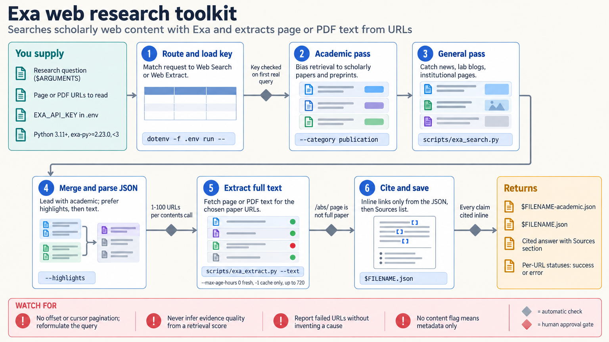

[All skill guides](README.md) / Exa Scientific Web Search

# Exa Scientific Web Search

**Find and extract scientific web sources for a traceable research overview.**

This skill uses Exa to search the web or retrieve content from specified pages and PDFs, including batches of URLs. It helps steer scientific queries toward publications, academic domains, and primary sources. The resulting material supports source discovery and reading; it is not itself a validated evidence synthesis or a guarantee that the search covers every relevant study.

*A research query or URL set leads to source discovery, content extraction, and provenance-aware reading. [View the full-size workflow diagram](../images/exa-search.png).*

## Questions this skill can help you explore

- **Which primary sources address this topic?** Search with scholarly categories and appropriate domain restrictions.
- **What does this specific article or page say?** Retrieve its available text for inspection.
- **Can I review several candidate sources efficiently?** Extract a bounded batch while tracking missing or partial content.

## What you bring

Bring a focused research question or a list of source URLs, with date, publication type, and domain preferences where relevant. Define the desired scope and whether you need discovery, full-page reading, or both. A useful request identifies the claim or experimental detail to verify rather than asking only for a broad topical summary.

## How the workflow works

1. **Select search or extraction.** Use a topic query for discovery and direct extraction when the source location is already known.
2. **Set the source scope.** Bias toward publications or restrict domains when that improves relevance, while recognizing the resulting coverage limits.
3. **Inspect candidate results.** Check publication type, date, authorship, and whether the source is primary research, a preprint, or commentary.
4. **Retrieve and read the needed content.** Track extraction failures, text limits, and source freshness before relying on a passage.
5. **Return a grounded account.** Link claims to their supporting pages and make unavailable material or unresolved questions explicit.

## What you get

| Output | What it helps you do |
| --- | --- |
| Candidate source list | Locate relevant scientific or technical pages. |
| Extracted page or PDF text | Read and compare accessible source content. |
| Linked research summary | Connect useful findings to their actual provenance. |

## Example request

> Use the Exa skill to find primary research on this experimental technique, prioritizing publication sources and the specified date range. Extract the most relevant articles, identify their systems and limitations, and link each factual claim to its source. Flag preprints, incomplete extractions, and sources that only repeat another paper’s conclusions.

*This is an illustrative request, not a reported research result.*

## Interpreting the results

**Search relevance is not scientific quality.** A publication filter or academic domain does not establish peer review, methodological strength, or support for a particular claim. Confirm those properties from the source and retain contradictory findings.

Extracted text can be incomplete or stale, and access barriers may hide important methods or qualifications. A selected list should not be described as exhaustive without a separately justified search protocol. Source discovery and evidence assessment remain distinct steps.

## Get started

The documented scripts use Python 3.11+, the exa-py SDK, internet access, and an EXA_API_KEY. They can run through uv with declared dependencies or in a prepared environment. A successful help command only checks local parsing; authentication and service availability are established by an actual request.

[Setup and technical instructions](../../skills/exa-search/SKILL.md)
