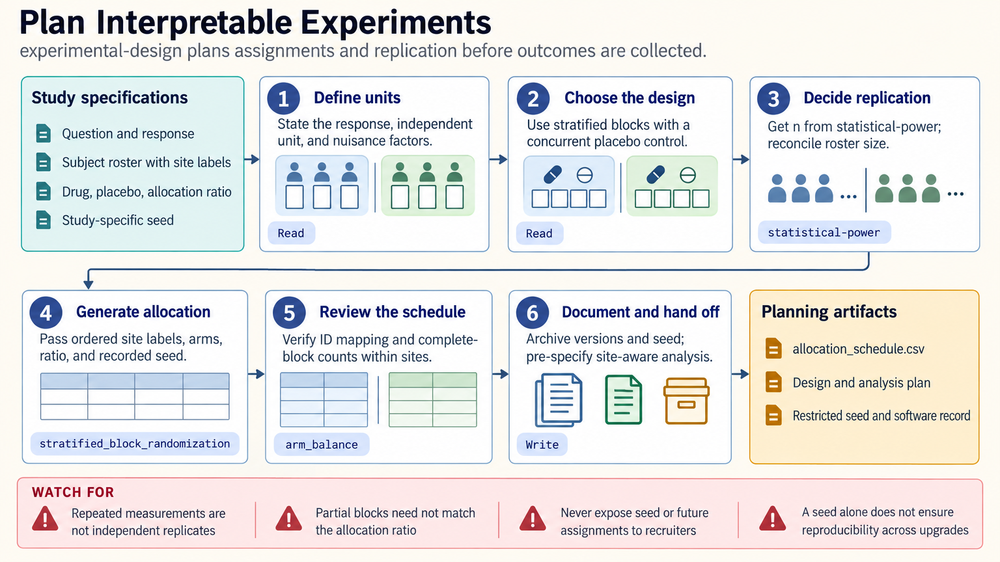

[All skill guides](README.md) / Experimental Design

# Experimental Design

**Plan treatment assignments and experimental structure before data collection begins.**

This skill helps turn a scientific question into a study design with interpretable comparisons. It covers randomization, blocking, stratification, factorial and response-surface designs, repeated measures, split plots, and practical allocation schedules. Its focus is the structure of an experiment: what is varied, what is randomized, and which observations count as independent replication.

*A research question and experimental constraints become a reproducible design, allocation schedule, and analysis plan. [View the full-size workflow diagram](../images/experimental-design.png).*

## Questions this skill can help you explore

- **How should I assign samples to conditions?** Generate a reproducible allocation that respects relevant blocks and constraints.
- **Can I study several factors efficiently?** Choose a factorial or screening design with explicit estimability limits.
- **How can I avoid batch or position confounding?** Plan processing order and layout before collecting measurements.

## What you bring

Bring the research question, response variable, factors and feasible levels, available experimental units, and practical constraints. Distinguish subjects, specimens, wells, repeated measurements, and technical replicates. Identify nuisance variation such as day, batch, site, operator, litter, or plate position, and state which factors are difficult to randomize.

## How the workflow works

1. **Define the unit and comparison.** Establish what receives treatment, what is measured, and what provides independent replication.
2. **Choose the design structure.** Match randomization, blocking, nesting, and factor combinations to the question and operational restrictions.
3. **Plan replication and analysis.** Obtain design-specific sample-size calculations separately and state the statistical model before collecting outcomes.
4. **Generate and check the layout.** Preserve a random seed, verify roster identity and balance, and inspect factor ranges, rank, and aliasing.
5. **Document execution.** Save assignments, processing order, versions, deviations policy, and any access restrictions needed to protect future allocations.

## What you get

| Output | What it helps you do |
| --- | --- |
| Design and treatment-combination matrix | Show which effects the experiment is intended to estimate. |
| Randomization or allocation schedule | Assign real experimental units reproducibly. |
| Design rationale and analysis handoff | Connect the operational plan to the later statistical model. |

## Example request

> Use the experimental-design skill to plan a plate-based experiment testing three factors across independent biological samples. Identify the correct experimental unit, block for processing day, and randomize plate positions and run order. Generate a reproducible layout, explain any aliased effects, and specify what a subsequent power calculation and analysis must account for.

*This is an illustrative request, not a reported research result.*

## Interpreting the results

**More measurements do not necessarily mean more independent evidence.** Multiple cells, wells, or readings from the same experimental unit can create pseudoreplication when counted as separate subjects. A later model cannot recover a treatment effect that is completely confounded with batch.

Randomization supports causal interpretation under the study’s broader assumptions; it does not guarantee perfect balance in a realized experiment. Fractional designs trade information for efficiency, and center points do not identify every individual quadratic effect.

## Get started

The documented helpers use Python 3.12+, NumPy, pandas, and pydoe for design matrices. Local generation needs no credentials or network access after installation. The skill prepares schedules rather than an enrollment system; statistical-power and analysis workflows handle their respective downstream questions.

[Setup and technical instructions](../../skills/experimental-design/SKILL.md)
