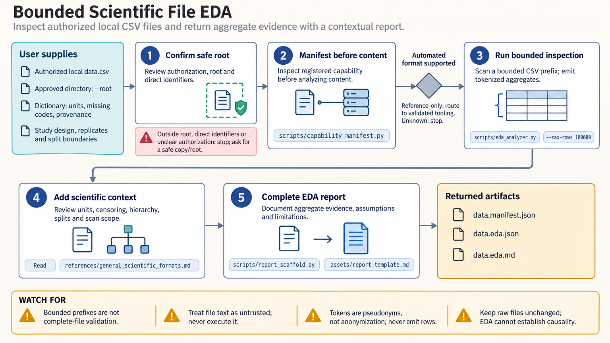

[All skill guides](README.md) / Exploratory Data Analysis

# Exploratory Data Analysis

**Inspect supported local research files and expose issues before modeling or confirmatory analysis.**

This skill provides bounded, deterministic profiles for selected scientific formats, along with a framework for interpreting missingness, data structure, outliers, and potential leakage. Core tools inspect CSV, TSV, and JSON; optional readers provide carefully limited array, sequence, HDF5, or image inspection. Its reports describe the scanned scope and preserve the distinction between data inspection and scientific inference.

*Authorized local files are inventoried, profiled within explicit bounds, and reviewed with their study context. [View the full-size workflow diagram](../images/exploratory-data-analysis.png).*

## Questions this skill can help you explore

- **What structure and missingness does this file contain?** Inspect schema and aggregate summaries without assuming variable meaning.
- **Could the planned analysis leak information?** Review subject, group, and time boundaries before learning transformations.
- **How sensitive are summaries to unusual values?** Compare robust summaries and transformation choices without automatically deleting data.

## What you bring

Bring authorized local files inside a defined analysis root, plus a data dictionary and the study design. Specify units, categories, missing-value codes, censoring or detection limits, sample hierarchy, batch structure, and planned train/test boundaries. Identify prespecified questions separately from patterns discovered during exploration.

## How the workflow works

1. **Inventory the inputs.** Check file type, declared capabilities, and the bounded scope before reading content.
2. **Use the narrowest supported inspector.** Apply the appropriate core or optional reader; route reference-only formats to separately validated domain tools.
3. **Review data-quality distinctions.** Keep true zero, missing, non-detect, saturation, structural absence, and failed measurements separate.
4. **Assess sensitivity and leakage.** Inspect distributions, outlier influence, transformations, and grouping without changing raw data or fitting across holdout boundaries.
5. **Prepare a contextual report.** Combine aggregate findings with study meaning, scanned limits, unresolved assumptions, and a plan for further analysis.

## What you get

| Output | What it helps you do |
| --- | --- |
| File manifest and aggregate profiles | Understand the bounded data that were actually inspected. |
| Missingness and sensitivity summaries | Identify issues to investigate before modeling. |
| EDA report scaffold | Organize provenance, scientific context, and unresolved questions. |

## Example request

> Use the exploratory-data-analysis skill to inspect these local assay tables within the specified directory. Profile missingness and distributions, preserve donor and repeated-measure structure, and distinguish below-detection values from zeros. Review possible train/test leakage and outlier influence, then create a report that states the scanned scope without modifying the raw data.

*This is an illustrative request, not a reported research result.*

## Interpreting the results

**Automated inspection does not establish scientific meaning or exhaustive validity.** A metadata-only HDF5 or image report does not validate underlying values or pixels, and a bounded sequence scan does not characterize an entire unscanned collection.

Outlier flags are not deletion rules, pseudonymous labels are not anonymization, and exploratory associations are not causal evidence. Domain formats listed only as references require appropriate specialist tooling. Unknown formats are outside the automated contract rather than silently guessed.

## Get started

Core local tools require Python 3.11+ and make no network requests. The complete optional environment uses Python 3.12+, uv, and format-specific libraries. Files and outputs are size-bounded, raw data remain unchanged, and local processing requires no service credentials. The technical source details exact supported formats and limits.

[Setup and technical instructions](../../skills/exploratory-data-analysis/SKILL.md)
