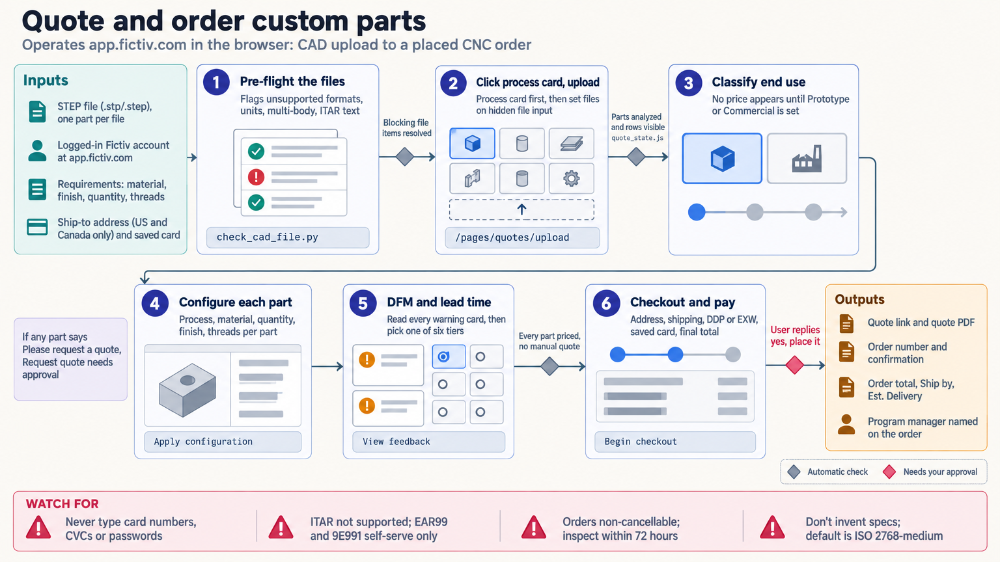

[All skill guides](README.md) / Fictiv Custom Part Manufacturing

# Fictiv Custom Part Manufacturing

**Turn a research hardware design into a clearly specified manufacturing quote.**

The Fictiv skill helps operate the manufacturing service through a user’s logged-in browser. It covers CAD upload, process and material selection, finishes, threads, tolerances, inspection requirements, manufacturability feedback, quotes, and order tracking. For laboratory work, it connects a part design with the practical requirements that determine whether a supplier can make the intended component.

*CAD files and manufacturing requirements move through configuration, manufacturability review, quotation, and authorized ordering. [View the full-size workflow diagram](../images/fictiv.png).*

## Questions this skill can help you explore

- **What would it take to manufacture this part?** Review supported processes and configure the exact requirements.
- **Which design details may cause problems?** Inspect design-for-manufacturing feedback before placing an order.
- **How do price and lead-time options compare?** Summarize the actual quote and unresolved requirements.

## What you bring

Bring the CAD files and matching drawing revision, confirmed units, quantity, material, finish, threads, tolerances, and required inspections or certificates. State the part’s intended use, delivery needs, budget, and whether the request is for a quote or purchase. Access uses your logged-in Fictiv account and applicable file-transfer permissions.

## How the workflow works

1. **Review files and requirements.** Check format, geometry, dimensions, units, part separation, and the suitability of the requested manufacturing route.
2. **Upload through the browser.** Choose the process and confirm that the expected parts and configuration controls appear.
3. **Configure each part explicitly.** Verify material, quantity, finish, threads, drawings, and inspection requirements, then reconcile the digital configuration with the drawing.
4. **Inspect feedback and pricing.** Read all manufacturability notices and compare available production regions, lead times, and quote paths.
5. **Present or complete the requested transaction.** Provide a reviewable quote summary; proceed through checkout only within explicit purchase authorization, then retain order details.

## What you get

| Output | What it helps you do |
| --- | --- |
| Configured quote and part summary | Review manufacturing choices, pricing, and lead-time options. |
| Manufacturability and open-item list | Identify design or specification questions before purchase. |
| Order and tracking records when requested | Follow an authorized manufacturing order. |

## Example request

> Use the Fictiv skill to prepare a quote for this laboratory fixture from the supplied STEP file and drawing. Confirm units, material, finish, thread requirements, and revision agreement. Summarize all manufacturability feedback and compare relevant lead-time options, then present the final configuration and price for review before any purchase.

*This is an illustrative request, not a reported research result.*

## Interpreting the results

**A quote is not an engineering validation.** The researcher still needs to establish that the design, material, tolerances, and inspection plan meet the experiment’s mechanical and functional requirements. Automated CAD checks and manufacturability feedback have limited scope.

Drawing and digital configuration can conflict, and geometry revisions require separate checking. Prices, available choices, and browser labels must be verified in the active session. File eligibility, commercial classification, and contractual decisions depend on the actual project.

## Get started

The workflow requires network access, browser automation, and the user’s logged-in Fictiv account. It uses the web application rather than a documented public customer SDK. Optional local CAD preflight uses Python 3.10+ and the standard library; the technical references describe quoting, checkout, and tracking workflows.

[Setup and technical instructions](../../skills/fictiv/SKILL.md)
