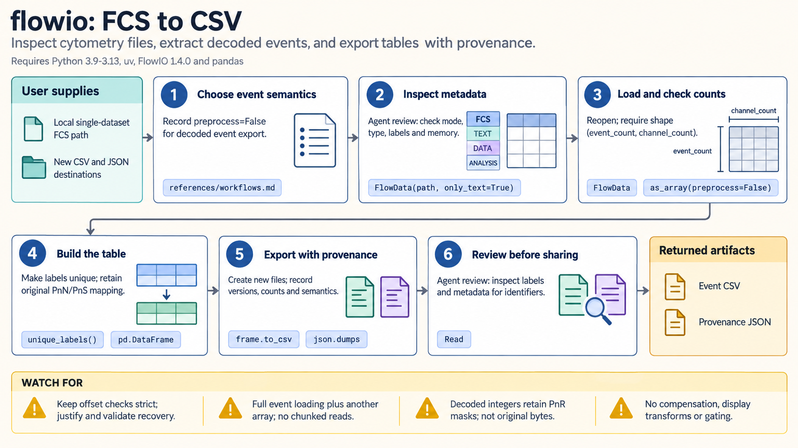

[All skill guides](README.md) / FlowIO FCS File Handling

# FlowIO FCS File Handling

**Inspect flow-cytometry files and extract events with their measurement conventions intact.**

FlowIO is a low-level reader and writer for Flow Cytometry Standard files. This skill covers metadata and channel inspection, event-array extraction, multi-dataset files, tabular export, and writing FCS 3.1 files. It helps distinguish the decoded measurements from metadata-based scaling, leaving compensation, biological gating, and population analysis to a dedicated cytometry workflow.

*FCS headers and channels are inspected before event extraction or controlled rewriting, followed by read-back checks. [View the full-size workflow diagram](../images/flowio.png).*

## Questions this skill can help you explore

- **Which channels and acquisition fields are present?** Inspect metadata before loading large event arrays.
- **What numerical values will be exported?** Choose decoded or metadata-preprocessed event semantics explicitly.
- **Did an FCS rewrite preserve the intended measurements?** Reopen and compare dimensions, labels, and representative values.

## What you bring

Bring the original FCS files and the precise operation: inventory, event extraction, conversion, or a justified repair. Describe channel identities and any known vendor-format issues. Specify whether output values should include gain, logarithmic, and time scaling, and which metadata fields are needed for the downstream task.

## How the workflow works

1. **Inspect metadata first.** Read channel definitions and declared counts without loading events when only an inventory is needed.
2. **Select event semantics.** Distinguish decoded DATA values from the metadata-based preprocessing option.
3. **Check array dimensions and channels.** Verify actual event rows against declared totals and account for one-based FCS parameter numbers versus zero-based array columns.
4. **Export or rewrite deliberately.** Preserve originals and review channel, scaling, and spillover metadata when changing the file.
5. **Reopen the result.** Check event and channel counts, labels, metadata, and representative numerical values before using the exported artifact.

## What you get

| Output | What it helps you do |
| --- | --- |
| Metadata and channel summaries | Understand file contents and acquisition conventions. |
| Event arrays or tables | Prepare clearly defined numerical inputs for later analysis. |
| Validated FCS 3.1 exports | Create a reviewed file for compatible downstream software. |

## Example request

> Use the FlowIO skill to inventory these FCS files and export event tables for a later gating workflow. Inspect metadata first, document the chosen preprocessing semantics, and verify actual array dimensions against declared counts. Keep the original files and report channel-label ambiguities or offset problems rather than suppressing parser errors automatically.

*This is an illustrative request, not a reported research result.*

## Interpreting the results

**Reading a file does not perform cytometry analysis.** FlowIO preprocessing does not apply spillover compensation or logicle/biexponential display transforms. Biological population claims therefore require a separate validated strategy.

Metadata may contain sensitive identifiers, so export only what is needed. Rewriting is not a byte-perfect copy: the writer uses single-precision FCS 3.1 list-mode data, and parsing may normalize metadata. Channel changes also require a review of any associated spillover matrix.

## Get started

The documented environment uses Python 3.9–3.13 and FlowIO, with NumPy included and pandas optional for tables. Local parsing needs no network or credentials after installation. Event access is in memory rather than chunked or memory-mapped, so larger files need explicit resource planning.

[Setup and technical instructions](../../skills/flowio/SKILL.md)
