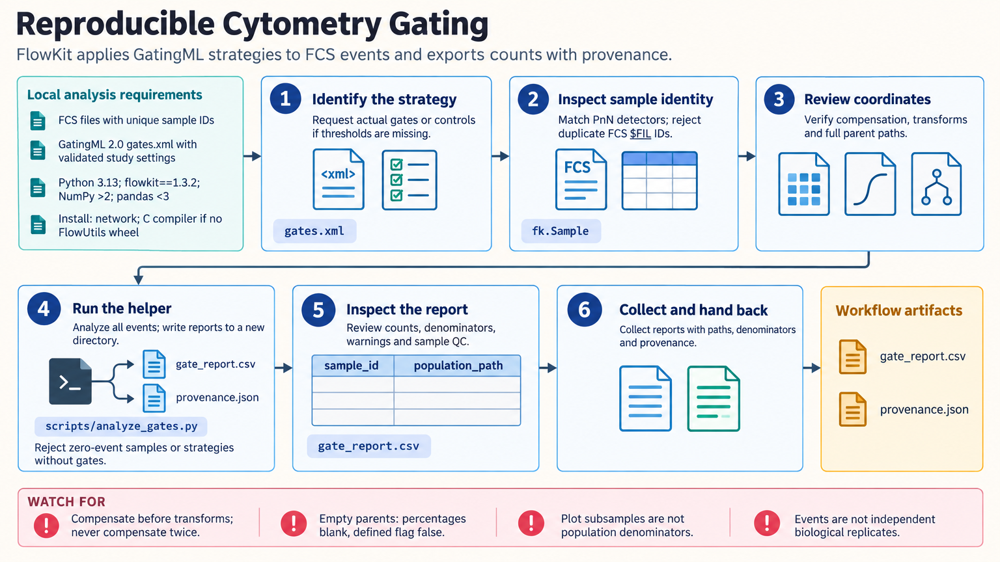

[All skill guides](README.md) / FlowKit Cytometry Analysis

# FlowKit Cytometry Analysis

**Apply reproducible compensation and gating strategies while retaining population denominators.**

FlowKit supports analysis of flow-cytometry events using compensation, transforms, hierarchical gates, GatingML strategies, and supported FlowJo workspaces. This skill helps preserve the analysis definition across samples and export traceable population counts and percentages. It emphasizes detector identity, gate coordinates, parent populations, and visual comparison with the intended reference analysis.

*Apply a recorded cytometry gating strategy and retain the information needed to interpret population summaries. [View the full-size workflow diagram](../images/flowkit.png).*

## Questions this skill can help you explore

- **How many events pass each population gate?** Apply the full hierarchy rather than isolated thresholds.
- **Can I reproduce a supported FlowJo analysis?** Import sample-specific definitions and compare representative outputs.
- **What does a reported percentage refer to?** Retain total-sample and immediate-parent denominators.

## What you bring

Bring local FCS files and a programmatic strategy, GatingML file, or supported FlowJo workspace. Provide compensation controls, appropriate negative or fluorescence-minus-one controls, transformation settings, detector labels, and biological sample identifiers. If gates have not been defined, supply the biological and control evidence needed to establish them rather than borrowing demonstration thresholds.

## How the workflow works

1. **Identify samples and channels.** Check detector labels, file-based identifiers, and collisions before loading a batch.
2. **Establish the event coordinate system.** Determine whether compensation has already occurred, then align nonlinear transforms and gate thresholds.
3. **Preserve the gate hierarchy.** Keep full population paths, parent gates, and relevant sample-specific overrides.
4. **Analyze and inspect overlays.** Use all events for counts, review sample quality, and compare imported analyses with representative reference results.
5. **Export denominators and provenance.** Retain sample totals, parent counts, percentages, input hashes, package versions, and the exact strategy.

## What you get

| Output | What it helps you do |
| --- | --- |
| Gate report with population paths | Compare counts without confusing repeated gate names. |
| Defined percentages and denominators | Distinguish whole-sample from parent-relative abundance. |
| Analysis provenance and QC views | Review how each population was obtained. |

## Example request

> Use the FlowKit skill to apply this reviewed GatingML strategy to my FCS batch. Check detector identities and compensation status, preserve the complete gate hierarchy, and inspect overlays for representative samples. Export counts and both percentage denominators, flag empty parents, and keep biological sample identifiers for the later statistical comparison.

*This is an illustrative request, not a reported research result.*

## Interpreting the results

**A gating result depends on its controls and coordinates.** Compensation and transforms change how thresholds should be interpreted. Legitimate negative compensated fluorescence should not be clipped merely to permit a logarithmic plot.

A child percentage with an empty parent is undefined rather than an observed zero percent. Plot subsamples do not determine population denominators, and events from one specimen do not replace biological replication. FlowJo import supports a subset of features, so import success alone does not establish agreement.

## Get started

The documented tested environment uses Python 3.13 and FlowKit with compatible FlowIO, FlowUtils, NumPy, pandas, SciPy, lxml, and Bokeh. Installation needs network access and may need a compiler for FlowUtils. Local FCS/XML/WSP analysis uses no service credentials and loads samples into memory.

[Setup and technical instructions](../../skills/flowkit/SKILL.md)
