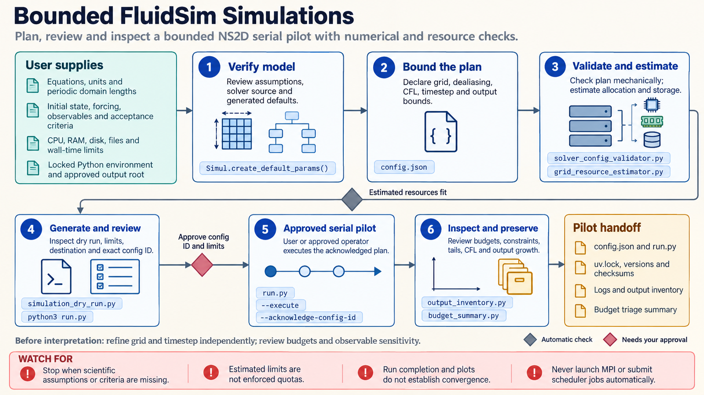

[All skill guides](README.md) / FluidSim Computational Fluid Dynamics

# FluidSim Computational Fluid Dynamics

**Plan bounded fluid simulations and assess the numerical evidence behind their observables.**

FluidSim provides Python-defined numerical solvers, particularly for periodic Cartesian pseudospectral fluid dynamics. This skill guides solver and parameter selection, resource planning, serial pilots, refinement, output inspection, and restart provenance. It treats numerical convergence and physical applicability as explicit research questions rather than assuming that a completed run or smooth plot is sufficient.

*A stated physical model becomes a bounded simulation plan, a serial pilot, refinement studies, and documented outputs. [View the full-size workflow diagram](../images/fluidsim.png).*

## Questions this skill can help you explore

- **Which solver and settings fit the equations?** Match geometry, boundaries, forcing, and observables to a verified solver.
- **Will the proposed run fit available resources?** Estimate supported memory and output requirements before execution.
- **Are the reported quantities numerically trustworthy?** Review refinement, constraints, spectra, and budget residuals.

## What you bring

Provide equations, units or nondimensionalization, geometry, boundary and initial conditions, forcing, and observables. Define acceptance criteria and explicit CPU, memory, disk, wall-time, timestep, resolution, and output limits. For a cluster, include the site’s scheduler, MPI and FFT environment, and authorized resource-allocation workflow.

## How the workflow works

1. **Specify the physical problem.** Confirm that the intended assumptions fit the selected solver and inspect its generated defaults.
2. **Validate a bounded plan.** Record resource ceilings, resolution, timestep, CFL and dealiasing choices in a strict configuration.
3. **Review the generated run script.** Inspect the proposed execution and its configuration identity before running a small serial pilot.
4. **Assess numerical behavior.** Check constraints, spectral tails, timestep history, output growth, conservation, and budget residuals.
5. **Refine and preserve.** Vary grid and timestep independently, assess observable sensitivity, and retain environment, logs, checksums, and restart lineage before scaling.

## What you get

| Output | What it helps you do |
| --- | --- |
| Validated plan and reviewed run script | Make physical and computational assumptions explicit. |
| Simulation outputs and numerical diagnostics | Assess the behavior of the configured model. |
| Refinement and restart provenance | Support reproducibility and qualified interpretation of observables. |

## Example request

> Use the FluidSim skill to plan a bounded periodic flow simulation for these equations and observables. Inspect the solver defaults, estimate supported resource use, and prepare a small serial pilot. Define independent grid and timestep refinement checks and save budget diagnostics, environment details, and restart provenance before preparing a cluster job.

*This is an illustrative request, not a reported research result.*

## Interpreting the results

**Numerical stability does not establish convergence or physical validity.** A smooth history can conceal inadequate spatial resolution, aliasing, or a biased observable. Conservation residuals and spectra are diagnostics, and reported conclusions need an appropriate refinement study.

Resource estimates have declared coverage limits and are not operating-system quotas. A restart also requires compatible state and configuration. Native FFT and MPI compatibility is site-specific, and the documented workflow does not assume a GPU backend.

## Get started

Local planning helpers use Python 3.11+ and the standard library, with h5py loaded only for supported metadata inspection. Simulations need FluidSim and compatible FFT dependencies. MPI execution additionally needs site-compatible libraries, compilers, and an approved scheduler workflow; installation may require network access.

[Setup and technical instructions](../../skills/fluidsim/SKILL.md)
