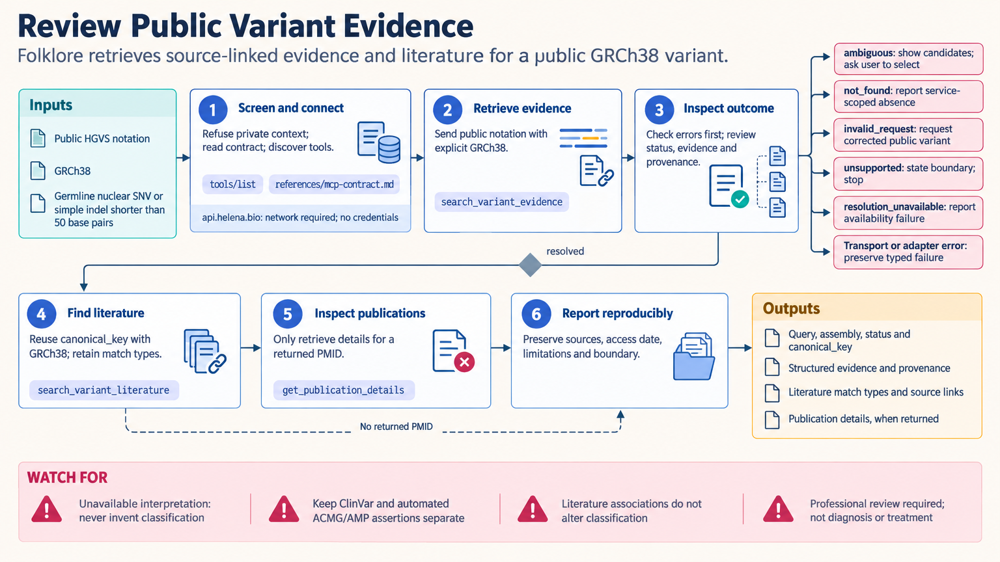

[All skill guides](README.md) / Folklore Public Variant Evidence

# Folklore Public Variant Evidence

**Retrieve source-linked public variant and gene–disease evidence with explicit resolution states.**

This skill uses Folklore’s public service to inspect one supported germline variant or retrieve ClinGen gene–disease validity assertions. It preserves evidence provenance, returned classifications, literature links, and the difference between an unresolved identifier and an unavailable service. The workflow is bounded to public identifiers and professional evidence review, without patient-specific inputs or interpretation.

*A supported public identifier leads to explicit resolution outcomes, source-linked evidence, and literature review. [View the full-size workflow diagram](../images/folklore-variant-evidence.png).*

## Questions this skill can help you explore

- **What public evidence is returned for this variant?** Resolve the identifier and preserve the service’s structured outcome.
- **Which literature is linked to the resolved variant?** Follow its canonical identity into publications.
- **What gene–disease validity assertions are available?** Retrieve distinct disease and inheritance records from the supported source snapshot.

## What you bring

For variant work, provide exactly one public GRCh38 germline nuclear SNV or simple insertion/deletion shorter than 50 bases. Accepted notation routes include supported genomic coordinates, HGVS, SPDI, rsIDs, and returned canonical keys. For gene–disease lookup, provide a gene or disease identifier. Patient, phenotype, family, segregation, private-case, and sequencing-file inputs are outside scope.

## How the workflow works

1. **Check the input boundary.** Confirm assembly, variant class, and public identifier without adding personal clinical context.
2. **Verify the service contract.** Discover available tools and distinguish transport or adapter failures from scientific response states.
3. **Retrieve and branch explicitly.** Keep resolved, ambiguous, not-found, invalid, unsupported, and unavailable outcomes distinct.
4. **Review evidence and literature.** Reuse a resolved canonical key and retain sources, disagreements, limitations, and publication links.
5. **Report provenance.** Record access date, source versions or snapshots, query scope, and any pagination or availability limits.

## What you get

| Output | What it helps you do |
| --- | --- |
| Structured variant evidence and outcome | Show what identity and evidence the service actually resolved. |
| Gene–disease assertion records | Review disease-specific validity and inheritance context. |
| Linked literature and provenance | Support independent professional examination of source material. |

## Example request

> Use the Folklore variant-evidence skill to review this single public GRCh38 germline variant. Preserve the exact resolution status, returned canonical identifier, source-linked evidence, and any disagreements. Retrieve related literature only after identity resolution and report source versions and limitations, without drawing patient-specific conclusions.

*This is an illustrative request, not a reported research result.*

## Interpreting the results

**A public evidence record does not answer an individual clinical question.** Automated classification support requires qualified review, and a gene–disease validity assertion does not classify a particular variant. Literature associations do not independently change the returned classification.

Not-found means no matching result within this service and query scope, not universal absence of evidence. The ClinGen source is a bounded snapshot, and availability failures must not be interpreted as negative scientific findings.

## Get started

The service requires network access and a host supporting its advertised stateless HTTP MCP protocol, or a compatible direct JSON-RPC client. No account or API key is required. The technical source specifies supported identifiers, response states, input exclusions, and reproducible reporting fields.

[Setup and technical instructions](../../skills/folklore-variant-evidence/SKILL.md)
