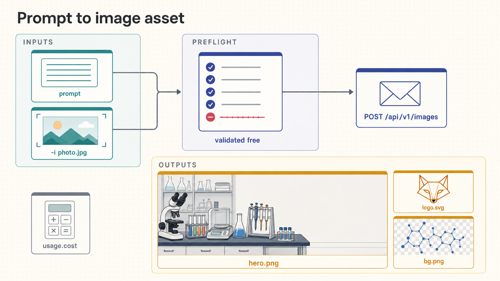

[All skill guides](README.md) / AI Image Generation and Editing

# AI Image Generation and Editing

**Create illustrative visual assets from a written brief or supplied image references.**

This skill generates and edits images through OpenRouter’s image API. It supports artwork, concept images, presentation visuals, and reference-based compositing, with model-specific choices for dimensions, formats, and transparency. For scientists, it is useful when an explanatory or decorative image is needed, while technical pathways, circuits, and evidence-bearing diagrams require their own accuracy-focused workflow.

*A visual brief and optional reference images lead to a model request, saved artwork, and visual review. [View the full-size workflow diagram](../images/generate-image.png).*

## Questions this skill can help you explore

- **How can I illustrate this research concept?** Turn an audience-specific brief into a visual asset.
- **Can I adapt an existing image?** Describe the intended edit while identifying reference roles.
- **Which output settings fit the deliverable?** Check model support for size, format, and transparency.

## What you bring

Bring a clear visual purpose, audience, subject, composition, style, and intended use. Specify aspect ratio, output format, transparency, and any text that must appear. For editing, provide the relevant images and explain what should change or remain recognizable. Reference material must be appropriate to upload to the external service.

## How the workflow works

1. **Define the brief.** Describe the subject, visual relationships, composition, and constraints in concrete terms.
2. **Inspect model capabilities.** Match the requested dimensions, format, references, and transparency to supported provider options.
3. **Review the request.** Use discovery or dry-run information to understand the selected model and parameters before a billed generation.
4. **Generate or edit.** Submit the prompt and authorized reference images, then save the returned artifact using its actual media type.
5. **Inspect the result.** Check subject accuracy, composition, labels, unwanted details, and suitability for the planned document or presentation.

## What you get

| Output | What it helps you do |
| --- | --- |
| Generated or edited image asset | Illustrate an idea or support a communication design. |
| Saved image with requested properties | Use compatible dimensions, format, and background handling. |
| Prompt and model context | Record how an illustrative artifact was produced. |

## Example request

> Use the generate-image skill to create a conceptual illustration of a scientist comparing several research approaches for a public presentation. Use the supplied visual references for style, keep the composition simple, and leave space for a caption added later. Check the generated image for misleading scientific details and retain the model and prompt information.

*This is an illustrative request, not a reported research result.*

## Interpreting the results

**Generated imagery is an illustration rather than scientific evidence.** It must not be presented as an observed micrograph, experimental result, authentic instrument readout, or validated molecular structure. Any scientific content and labels need deliberate review.

Model capabilities and costs vary, and not every provider supports the same combination of parameters. Reference images are uploaded to an external service. Legible text and convincing appearance also do not guarantee correct labels or faithful technical relationships.

## Get started

The bundled script uses Python 3.9+ and the standard library, with network access to OpenRouter. Image generation requires an OPENROUTER_API_KEY and is billed per request; discovery and dry-run operations do not require that credential. The technical instructions describe model-specific support and the separate scientific-schematics route.

[Setup and technical instructions](../../skills/generate-image/SKILL.md)
