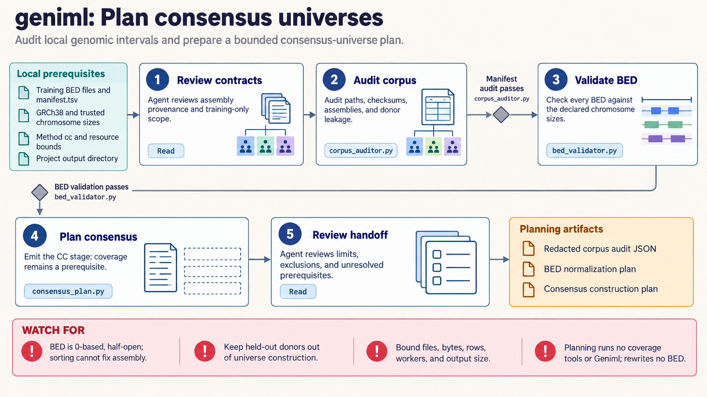

[All skill guides](README.md) / Geniml Genomic Interval Machine Learning

# Geniml Genomic Interval Machine Learning

**Prepare genomic interval learning workflows with explicit coordinate, vocabulary, and model contracts.**

Geniml supports machine-learning and statistical workflows over genomic interval sets, including Region2Vec, scEmbed, and consensus universes. This skill emphasizes local validation and planning before training or inference. Its bundled helpers inspect inputs and compatibility without loading model checkpoints, invoking services, or executing training, so problems in assemblies and token vocabularies can be found early.

*Interval files and universe definitions undergo local contract checks before a documented model or consensus workflow is planned. [View the full-size workflow diagram](../images/geniml.png).*

## Questions this skill can help you explore

- **Are these interval sets compatible?** Check BED conventions, contigs, assemblies, and the intended universe.
- **Does this model bundle match its tokenizer?** Inspect configuration, vocabulary size, ordering, and provenance.
- **How should an embedding or consensus analysis be prepared?** Plan the relevant workflow and required dependencies.

## What you bring

Bring local interval files, assembly and contig information, the exact universe definition, and sample or group metadata. For existing models, provide a trusted local bundle and its provenance, including configuration, tokenizer, checkpoint identity, and preprocessing history. State the scientific comparison and the intended training/evaluation split before constructing learned representations.

## How the workflow works

1. **Validate interval contracts.** Check zero-based half-open coordinates, assembly consistency, and the meaning of the genomic universe.
2. **Inspect the required workflow.** Distinguish Region2Vec, scEmbed, BEDspace, or consensus methods and their actual installed-version interfaces.
3. **Check model compatibility.** Match universe bytes and order, token identities, vocabulary size, dimensions, checkpoint shape, and pooling policy.
4. **Prepare an explicit local plan.** Record dependency versions, file identities, sample grouping, resources, and any separately authorized acquisition steps.
5. **Evaluate before interpretation.** Run the scientific workflow only in the appropriate environment and retain holdout design, diagnostics, and provenance for downstream claims.

## What you get

| Output | What it helps you do |
| --- | --- |
| Interval and universe audit records | Expose coordinate or vocabulary mismatches early. |
| Model-bundle compatibility summaries | Review whether artifacts belong to the same representation. |
| Workflow plans and local inspection reports | Prepare a bounded, reproducible analysis without implicit training or downloads. |

## Example request

> Use the Geniml skill to audit my local BED collection and proposed Region2Vec bundle. Confirm assembly and coordinate conventions, inspect the exact universe order and tokenizer configuration, and identify compatibility gaps without loading untrusted checkpoints. Prepare a reproducible training or inference plan that keeps related biological samples together in evaluation.

*This is an illustrative request, not a reported research result.*

## Interpreting the results

**A compatible bundle does not establish a useful biological representation.** Embeddings depend on the universe, training data, tokenization, and pooling, and similarity does not itself establish shared function. Consensus intervals also depend on input coverage and method assumptions.

The bundled planners do not run Geniml or certify checkpoint safety. Some upstream constructors can download implicitly and do not enforce all apparent revision/offline options. Use verified local artifacts and preserve the actual package and model contracts.

## Get started

The tested scientific stack uses Python 3.12 with pinned Geniml and Gtars; scEmbed needs a compatible AnnData/Zarr 2 environment and additional ML packages. Bundled planners and inspectors use only the standard library and make no network requests. Dependency installation or explicitly selected public-model/data acquisition requires separate setup.

[Setup and technical instructions](../../skills/geniml/SKILL.md)
