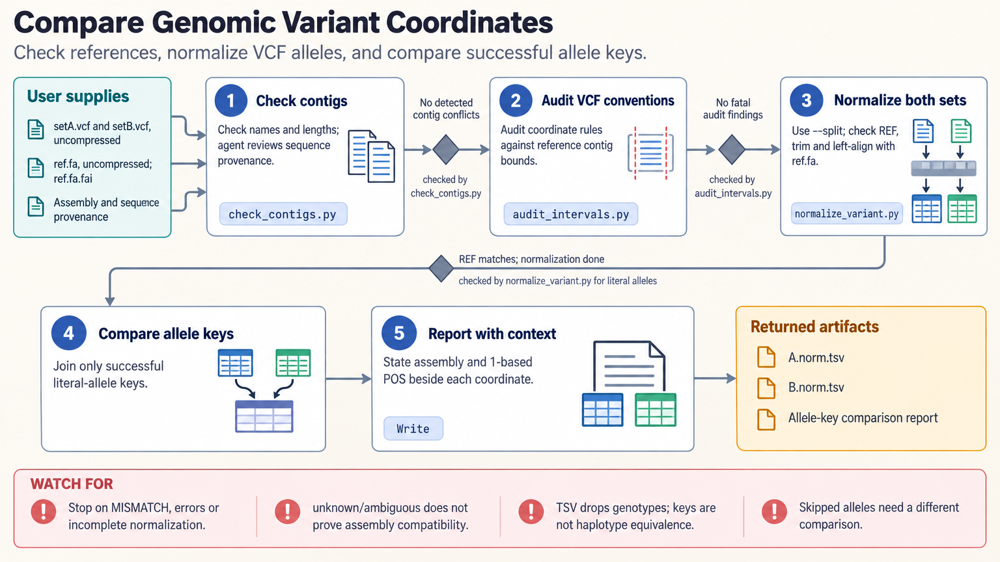

[All skill guides](README.md) / Genomic Coordinates and Variant Representation

# Genomic Coordinates and Variant Representation

**Prevent silent coordinate errors when genomic records cross formats, tools, or references.**

A genomic location is meaningful only with its coordinate convention and reference assembly. This skill helps convert interval conventions, audit format-specific coordinates, detect contig and assembly mismatches, and normalize simple variant representations against a reference. It focuses on the quiet errors that can leave files syntactically valid while changing which base or biological event an analysis describes.

*Explicit assembly and coordinate conventions support interval audits, reference checks, and normalized variant comparisons. [View the full-size workflow diagram](../images/genomic-coordinates.png).*

## Questions this skill can help you explore

- **Do these intervals refer to the same bases?** Distinguish zero-based half-open and one-based inclusive spans.
- **Why do variant records fail to match?** Check reference alleles and normalize equivalent literal alleles.
- **Can these files be joined safely?** Inspect contig naming, lengths, assembly evidence, and coordinate extents.

## What you bring

Bring the files or coordinate triples, their documented format and assembly, and reference provenance. Variant normalization needs the matching uncompressed reference FASTA with exact contig names; an index improves access. Describe whether the task concerns ordinary intervals, insertion points, simple alleles, structural variants, or transcript positions, since those need different semantics.

## How the workflow works

1. **Identify the coordinate contract.** State assembly, contig naming, coordinate origin, endpoint convention, and feature meaning.
2. **Audit before converting.** Look for invalid extents, format violations, naming mismatches, and conflicts with reference lengths.
3. **Convert supported spans explicitly.** Preserve the biological interval and flag cases that cannot be represented by an ordinary endpoint conversion.
4. **Normalize literal variants.** Check reference alleles, trim and left-align supported alleles, and preserve incomplete or skipped outcomes.
5. **Report the exact comparison.** Retain input and output conventions, reference identity, normalization limits, and any unresolved compatibility evidence.

## What you get

| Output | What it helps you do |
| --- | --- |
| Coordinate audit and conversion tables | Expose off-by-one errors and unsupported representations. |
| Normalized allele keys | Compare supported simple variants against the same reference. |
| Assembly and contig diagnostics | Identify conflicts before joining datasets. |

## Example request

> Use the genomic-coordinates skill to audit my BED intervals and VCF against this reference FASTA. Confirm assembly and contig conventions, check interval extents and REF alleles, and normalize simple indels before comparing them with a second variant list. Report ambiguous assembly evidence and incomplete normalization rather than forcing equivalence.

*This is an illustrative request, not a reported research result.*

## Interpreting the results

**Variants are not interchangeable with ordinary intervals.** Indel anchors, zero-length insertion points, transcript orientation, and HGVS conventions need feature-specific handling. A simple endpoint shift cannot perform liftover or genomic-to-transcript mapping.

Matching normalized keys establishes equivalence of supported individual literal alleles, not arbitrary multi-record haplotypes. Contig lengths can detect some conflicts but cannot prove sequence identity. The helper’s normalized tables discard genotypes and annotations, so production VCF rewriting requires appropriate native tooling.

## Get started

The bundled tools run locally with Python 3.11+ and the standard library, without credentials or network access. Text inputs are uncompressed. Indexed FASTA access avoids loading the whole reference; without an index, memory requirements increase. The technical source describes supported formats and the boundaries of every helper.

[Setup and technical instructions](../../skills/genomic-coordinates/SKILL.md)
