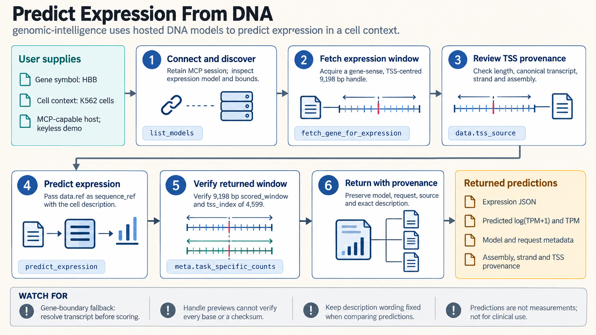

[All skill guides](README.md) / Genomic Intelligence

# Genomic Intelligence

**Explore what DNA sequence models predict about regulation, gene structure, and expression.**

This skill connects a research assistant to hosted DNA models for promoter regions, splice sites, enhancer activity, chromatin features, gene annotation, and expression prediction. You can start with a sequence or acquire a reference sequence from a gene or genomic region. The models run on the provider's infrastructure, so the workflow does not require a local GPU or downloaded model weights.

*From a defined DNA sequence and biological context to traceable model predictions. [View the full-size workflow diagram](../images/genomic-intelligence.png).*

## Questions this skill can help you explore

- **Where might regulatory features occur?** Predict candidate promoters, splice sites, enhancer activity, or chromatin features.
- **What genes might this region contain?** Explore predicted transcripts and a combined gene-finding and expression workflow.
- **What expression does the model predict?** Score an appropriate transcription-start-site window with a declared cell and assay context.

## What you bring

Provide a DNA sequence, FASTA file, gene identifier, or genomic region, together with the organism, genome assembly, strand, and research question. Expression predictions need a suitable window around the transcription start site and a cell-type or assay description. Identify sequence provenance and whether it is appropriate to send the sequence to a hosted service.

## How it works

1. **Choose a prediction task.** Inspect the available models and their species, sequence windows, and input requirements.
2. **Acquire and check the sequence.** Preserve reference coordinates and orientation; verify that the selected sequence really covers the intended biological region.
3. **Submit the model request.** Use the hosted agent connection or REST interface and retain job identifiers when work completes asynchronously.
4. **Inspect the returned coverage.** Check the region actually scored, padding, skipped genes, and the model recorded with the result.
5. **Report predictions with context.** Save the structured output and explain which observations would be needed to evaluate the proposed biological interpretation.

## What you get

| Output | What it helps you do |
| --- | --- |
| Predicted regions and sites | Prioritize sequence features for closer examination. |
| Transcript or expression predictions | Explore candidate gene structures and model-estimated expression. |
| Model and sequence metadata | Trace each prediction to its input, task, and scored window. |

## Example request

> Use the Genomic Intelligence skill to examine this reference genomic region for candidate promoters and splice sites. Confirm the assembly, strand, and sequence windows before submitting it. Save the predicted features with their coordinates and model metadata, and explain which findings remain hypotheses requiring experimental evidence.

*This is an illustrative request, not a reported research result.*

## Interpreting the results

**A predicted feature is not an experimental observation.** Model suitability depends on the organism, training context, sequence window, and task. Expression output is a transformed expression prediction, not a measured RNA-seq count or a clinical assessment.

An accepted request can still analyze the wrong window or mostly padded sequence. Review the scored region and transcription-start-site position rather than interpreting a successful response as confirmation of biological correctness.

## Get started

Network access is required. The hosted MCP connection offers a limited public demo without a key; REST prediction uses a GI_API_KEY bearer token. The documented Python REST examples require Python 3.10+ and requests. Submitted sequences are processed remotely.

[Setup and technical instructions](../../skills/genomic-intelligence/SKILL.md)
